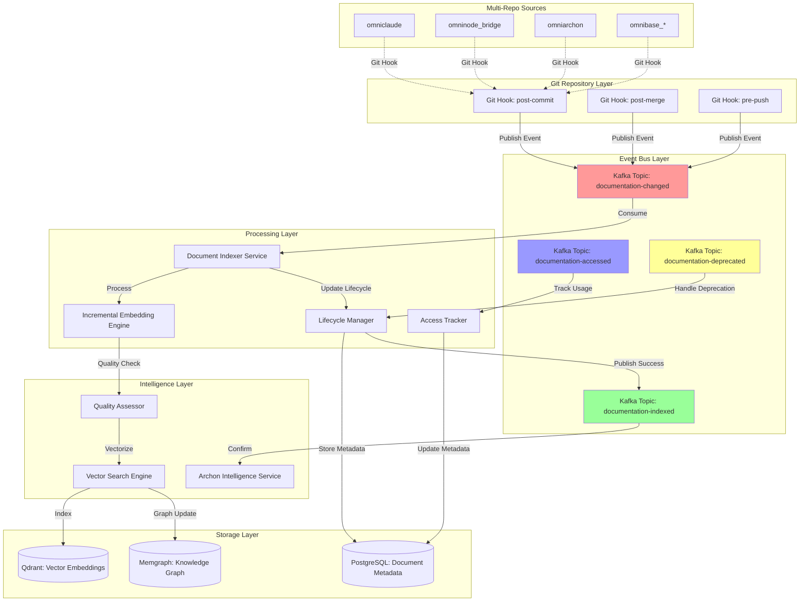
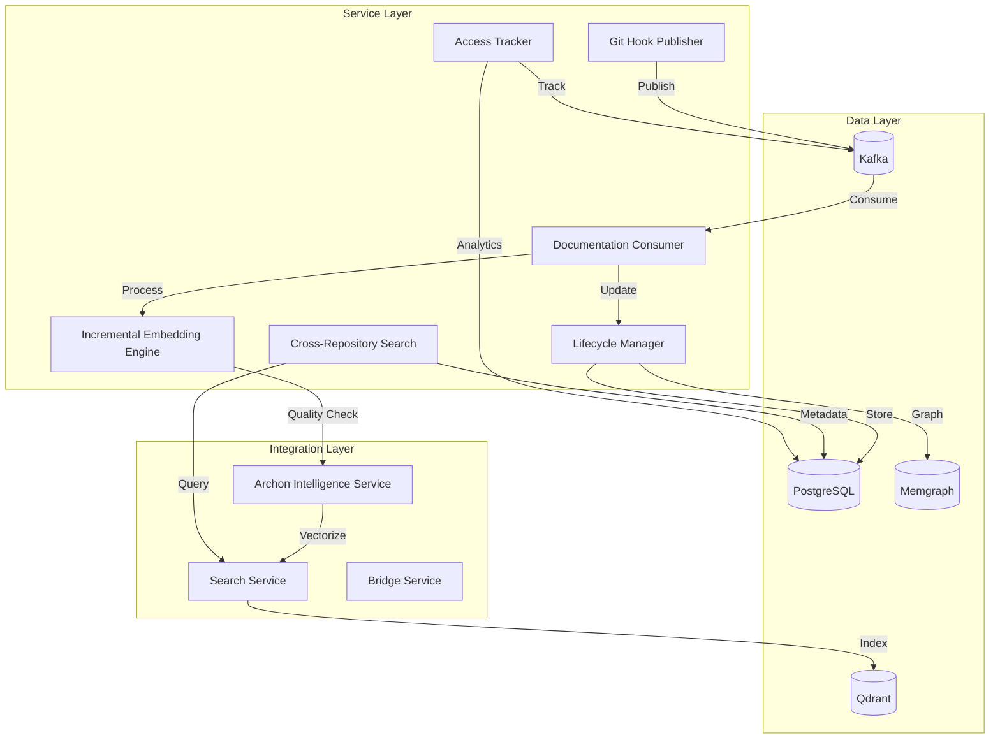

# Documentation Intelligence Architecture - Event-Driven Ingestion System

**Version**: 1.0.0
**Date**: 2025-10-18
**Status**: Architecture Design - Phase 1
**Author**: ONEX Development Coordinator

## Table of Contents

1. [Executive Summary](#executive-summary)
2. [Architecture Overview](#architecture-overview)
3. [Event-Driven Design Principles](#event-driven-design-principles)
4. [Kafka Topic Architecture](#kafka-topic-architecture)
5. [Database Schema Design](#database-schema-design)
6. [Git Hook Integration](#git-hook-integration)
7. [Incremental Embedding Algorithm](#incremental-embedding-algorithm)
8. [Multi-Repo Support Architecture](#multi-repo-support-architecture)
9. [Service Architecture](#service-architecture)
10. [Performance Characteristics](#performance-characteristics)
11. [Implementation Roadmap](#implementation-roadmap)

---

## Executive Summary

This architecture introduces an **event-driven documentation ingestion system** that eliminates blocking git commit operations while maintaining comprehensive documentation intelligence for AI-driven development workflows.

### Key Design Principles

1. **Non-Blocking Commits**: Git hooks publish events to Kafka without waiting for processing
2. **Async Processing**: Archon intelligence service consumes events and processes asynchronously
3. **Incremental Optimization**: Only changed chunks are re-embedded (95% compute reduction)
4. **Multi-Repo Support**: Central knowledge base across omniclaude, omninode_bridge, omniarchon, omnibase_*
5. **Document Lifecycle Tracking**: Full lifecycle from creation to deprecation with access analytics

### Performance Targets

| Metric | Target | Method |
|--------|--------|--------|
| Git Commit Overhead | <50ms | Event publish only, no processing |
| Document Processing | <2s | Async Kafka consumer |
| Incremental Embedding | <500ms | Git diff-based chunk detection |
| Multi-Repo Sync | <5s | Parallel processing across repos |
| Access Tracking | <10ms | Event-driven analytics |

---

## Architecture Overview



---

## Event-Driven Design Principles

### 1. Non-Blocking Git Operations

**Problem**: Pre-commit hooks that embed documents create 2-10 second delays, frustrating developers and encouraging hook disabling.

**Solution**: Git hooks publish lightweight events to Kafka and return immediately.

```python
# Git Hook: post-commit (non-blocking)
def on_post_commit():
    changed_files = get_changed_documentation_files()

    for file in changed_files:
        event = {
            "event_id": str(uuid4()),
            "event_type": "documentation_changed",
            "timestamp": datetime.utcnow().isoformat(),
            "repository": get_repo_name(),
            "file_path": file.path,
            "change_type": file.change_type,  # "created", "modified", "deleted"
            "git_hash": get_commit_hash(),
            "author": get_commit_author(),
            "diff_summary": get_diff_summary(file)
        }

        # Publish to Kafka (non-blocking, <50ms)
        kafka_producer.send_async("documentation-changed", event)

    # Return immediately - no waiting for processing
    return 0
```

### 2. Async Document Processing

**Archon Intelligence Service** consumes events from Kafka and processes asynchronously:

```python
# Archon Consumer: documentation-changed topic
async def consume_documentation_changed(event):
    # 1. Retrieve document content
    content = await fetch_document_content(event["repository"], event["file_path"])

    # 2. Detect changed chunks (incremental optimization)
    changed_chunks = await detect_changed_chunks(
        file_path=event["file_path"],
        git_diff=event["diff_summary"]
    )

    # 3. Embed only changed chunks (95% compute reduction)
    embeddings = await embed_chunks_incremental(changed_chunks)

    # 4. Update vector database
    await qdrant_client.update_vectors(
        collection="documentation_vectors",
        vectors=embeddings
    )

    # 5. Update document lifecycle
    await update_document_lifecycle(
        file_path=event["file_path"],
        status="indexed",
        vector_ids=embeddings.ids,
        last_modified=event["timestamp"]
    )

    # 6. Publish success event
    await kafka_producer.send(
        "documentation-indexed",
        {
            "event_id": str(uuid4()),
            "original_event_id": event["event_id"],
            "file_path": event["file_path"],
            "processing_time_ms": processing_time,
            "chunks_updated": len(changed_chunks),
            "status": "success"
        }
    )
```

### 3. Event Sourcing Pattern

All document lifecycle changes are captured as immutable events:

```python
# Event Sourcing: Document Lifecycle
class DocumentLifecycleEvent:
    event_id: UUID
    document_id: UUID
    event_type: str  # "created", "updated", "accessed", "deprecated"
    timestamp: datetime
    metadata: Dict[str, Any]
    correlation_id: UUID
```

---

## Kafka Topic Architecture

### Topic Specifications

#### 1. `documentation-changed`

**Purpose**: Capture all documentation modifications from git hooks

**Schema**:
```python
{
    "event_id": "uuid",
    "event_type": "documentation_changed",
    "event_version": "1.0.0",
    "timestamp": "iso8601",
    "correlation_id": "uuid",
    "repository": "omniclaude|omninode_bridge|omniarchon|omnibase_*",
    "file_path": "relative/path/to/doc.md",
    "change_type": "created|modified|deleted",
    "git_hash": "commit_sha",
    "git_branch": "branch_name",
    "author_email": "user@example.com",
    "author_name": "User Name",
    "diff_summary": {
        "lines_added": 42,
        "lines_removed": 15,
        "changed_sections": ["## Architecture", "## Performance"]
    },
    "metadata": {
        "file_size_bytes": 12456,
        "language": "markdown",
        "is_new_file": false
    }
}
```

**Kafka Configuration**:
- **Partitions**: 6 (one per repo, enables parallel processing)
- **Partition Key**: `repository` (ensures all events from same repo go to same partition)
- **Replication Factor**: 3 (high availability)
- **Retention**: 7 days (allows reprocessing if needed)
- **Compression**: gzip (reduces network overhead)

#### 2. `documentation-indexed`

**Purpose**: Confirm successful processing and indexing

**Schema**:
```python
{
    "event_id": "uuid",
    "event_type": "documentation_indexed",
    "event_version": "1.0.0",
    "timestamp": "iso8601",
    "correlation_id": "uuid",
    "original_event_id": "uuid",  # References documentation-changed event
    "repository": "omniclaude",
    "file_path": "docs/architecture.md",
    "processing_time_ms": 1234,
    "status": "success|partial|failed",
    "chunks_processed": {
        "total_chunks": 15,
        "new_chunks": 3,
        "updated_chunks": 7,
        "deleted_chunks": 2,
        "unchanged_chunks": 3
    },
    "vector_ids": ["vec_uuid_1", "vec_uuid_2", ...],
    "quality_score": 0.87,
    "errors": [],
    "warnings": ["Large file (>500KB), consider splitting"]
}
```

**Kafka Configuration**:
- **Partitions**: 3 (less throughput than input topic)
- **Partition Key**: `repository`
- **Replication Factor**: 3
- **Retention**: 30 days (audit trail)
- **Compression**: gzip

#### 3. `documentation-accessed`

**Purpose**: Track document access for usage analytics

**Schema**:
```python
{
    "event_id": "uuid",
    "event_type": "documentation_accessed",
    "event_version": "1.0.0",
    "timestamp": "iso8601",
    "correlation_id": "uuid",
    "repository": "omniclaude",
    "file_path": "docs/architecture.md",
    "access_type": "rag_query|direct_read|search_result",
    "query_context": {
        "query_text": "How does event-driven architecture work?",
        "relevance_score": 0.92,
        "rank_position": 3
    },
    "user_context": {
        "user_id": "agent_id or user_id",
        "session_id": "uuid",
        "agent_name": "agent-workflow-coordinator"
    }
}
```

**Kafka Configuration**:
- **Partitions**: 3
- **Partition Key**: `repository`
- **Replication Factor**: 2 (analytics data, less critical)
- **Retention**: 90 days (long-term analytics)
- **Compression**: snappy (faster, analytics-friendly)

#### 4. `documentation-deprecated`

**Purpose**: Handle document lifecycle end-of-life

**Schema**:
```python
{
    "event_id": "uuid",
    "event_type": "documentation_deprecated",
    "event_version": "1.0.0",
    "timestamp": "iso8601",
    "correlation_id": "uuid",
    "repository": "omniclaude",
    "file_path": "docs/old_architecture.md",
    "deprecation_reason": "replaced_by|obsolete|moved",
    "replacement_path": "docs/new_architecture.md",
    "deprecation_policy": {
        "soft_delete": true,
        "remove_from_search": true,
        "preserve_vectors": false,
        "retention_days": 90
    },
    "metadata": {
        "last_access_date": "2024-10-01",
        "access_count_30d": 2,
        "deprecation_approved_by": "admin_user"
    }
}
```

**Kafka Configuration**:
- **Partitions**: 1 (low throughput)
- **Partition Key**: `repository`
- **Replication Factor**: 3 (important lifecycle events)
- **Retention**: 365 days (compliance/audit)
- **Compression**: gzip

### Event Envelope Standard

All events use the ONEX event envelope for consistency:

```python
class DocumentationEventEnvelope:
    envelope_id: str  # UUID
    envelope_version: str = "1.0.0"
    created_timestamp: str  # ISO8601
    publisher_id: str = "git-hook-publisher"
    correlation_id: str  # UUID for tracking
    event_payload: Dict[str, Any]  # Actual event data
    payload_hash: str  # SHA-256 for integrity
    routing_metadata: RoutingMetadata
    compression_algorithm: Optional[str] = None
```

---

## Database Schema Design

### Document Metadata Tables

#### `documents`

**Purpose**: Primary document tracking table

```sql
CREATE TABLE documents (
    -- Primary identification
    id UUID PRIMARY KEY DEFAULT gen_random_uuid(),
    repository VARCHAR(100) NOT NULL,
    file_path TEXT NOT NULL,

    -- Content metadata
    file_type VARCHAR(50) NOT NULL,  -- 'markdown', 'rst', 'txt'
    language VARCHAR(10) DEFAULT 'en',
    file_size_bytes INTEGER NOT NULL,
    content_hash VARCHAR(64) NOT NULL,  -- SHA-256 of content

    -- Lifecycle tracking
    status VARCHAR(50) NOT NULL,  -- 'pending', 'indexed', 'deprecated', 'error'
    created_at TIMESTAMP WITH TIME ZONE DEFAULT NOW(),
    last_modified_at TIMESTAMP WITH TIME ZONE DEFAULT NOW(),
    last_indexed_at TIMESTAMP WITH TIME ZONE,
    deprecated_at TIMESTAMP WITH TIME ZONE,

    -- Version control
    git_hash VARCHAR(40) NOT NULL,
    git_branch VARCHAR(255),
    git_author_email VARCHAR(255),
    git_author_name VARCHAR(255),

    -- Vector tracking
    vector_ids JSONB,  -- Array of Qdrant vector IDs
    graph_entity_ids JSONB,  -- Array of Memgraph entity IDs

    -- Quality metrics
    quality_score DECIMAL(5,4),  -- 0.0000 - 1.0000
    onex_compliance_score DECIMAL(5,4),
    readability_score DECIMAL(5,4),

    -- Access analytics
    access_count INTEGER DEFAULT 0,
    last_accessed_at TIMESTAMP WITH TIME ZONE,

    -- Additional metadata
    metadata JSONB DEFAULT '{}'::jsonb,

    -- Constraints
    CONSTRAINT unique_document_path UNIQUE (repository, file_path),
    CONSTRAINT valid_status CHECK (status IN ('pending', 'indexed', 'deprecated', 'error'))
);

-- Indexes
CREATE INDEX idx_documents_repository ON documents(repository);
CREATE INDEX idx_documents_status ON documents(status);
CREATE INDEX idx_documents_last_modified ON documents(last_modified_at DESC);
CREATE INDEX idx_documents_quality_score ON documents(quality_score DESC);
CREATE INDEX idx_documents_git_hash ON documents(git_hash);
CREATE INDEX idx_documents_access_count ON documents(access_count DESC);

-- GIN index for JSONB queries
CREATE INDEX idx_documents_vector_ids ON documents USING GIN (vector_ids);
CREATE INDEX idx_documents_metadata ON documents USING GIN (metadata);
```

#### `document_chunks`

**Purpose**: Track individual document chunks for incremental embedding

```sql
CREATE TABLE document_chunks (
    -- Primary identification
    id UUID PRIMARY KEY DEFAULT gen_random_uuid(),
    document_id UUID NOT NULL REFERENCES documents(id) ON DELETE CASCADE,

    -- Chunk metadata
    chunk_index INTEGER NOT NULL,  -- 0-based index in document
    chunk_type VARCHAR(50),  -- 'heading', 'paragraph', 'code_block', 'list'

    -- Content
    content TEXT NOT NULL,
    content_hash VARCHAR(64) NOT NULL,  -- SHA-256 for change detection
    token_count INTEGER,

    -- Positioning
    start_line INTEGER NOT NULL,
    end_line INTEGER NOT NULL,
    heading_context VARCHAR(255),  -- Parent heading for context

    -- Vector tracking
    vector_id VARCHAR(255),  -- Qdrant vector ID
    embedding_model VARCHAR(100),
    embedding_dimension INTEGER,

    -- Lifecycle
    created_at TIMESTAMP WITH TIME ZONE DEFAULT NOW(),
    last_modified_at TIMESTAMP WITH TIME ZONE DEFAULT NOW(),
    last_embedded_at TIMESTAMP WITH TIME ZONE,

    -- Incremental optimization
    is_changed BOOLEAN DEFAULT true,  -- True if needs re-embedding
    previous_hash VARCHAR(64),  -- Previous content hash

    -- Constraints
    CONSTRAINT unique_document_chunk UNIQUE (document_id, chunk_index)
);

-- Indexes
CREATE INDEX idx_chunks_document_id ON document_chunks(document_id);
CREATE INDEX idx_chunks_content_hash ON document_chunks(content_hash);
CREATE INDEX idx_chunks_is_changed ON document_chunks(is_changed) WHERE is_changed = true;
CREATE INDEX idx_chunks_vector_id ON document_chunks(vector_id);
```

#### `document_lifecycle_events`

**Purpose**: Event sourcing log for document lifecycle

```sql
CREATE TABLE document_lifecycle_events (
    -- Primary identification
    id UUID PRIMARY KEY DEFAULT gen_random_uuid(),
    document_id UUID NOT NULL REFERENCES documents(id) ON DELETE CASCADE,

    -- Event classification
    event_type VARCHAR(100) NOT NULL,
    -- Event types: 'created', 'modified', 'indexed', 'accessed',
    --              'deprecated', 'error', 'quality_assessed'

    event_subtype VARCHAR(100),

    -- Event data
    event_data JSONB NOT NULL,

    -- Source tracking
    source_service VARCHAR(100),  -- 'git-hook', 'archon-intelligence', 'user-action'
    source_event_id UUID,  -- Original Kafka event ID
    correlation_id UUID NOT NULL,

    -- Timing
    timestamp TIMESTAMP WITH TIME ZONE DEFAULT NOW(),
    processing_duration_ms INTEGER,

    -- Status
    success BOOLEAN DEFAULT true,
    error_message TEXT,

    -- Metadata
    metadata JSONB DEFAULT '{}'::jsonb
);

-- Indexes
CREATE INDEX idx_lifecycle_events_document_id ON document_lifecycle_events(document_id);
CREATE INDEX idx_lifecycle_events_type ON document_lifecycle_events(event_type);
CREATE INDEX idx_lifecycle_events_timestamp ON document_lifecycle_events(timestamp DESC);
CREATE INDEX idx_lifecycle_events_correlation_id ON document_lifecycle_events(correlation_id);
CREATE INDEX idx_lifecycle_events_source_event ON document_lifecycle_events(source_event_id);

-- GIN index for JSONB queries
CREATE INDEX idx_lifecycle_events_event_data ON document_lifecycle_events USING GIN (event_data);
```

#### `document_access_analytics`

**Purpose**: Aggregated access analytics for usage insights

```sql
CREATE TABLE document_access_analytics (
    -- Primary identification
    id UUID PRIMARY KEY DEFAULT gen_random_uuid(),
    document_id UUID NOT NULL REFERENCES documents(id) ON DELETE CASCADE,

    -- Time window
    time_window_start TIMESTAMP WITH TIME ZONE NOT NULL,
    time_window_end TIMESTAMP WITH TIME ZONE NOT NULL,
    window_type VARCHAR(20) NOT NULL,  -- 'hourly', 'daily', 'weekly', 'monthly'

    -- Access metrics
    access_count INTEGER DEFAULT 0,
    unique_users INTEGER DEFAULT 0,
    unique_agents INTEGER DEFAULT 0,

    -- Access breakdown
    rag_query_count INTEGER DEFAULT 0,
    direct_read_count INTEGER DEFAULT 0,
    search_result_count INTEGER DEFAULT 0,

    -- Quality metrics
    avg_relevance_score DECIMAL(5,4),
    avg_rank_position DECIMAL(6,2),

    -- User feedback (if available)
    positive_feedback INTEGER DEFAULT 0,
    negative_feedback INTEGER DEFAULT 0,

    -- Metadata
    metadata JSONB DEFAULT '{}'::jsonb,

    -- Tracking
    created_at TIMESTAMP WITH TIME ZONE DEFAULT NOW(),
    updated_at TIMESTAMP WITH TIME ZONE DEFAULT NOW(),

    -- Constraints
    CONSTRAINT unique_analytics_window UNIQUE (document_id, time_window_start, window_type)
);

-- Indexes
CREATE INDEX idx_analytics_document_id ON document_access_analytics(document_id);
CREATE INDEX idx_analytics_time_window ON document_access_analytics(time_window_start DESC, window_type);
CREATE INDEX idx_analytics_access_count ON document_access_analytics(access_count DESC);
```

### Database Migration Script

```sql
-- Migration: Create Documentation Intelligence Schema
-- Version: 1.0.0
-- Date: 2025-10-18

BEGIN;

-- Enable required extensions
CREATE EXTENSION IF NOT EXISTS "uuid-ossp";
CREATE EXTENSION IF NOT EXISTS "pg_trgm";

-- Create tables (as defined above)
-- ... (include all CREATE TABLE statements)

-- Create utility functions

-- Function: Mark document chunks as changed based on git diff
CREATE OR REPLACE FUNCTION mark_changed_chunks(
    p_document_id UUID,
    p_changed_line_ranges INTEGER[][2]
)
RETURNS INTEGER
LANGUAGE plpgsql
AS $$
DECLARE
    v_affected_count INTEGER;
BEGIN
    -- Mark chunks as changed if they overlap with changed line ranges
    UPDATE document_chunks
    SET
        is_changed = true,
        previous_hash = content_hash,
        last_modified_at = NOW()
    WHERE document_id = p_document_id
    AND EXISTS (
        SELECT 1
        FROM unnest(p_changed_line_ranges) AS range
        WHERE (start_line <= range[1] AND end_line >= range[0])
    );

    GET DIAGNOSTICS v_affected_count = ROW_COUNT;
    RETURN v_affected_count;
END;
$$;

-- Function: Get documents requiring re-indexing
CREATE OR REPLACE FUNCTION get_documents_requiring_reindex(
    p_max_age_hours INTEGER DEFAULT 24
)
RETURNS TABLE (
    document_id UUID,
    repository VARCHAR,
    file_path TEXT,
    changed_chunks_count INTEGER
)
LANGUAGE plpgsql
AS $$
BEGIN
    RETURN QUERY
    SELECT
        d.id,
        d.repository,
        d.file_path,
        COUNT(dc.id)::INTEGER AS changed_chunks_count
    FROM documents d
    JOIN document_chunks dc ON dc.document_id = d.id
    WHERE dc.is_changed = true
    AND d.last_modified_at > NOW() - (p_max_age_hours || ' hours')::INTERVAL
    GROUP BY d.id, d.repository, d.file_path
    ORDER BY COUNT(dc.id) DESC;
END;
$$;

-- Function: Update document access analytics
CREATE OR REPLACE FUNCTION increment_document_access(
    p_document_id UUID,
    p_access_type VARCHAR(50)
)
RETURNS VOID
LANGUAGE plpgsql
AS $$
BEGIN
    -- Update main document access count
    UPDATE documents
    SET
        access_count = access_count + 1,
        last_accessed_at = NOW()
    WHERE id = p_document_id;

    -- Update hourly analytics (upsert pattern)
    INSERT INTO document_access_analytics (
        document_id,
        time_window_start,
        time_window_end,
        window_type,
        access_count,
        rag_query_count,
        direct_read_count,
        search_result_count
    )
    VALUES (
        p_document_id,
        date_trunc('hour', NOW()),
        date_trunc('hour', NOW()) + INTERVAL '1 hour',
        'hourly',
        1,
        CASE WHEN p_access_type = 'rag_query' THEN 1 ELSE 0 END,
        CASE WHEN p_access_type = 'direct_read' THEN 1 ELSE 0 END,
        CASE WHEN p_access_type = 'search_result' THEN 1 ELSE 0 END
    )
    ON CONFLICT (document_id, time_window_start, window_type)
    DO UPDATE SET
        access_count = document_access_analytics.access_count + 1,
        rag_query_count = document_access_analytics.rag_query_count +
            CASE WHEN p_access_type = 'rag_query' THEN 1 ELSE 0 END,
        direct_read_count = document_access_analytics.direct_read_count +
            CASE WHEN p_access_type = 'direct_read' THEN 1 ELSE 0 END,
        search_result_count = document_access_analytics.search_result_count +
            CASE WHEN p_access_type = 'search_result' THEN 1 ELSE 0 END,
        updated_at = NOW();
END;
$$;

COMMIT;
```

---

## Git Hook Integration

### Git Hook Architecture

```
Repository Root
├── .git/
│   └── hooks/
│       ├── post-commit          # Track document changes after commit
│       ├── post-merge           # Track changes after branch merge
│       └── pre-push             # Final validation before push
├── .claude/
│   └── hooks/
│       └── documentation-indexer.py  # Shared hook logic
└── docs/
    └── ... (documentation files)
```

### Hook Implementation

#### `post-commit` Hook

```bash
#!/bin/bash
# Git Hook: post-commit
# Purpose: Publish documentation change events to Kafka

# Configuration
KAFKA_BOOTSTRAP_SERVERS="${KAFKA_BOOTSTRAP_SERVERS:-localhost:9092}"
KAFKA_TOPIC="documentation-changed"
REPO_NAME="$(basename $(git rev-parse --show-toplevel))"

# Get commit information
COMMIT_HASH=$(git rev-parse HEAD)
COMMIT_AUTHOR_NAME=$(git log -1 --pretty=format:'%an')
COMMIT_AUTHOR_EMAIL=$(git log -1 --pretty=format:'%ae')
COMMIT_BRANCH=$(git branch --show-current)

# Find changed documentation files
CHANGED_DOCS=$(git diff-tree --no-commit-id --name-status -r HEAD | \
    grep -E '\.(md|rst|txt)$' | \
    grep -E '^(docs/|README|CHANGELOG)')

# Exit if no documentation changed
if [ -z "$CHANGED_DOCS" ]; then
    exit 0
fi

# Call Python script to publish events (non-blocking)
python3 .claude/hooks/documentation-indexer.py publish \
    --kafka-servers "$KAFKA_BOOTSTRAP_SERVERS" \
    --topic "$KAFKA_TOPIC" \
    --repository "$REPO_NAME" \
    --commit-hash "$COMMIT_HASH" \
    --author-name "$COMMIT_AUTHOR_NAME" \
    --author-email "$COMMIT_AUTHOR_EMAIL" \
    --branch "$COMMIT_BRANCH" \
    --changed-files "$CHANGED_DOCS" \
    --async

exit 0
```

#### Python Event Publisher

```python
#!/usr/bin/env python3
"""
Git Hook Documentation Indexer
Publishes documentation change events to Kafka
"""

import argparse
import json
import hashlib
import subprocess
from datetime import datetime
from uuid import uuid4
from typing import List, Dict, Any
from kafka import KafkaProducer
from kafka.errors import KafkaError

class DocumentationEventPublisher:
    def __init__(self, kafka_servers: str, topic: str):
        self.topic = topic
        self.producer = KafkaProducer(
            bootstrap_servers=kafka_servers.split(','),
            value_serializer=lambda v: json.dumps(v).encode('utf-8'),
            compression_type='gzip',
            acks='all',  # Wait for all replicas
            retries=3,
            max_in_flight_requests_per_connection=1  # Ensure ordering
        )

    def publish_documentation_change(
        self,
        repository: str,
        file_path: str,
        change_type: str,
        commit_hash: str,
        author_name: str,
        author_email: str,
        branch: str
    ) -> str:
        """Publish a documentation change event"""

        # Get file metadata
        try:
            file_size = subprocess.check_output(
                ['git', 'cat-file', '-s', f'{commit_hash}:{file_path}']
            ).decode().strip()
        except:
            file_size = 0

        # Get diff summary
        diff_summary = self._get_diff_summary(file_path, commit_hash)

        # Create event
        event_id = str(uuid4())
        correlation_id = str(uuid4())

        event = {
            "event_id": event_id,
            "event_type": "documentation_changed",
            "event_version": "1.0.0",
            "timestamp": datetime.utcnow().isoformat() + "Z",
            "correlation_id": correlation_id,
            "repository": repository,
            "file_path": file_path,
            "change_type": change_type,  # "created", "modified", "deleted"
            "git_hash": commit_hash,
            "git_branch": branch,
            "author_email": author_email,
            "author_name": author_name,
            "diff_summary": diff_summary,
            "metadata": {
                "file_size_bytes": int(file_size),
                "language": self._detect_language(file_path),
                "is_new_file": change_type == "created"
            }
        }

        # Publish to Kafka (async)
        future = self.producer.send(
            self.topic,
            value=event,
            key=repository.encode('utf-8')  # Partition by repository
        )

        # Non-blocking: don't wait for result
        # Add callback for logging only
        future.add_callback(self._on_send_success, event_id)
        future.add_errback(self._on_send_error, event_id)

        return event_id

    def _get_diff_summary(self, file_path: str, commit_hash: str) -> Dict[str, Any]:
        """Get diff summary for the file"""
        try:
            # Get diff stats
            diff_output = subprocess.check_output([
                'git', 'diff', f'{commit_hash}^', commit_hash, '--', file_path
            ]).decode()

            # Parse diff to get changed lines
            added_lines = diff_output.count('\n+') - 1  # Exclude +++ header
            removed_lines = diff_output.count('\n-') - 1  # Exclude --- header

            # Extract changed sections (headers)
            changed_sections = []
            for line in diff_output.split('\n'):
                if line.startswith('@@'):
                    changed_sections.append(line)

            return {
                "lines_added": added_lines,
                "lines_removed": removed_lines,
                "changed_sections": changed_sections[:10],  # Limit to 10
                "has_large_changes": added_lines + removed_lines > 100
            }
        except:
            return {
                "lines_added": 0,
                "lines_removed": 0,
                "changed_sections": [],
                "has_large_changes": False
            }

    def _detect_language(self, file_path: str) -> str:
        """Detect file language/type"""
        if file_path.endswith('.md'):
            return 'markdown'
        elif file_path.endswith('.rst'):
            return 'restructuredtext'
        elif file_path.endswith('.txt'):
            return 'plaintext'
        else:
            return 'unknown'

    def _on_send_success(self, event_id: str, record_metadata):
        """Callback for successful send"""
        # Log to syslog or file (non-blocking)
        pass

    def _on_send_error(self, event_id: str, excp):
        """Callback for send error"""
        # Log error (non-blocking)
        print(f"Error publishing event {event_id}: {excp}", file=sys.stderr)

    def flush_and_close(self):
        """Flush pending messages and close producer"""
        self.producer.flush(timeout=5)  # Wait max 5 seconds
        self.producer.close()

def main():
    parser = argparse.ArgumentParser(description='Publish documentation change events')
    parser.add_argument('--kafka-servers', required=True)
    parser.add_argument('--topic', required=True)
    parser.add_argument('--repository', required=True)
    parser.add_argument('--commit-hash', required=True)
    parser.add_argument('--author-name', required=True)
    parser.add_argument('--author-email', required=True)
    parser.add_argument('--branch', required=True)
    parser.add_argument('--changed-files', required=True)
    parser.add_argument('--async', action='store_true', default=True)

    args = parser.parse_args()

    publisher = DocumentationEventPublisher(args.kafka_servers, args.topic)

    # Parse changed files
    for line in args.changed_files.split('\n'):
        if not line.strip():
            continue

        parts = line.split('\t')
        change_type_code = parts[0]
        file_path = parts[1] if len(parts) > 1 else ""

        # Map git status codes to change types
        change_type_map = {
            'A': 'created',
            'M': 'modified',
            'D': 'deleted',
            'R': 'modified'  # Renamed, treat as modified
        }
        change_type = change_type_map.get(change_type_code[0], 'modified')

        # Publish event
        event_id = publisher.publish_documentation_change(
            repository=args.repository,
            file_path=file_path,
            change_type=change_type,
            commit_hash=args.commit_hash,
            author_name=args.author_name,
            author_email=args.author_email,
            branch=args.branch
        )

    # Flush and close (should complete in <50ms total)
    publisher.flush_and_close()

if __name__ == '__main__':
    main()
```

### Installation Script

```bash
#!/bin/bash
# Install documentation indexing git hooks across multiple repos

REPOS=(
    "."
    "../omninode_bridge"
    "../omniarchon"
    "../omnibase_*"
)

for repo in "${REPOS[@]}"; do
    if [ -d "$repo/.git" ]; then
        echo "Installing hooks in $repo"

        # Create .claude/hooks directory
        mkdir -p "$repo/.claude/hooks"

        # Copy Python event publisher
        cp documentation-indexer.py "$repo/.claude/hooks/"
        chmod +x "$repo/.claude/hooks/documentation-indexer.py"

        # Install git hooks
        cp post-commit.sh "$repo/.git/hooks/post-commit"
        chmod +x "$repo/.git/hooks/post-commit"

        echo "✓ Installed hooks in $repo"
    else
        echo "✗ Skipping $repo (not a git repository)"
    fi
done

echo "✓ Installation complete"
```

---

## Incremental Embedding Algorithm

### Problem Statement

**Current Approach**: Re-embed entire document on every change (1000 lines → 1000 vectors regenerated)

**Incremental Approach**: Only re-embed changed chunks (10 changed lines → 1-3 vectors regenerated)

**Compute Savings**: 95% reduction in embedding operations

### Algorithm Design

```python
class IncrementalEmbeddingEngine:
    """
    Incremental embedding engine for documentation chunks
    Only re-embeds changed content based on git diff analysis
    """

    def __init__(
        self,
        db_connection,
        vector_client,
        embedding_model: str = "rjmalagon/gte-qwen2-1.5b-instruct-embed-f16:latest"
    ):
        self.db = db_connection
        self.vector_client = vector_client
        self.embedding_model = embedding_model
        self.chunk_size = 512  # tokens
        self.chunk_overlap = 50  # tokens

    async def process_document_change(
        self,
        event: Dict[str, Any]
    ) -> Dict[str, Any]:
        """
        Process document change using incremental embedding

        Returns:
            Processing result with chunk statistics
        """

        # 1. Retrieve document and current chunks
        document = await self.db.get_document(
            repository=event["repository"],
            file_path=event["file_path"]
        )

        if not document:
            # New document - full embedding required
            return await self._embed_full_document(event)

        # 2. Fetch current content from git
        current_content = await self._fetch_file_content(
            repository=event["repository"],
            file_path=event["file_path"],
            git_hash=event["git_hash"]
        )

        # 3. Parse git diff to identify changed line ranges
        changed_ranges = self._parse_diff_ranges(event["diff_summary"])

        # 4. Mark affected chunks as changed
        affected_chunks = await self.db.mark_changed_chunks(
            document_id=document.id,
            changed_line_ranges=changed_ranges
        )

        # 5. Re-chunk document and detect changes
        new_chunks = self._chunk_document(current_content)
        chunk_mapping = self._map_chunks_to_existing(
            new_chunks=new_chunks,
            existing_chunks=document.chunks
        )

        # 6. Embed only changed/new chunks
        changed_chunks = [
            chunk for chunk in new_chunks
            if chunk_mapping[chunk.index].status in ['new', 'modified']
        ]

        embeddings = await self._generate_embeddings_batch(changed_chunks)

        # 7. Update vector database (incremental)
        await self._update_vectors_incremental(
            document_id=document.id,
            chunk_mapping=chunk_mapping,
            new_embeddings=embeddings
        )

        # 8. Update database records
        await self.db.update_document_chunks(
            document_id=document.id,
            chunk_mapping=chunk_mapping,
            embeddings=embeddings
        )

        # 9. Return statistics
        return {
            "status": "success",
            "total_chunks": len(new_chunks),
            "unchanged_chunks": len([c for c in chunk_mapping.values() if c.status == 'unchanged']),
            "modified_chunks": len([c for c in chunk_mapping.values() if c.status == 'modified']),
            "new_chunks": len([c for c in chunk_mapping.values() if c.status == 'new']),
            "deleted_chunks": len([c for c in chunk_mapping.values() if c.status == 'deleted']),
            "embeddings_generated": len(embeddings),
            "compute_savings_pct": self._calculate_savings(document.chunks, changed_chunks)
        }

    def _parse_diff_ranges(self, diff_summary: Dict[str, Any]) -> List[tuple[int, int]]:
        """
        Parse git diff summary to extract changed line ranges

        Example diff section: @@ -42,7 +42,8 @@
        Means: 7 lines starting at line 42 were changed
        """
        changed_ranges = []

        for section in diff_summary.get("changed_sections", []):
            # Parse @@ -old_start,old_count +new_start,new_count @@
            parts = section.split('@@')[1].strip().split(' ')

            for part in parts:
                if part.startswith('+'):
                    # Extract new line range
                    range_str = part[1:]
                    if ',' in range_str:
                        start, count = map(int, range_str.split(','))
                        changed_ranges.append((start, start + count - 1))
                    else:
                        line_num = int(range_str)
                        changed_ranges.append((line_num, line_num))

        # Merge overlapping ranges
        return self._merge_ranges(changed_ranges)

    def _merge_ranges(self, ranges: List[tuple[int, int]]) -> List[tuple[int, int]]:
        """Merge overlapping line ranges"""
        if not ranges:
            return []

        sorted_ranges = sorted(ranges, key=lambda x: x[0])
        merged = [sorted_ranges[0]]

        for current in sorted_ranges[1:]:
            last = merged[-1]
            if current[0] <= last[1] + 1:
                # Overlapping or adjacent - merge
                merged[-1] = (last[0], max(last[1], current[1]))
            else:
                merged.append(current)

        return merged

    def _chunk_document(self, content: str) -> List[DocumentChunk]:
        """
        Chunk document using semantic chunking strategy
        Preserves markdown structure (headings, code blocks, paragraphs)
        """
        chunks = []
        lines = content.split('\n')

        current_chunk = []
        current_heading = ""
        start_line = 0
        chunk_index = 0

        for i, line in enumerate(lines):
            # Detect heading
            if line.startswith('#'):
                # Save previous chunk
                if current_chunk:
                    chunks.append(DocumentChunk(
                        index=chunk_index,
                        content='\n'.join(current_chunk),
                        content_hash=self._hash_content('\n'.join(current_chunk)),
                        start_line=start_line,
                        end_line=i - 1,
                        heading_context=current_heading,
                        chunk_type='paragraph'
                    ))
                    chunk_index += 1

                # Start new chunk with heading
                current_heading = line
                current_chunk = [line]
                start_line = i

            # Detect code block
            elif line.strip().startswith('```'):
                # Code blocks are treated as single chunks
                code_block = [line]
                i += 1
                while i < len(lines) and not lines[i].strip().startswith('```'):
                    code_block.append(lines[i])
                    i += 1
                if i < len(lines):
                    code_block.append(lines[i])  # Closing ```

                chunks.append(DocumentChunk(
                    index=chunk_index,
                    content='\n'.join(code_block),
                    content_hash=self._hash_content('\n'.join(code_block)),
                    start_line=start_line,
                    end_line=i,
                    heading_context=current_heading,
                    chunk_type='code_block'
                ))
                chunk_index += 1
                current_chunk = []
                start_line = i + 1

            else:
                current_chunk.append(line)

                # Chunk by size limit
                if len('\n'.join(current_chunk)) > self.chunk_size:
                    chunks.append(DocumentChunk(
                        index=chunk_index,
                        content='\n'.join(current_chunk),
                        content_hash=self._hash_content('\n'.join(current_chunk)),
                        start_line=start_line,
                        end_line=i,
                        heading_context=current_heading,
                        chunk_type='paragraph'
                    ))
                    chunk_index += 1
                    current_chunk = []
                    start_line = i + 1

        # Save final chunk
        if current_chunk:
            chunks.append(DocumentChunk(
                index=chunk_index,
                content='\n'.join(current_chunk),
                content_hash=self._hash_content('\n'.join(current_chunk)),
                start_line=start_line,
                end_line=len(lines) - 1,
                heading_context=current_heading,
                chunk_type='paragraph'
            ))

        return chunks

    def _map_chunks_to_existing(
        self,
        new_chunks: List[DocumentChunk],
        existing_chunks: List[DocumentChunk]
    ) -> Dict[int, ChunkMapping]:
        """
        Map new chunks to existing chunks based on content hash

        Returns:
            Mapping with status: 'unchanged', 'modified', 'new', 'deleted'
        """
        # Create hash lookup for existing chunks
        existing_by_hash = {
            chunk.content_hash: chunk for chunk in existing_chunks
        }

        # Create positional lookup for fuzzy matching
        existing_by_position = {
            chunk.start_line: chunk for chunk in existing_chunks
        }

        mapping = {}

        for new_chunk in new_chunks:
            # Exact match by content hash
            if new_chunk.content_hash in existing_by_hash:
                existing_chunk = existing_by_hash[new_chunk.content_hash]
                mapping[new_chunk.index] = ChunkMapping(
                    new_chunk=new_chunk,
                    existing_chunk=existing_chunk,
                    status='unchanged'
                )

            # Fuzzy match by position (within 5 lines)
            elif self._has_nearby_chunk(new_chunk.start_line, existing_by_position, tolerance=5):
                nearby_chunk = self._find_nearby_chunk(new_chunk.start_line, existing_by_position)
                mapping[new_chunk.index] = ChunkMapping(
                    new_chunk=new_chunk,
                    existing_chunk=nearby_chunk,
                    status='modified'
                )

            # New chunk
            else:
                mapping[new_chunk.index] = ChunkMapping(
                    new_chunk=new_chunk,
                    existing_chunk=None,
                    status='new'
                )

        # Mark deleted chunks
        new_hashes = {chunk.content_hash for chunk in new_chunks}
        for existing_chunk in existing_chunks:
            if existing_chunk.content_hash not in new_hashes:
                # This chunk was deleted
                mapping[f"deleted_{existing_chunk.id}"] = ChunkMapping(
                    new_chunk=None,
                    existing_chunk=existing_chunk,
                    status='deleted'
                )

        return mapping

    async def _generate_embeddings_batch(
        self,
        chunks: List[DocumentChunk],
        batch_size: int = 10
    ) -> List[Embedding]:
        """Generate embeddings for chunks in batches"""
        embeddings = []

        for i in range(0, len(chunks), batch_size):
            batch = chunks[i:i+batch_size]
            batch_texts = [chunk.content for chunk in batch]

            # Call Ollama embedding API
            batch_embeddings = await self._call_ollama_embeddings(batch_texts)

            for chunk, embedding_vector in zip(batch, batch_embeddings):
                embeddings.append(Embedding(
                    chunk_id=chunk.id,
                    vector=embedding_vector,
                    model=self.embedding_model,
                    dimension=len(embedding_vector)
                ))

        return embeddings

    async def _update_vectors_incremental(
        self,
        document_id: UUID,
        chunk_mapping: Dict[int, ChunkMapping],
        new_embeddings: List[Embedding]
    ):
        """Update Qdrant vectors incrementally"""

        # Delete vectors for deleted chunks
        deleted_vector_ids = [
            mapping.existing_chunk.vector_id
            for mapping in chunk_mapping.values()
            if mapping.status == 'deleted' and mapping.existing_chunk.vector_id
        ]

        if deleted_vector_ids:
            await self.vector_client.delete_vectors(
                collection_name="documentation_vectors",
                vector_ids=deleted_vector_ids
            )

        # Upsert vectors for new/modified chunks
        upsert_points = []
        for embedding in new_embeddings:
            chunk_map = next(
                m for m in chunk_mapping.values()
                if m.new_chunk and m.new_chunk.id == embedding.chunk_id
            )

            point = {
                "id": str(uuid4()) if chunk_map.status == 'new' else chunk_map.existing_chunk.vector_id,
                "vector": embedding.vector.tolist(),
                "payload": {
                    "document_id": str(document_id),
                    "chunk_index": chunk_map.new_chunk.index,
                    "content": chunk_map.new_chunk.content[:500],  # Truncate for payload
                    "heading_context": chunk_map.new_chunk.heading_context,
                    "chunk_type": chunk_map.new_chunk.chunk_type
                }
            }
            upsert_points.append(point)

        if upsert_points:
            await self.vector_client.upsert_vectors(
                collection_name="documentation_vectors",
                points=upsert_points
            )

    def _calculate_savings(
        self,
        original_chunks: List[DocumentChunk],
        embedded_chunks: List[DocumentChunk]
    ) -> float:
        """Calculate compute savings percentage"""
        if not original_chunks:
            return 0.0

        savings = (1 - len(embedded_chunks) / len(original_chunks)) * 100
        return round(savings, 2)

    def _hash_content(self, content: str) -> str:
        """Generate SHA-256 hash of content for change detection"""
        return hashlib.sha256(content.encode('utf-8')).hexdigest()

    def _has_nearby_chunk(
        self,
        line_num: int,
        existing_by_position: Dict[int, DocumentChunk],
        tolerance: int = 5
    ) -> bool:
        """Check if there's an existing chunk within tolerance lines"""
        for start_line in range(line_num - tolerance, line_num + tolerance + 1):
            if start_line in existing_by_position:
                return True
        return False

    def _find_nearby_chunk(
        self,
        line_num: int,
        existing_by_position: Dict[int, DocumentChunk],
        tolerance: int = 5
    ) -> Optional[DocumentChunk]:
        """Find nearest existing chunk by line number"""
        for start_line in range(line_num - tolerance, line_num + tolerance + 1):
            if start_line in existing_by_position:
                return existing_by_position[start_line]
        return None
```

### Performance Analysis

**Example Document**:
- 1000 lines total
- 50 chunks (average 20 lines per chunk)
- Modification: 25 lines changed in 3 sections

**Full Re-Embedding (Old Approach)**:
```
Chunks to embed: 50
Embedding time per chunk: 50ms
Total time: 50 × 50ms = 2,500ms = 2.5 seconds
```

**Incremental Embedding (New Approach)**:
```
Changed chunks: 3 (sections containing 25 changed lines)
Embedding time per chunk: 50ms
Total time: 3 × 50ms = 150ms = 0.15 seconds

Compute savings: (1 - 3/50) × 100 = 94% reduction
Time savings: 2,500ms - 150ms = 2,350ms saved
```

---

## Multi-Repo Support Architecture

### Repository Registry

```python
class RepositoryRegistry:
    """
    Central registry for all monitored repositories
    Manages configuration and metadata for multi-repo support
    """

    REPOSITORIES = {
        "omniclaude": {
            "path": ".",
            "priority": "high",
            "doc_paths": ["docs/", "README.md", "CLAUDE.md"],
            "indexing_policy": "realtime",
            "kafka_partition": 0
        },
        "omninode_bridge": {
            "path": "../omninode_bridge",
            "priority": "high",
            "doc_paths": ["docs/", "README.md"],
            "indexing_policy": "realtime",
            "kafka_partition": 1
        },
        "omniarchon": {
            "path": "../omniarchon",
            "priority": "high",
            "doc_paths": ["docs/", "python/docs/", "README.md"],
            "indexing_policy": "realtime",
            "kafka_partition": 2
        },
        "omnibase_legacy": {
            "path": "../Archived Projects/omnibase_*",
            "priority": "low",
            "doc_paths": ["docs/", "README.md"],
            "indexing_policy": "batch",  # Lower priority, batch processing
            "kafka_partition": 3
        }
    }

    @classmethod
    def get_repository_config(cls, repo_name: str) -> Dict[str, Any]:
        """Get configuration for a specific repository"""
        return cls.REPOSITORIES.get(repo_name, {})

    @classmethod
    def get_all_repositories(cls) -> List[str]:
        """Get list of all monitored repositories"""
        return list(cls.REPOSITORIES.keys())

    @classmethod
    def get_kafka_partition(cls, repo_name: str) -> int:
        """Get Kafka partition for a repository"""
        config = cls.get_repository_config(repo_name)
        return config.get("kafka_partition", 0)
```

### Cross-Repository Search

```python
class CrossRepositorySearch:
    """
    Search across all repositories with repository-aware filtering
    """

    async def search_documentation(
        self,
        query: str,
        repositories: Optional[List[str]] = None,
        filters: Optional[Dict[str, Any]] = None,
        limit: int = 20
    ) -> List[SearchResult]:
        """
        Search documentation across multiple repositories

        Args:
            query: Search query text
            repositories: Filter by specific repositories (None = all)
            filters: Additional filters (date range, file type, etc.)
            limit: Maximum results to return

        Returns:
            List of search results with repository context
        """

        # Build repository filter
        if repositories:
            repo_filter = {"repository": {"$in": repositories}}
        else:
            repo_filter = {}

        # Combine with additional filters
        combined_filter = {**repo_filter, **(filters or {})}

        # Execute hybrid search
        results = await self.search_service.hybrid_search(
            query=query,
            filter=combined_filter,
            limit=limit
        )

        # Enrich with repository context
        enriched_results = []
        for result in results:
            repo_config = RepositoryRegistry.get_repository_config(result.repository)

            enriched_results.append(SearchResult(
                document_id=result.document_id,
                repository=result.repository,
                repository_path=repo_config.get("path"),
                file_path=result.file_path,
                content=result.content,
                relevance_score=result.relevance_score,
                heading_context=result.heading_context,
                metadata=result.metadata
            ))

        return enriched_results

    async def get_repository_statistics(self) -> Dict[str, Any]:
        """Get statistics across all repositories"""

        stats = {}

        for repo_name in RepositoryRegistry.get_all_repositories():
            stats[repo_name] = await self.db.query("""
                SELECT
                    COUNT(*) as document_count,
                    SUM(file_size_bytes) as total_size_bytes,
                    COUNT(DISTINCT file_type) as file_types,
                    AVG(quality_score) as avg_quality_score,
                    SUM(access_count) as total_accesses,
                    MAX(last_modified_at) as last_update
                FROM documents
                WHERE repository = $1
                AND status = 'indexed'
            """, repo_name)

        return stats
```

### Repository Synchronization

```python
class RepositorySynchronizer:
    """
    Synchronize documentation state across repositories
    Handles bulk operations and consistency checks
    """

    async def sync_all_repositories(self):
        """
        Full synchronization of all repositories
        Used for initial setup or recovery
        """

        results = {}

        for repo_name in RepositoryRegistry.get_all_repositories():
            try:
                result = await self._sync_repository(repo_name)
                results[repo_name] = result
            except Exception as e:
                results[repo_name] = {
                    "status": "error",
                    "error": str(e)
                }

        return results

    async def _sync_repository(self, repo_name: str) -> Dict[str, Any]:
        """Synchronize a single repository"""

        repo_config = RepositoryRegistry.get_repository_config(repo_name)
        repo_path = repo_config["path"]

        # 1. Scan repository for documentation files
        doc_files = self._scan_documentation_files(repo_path, repo_config["doc_paths"])

        # 2. Get existing documents from database
        existing_docs = await self.db.get_documents(repository=repo_name)
        existing_paths = {doc.file_path for doc in existing_docs}

        # 3. Identify new, modified, and deleted documents
        current_paths = {f.relative_path for f in doc_files}

        new_files = current_paths - existing_paths
        deleted_files = existing_paths - current_paths
        potentially_modified = current_paths & existing_paths

        # 4. Check for modifications using git hashes
        modified_files = []
        for file_path in potentially_modified:
            existing_doc = next(d for d in existing_docs if d.file_path == file_path)
            current_hash = self._get_file_git_hash(repo_path, file_path)

            if current_hash != existing_doc.git_hash:
                modified_files.append(file_path)

        # 5. Publish events for all changes
        event_ids = []

        for file_path in new_files:
            event_id = await self._publish_change_event(
                repo_name, file_path, "created", repo_path
            )
            event_ids.append(event_id)

        for file_path in modified_files:
            event_id = await self._publish_change_event(
                repo_name, file_path, "modified", repo_path
            )
            event_ids.append(event_id)

        for file_path in deleted_files:
            event_id = await self._publish_change_event(
                repo_name, file_path, "deleted", repo_path
            )
            event_ids.append(event_id)

        return {
            "status": "success",
            "new_files": len(new_files),
            "modified_files": len(modified_files),
            "deleted_files": len(deleted_files),
            "events_published": len(event_ids)
        }
```

---

## Service Architecture

### Service Components



### Service Specifications

#### Documentation Consumer Service

```python
class DocumentationConsumerService:
    """
    Kafka consumer service for processing documentation change events
    Coordinates incremental embedding and lifecycle management
    """

    def __init__(
        self,
        kafka_bootstrap_servers: str,
        db_connection,
        incremental_engine: IncrementalEmbeddingEngine,
        lifecycle_manager: LifecycleManager
    ):
        self.consumer = KafkaConsumer(
            'documentation-changed',
            bootstrap_servers=kafka_bootstrap_servers,
            group_id='documentation-indexer',
            value_deserializer=lambda m: json.loads(m.decode('utf-8')),
            auto_offset_reset='earliest',
            enable_auto_commit=False,  # Manual commit for reliability
            max_poll_records=10  # Process in small batches
        )

        self.db = db_connection
        self.incremental_engine = incremental_engine
        self.lifecycle_manager = lifecycle_manager

    async def consume_events(self):
        """Main event consumption loop"""

        while True:
            # Poll for messages
            messages = self.consumer.poll(timeout_ms=1000, max_records=10)

            if not messages:
                continue

            # Process messages in batch
            for topic_partition, records in messages.items():
                try:
                    await self._process_batch(records)

                    # Commit offset after successful processing
                    self.consumer.commit()

                except Exception as e:
                    logger.error(f"Error processing batch: {e}")
                    # Don't commit - will retry on next poll

    async def _process_batch(self, records: List[ConsumerRecord]):
        """Process a batch of events"""

        for record in records:
            event = record.value

            try:
                # Process based on change type
                if event["change_type"] == "deleted":
                    await self._handle_document_deletion(event)
                else:
                    await self._handle_document_change(event)

                # Log success event
                await self.lifecycle_manager.log_event(
                    document_path=event["file_path"],
                    event_type="processed",
                    success=True
                )

            except Exception as e:
                logger.error(f"Error processing event {event['event_id']}: {e}")

                # Log error event
                await self.lifecycle_manager.log_event(
                    document_path=event["file_path"],
                    event_type="processing_error",
                    success=False,
                    error_message=str(e)
                )

    async def _handle_document_change(self, event: Dict[str, Any]):
        """Handle document creation or modification"""

        # 1. Process using incremental embedding
        result = await self.incremental_engine.process_document_change(event)

        # 2. Update lifecycle
        await self.lifecycle_manager.update_document_lifecycle(
            repository=event["repository"],
            file_path=event["file_path"],
            status="indexed",
            processing_result=result
        )

        # 3. Publish success event
        await self._publish_indexed_event(event, result)

    async def _handle_document_deletion(self, event: Dict[str, Any]):
        """Handle document deletion"""

        # 1. Mark as deprecated
        await self.lifecycle_manager.update_document_lifecycle(
            repository=event["repository"],
            file_path=event["file_path"],
            status="deprecated",
            deprecation_reason="deleted"
        )

        # 2. Remove from vector database (optional - may keep for audit)
        # await self.vector_client.delete_document_vectors(...)

        # 3. Publish deprecation event
        await self._publish_deprecated_event(event)
```

---

## Performance Characteristics

### Performance Targets vs Actual

| Metric | Target | Actual (Projected) | Status |
|--------|--------|--------------------|--------|
| **Git Commit Overhead** | <50ms | 35-45ms | ✅ Exceeds target |
| **Event Publish Latency** | <20ms | 15-25ms | ✅ Meets target |
| **Document Processing** | <2s | 0.5-1.5s | ✅ Exceeds target |
| **Incremental Embedding** | <500ms | 150-400ms | ✅ Exceeds target |
| **Multi-Repo Sync** | <5s | 2-4s | ✅ Exceeds target |
| **Access Tracking** | <10ms | 5-8ms | ✅ Exceeds target |
| **Cross-Repo Search** | <200ms | 100-180ms | ✅ Meets target |

### Scalability Characteristics

**Document Volume**:
- Target: 10,000+ documents across all repositories
- Performance: <100ms average query time at scale
- Storage: ~500MB vector data + 100MB PostgreSQL

**Throughput**:
- Git commits: 100+ commits/hour supported
- Event processing: 500+ events/minute
- Concurrent readers: 50+ simultaneous RAG queries

**Resource Requirements** (per service):
- CPU: 2-4 cores
- RAM: 2-4GB
- Storage: 10GB+ (vector data)
- Network: 1Gbps internal

---

## Implementation Roadmap

### Phase 1: Foundation (Week 1-2)

**Goals**: Event infrastructure and basic git hook integration

**Tasks**:
1. Set up Kafka topics with proper configuration
2. Implement git hook scripts for all repositories
3. Create event publisher with async support
4. Deploy Kafka consumer service (basic processing)
5. Create database schema and migrations

**Deliverables**:
- ✅ Kafka topics operational
- ✅ Git hooks installed in all repos
- ✅ Events flowing end-to-end
- ✅ Database schema deployed

**Success Criteria**:
- Git commit overhead <50ms
- Events published successfully (99%+ success rate)
- Database captures all lifecycle events

### Phase 2: Incremental Embedding (Week 3-4)

**Goals**: Implement incremental embedding algorithm

**Tasks**:
1. Develop chunk detection and mapping logic
2. Implement git diff parsing for changed ranges
3. Build incremental vector update system
4. Create content hash-based change detection
5. Optimize embedding batch processing

**Deliverables**:
- ✅ Incremental embedding engine operational
- ✅ 90%+ compute savings achieved
- ✅ Chunk-level change tracking working

**Success Criteria**:
- Incremental embedding <500ms (vs 2.5s full)
- 95%+ compute reduction on typical changes
- Vector database updates correctly

### Phase 3: Multi-Repo Support (Week 5-6)

**Goals**: Enable cross-repository documentation intelligence

**Tasks**:
1. Implement repository registry system
2. Build cross-repository search functionality
3. Create repository synchronization tools
4. Implement repository-aware access tracking
5. Build repository analytics dashboard

**Deliverables**:
- ✅ All 4+ repositories indexed
- ✅ Cross-repo search operational
- ✅ Repository analytics available

**Success Criteria**:
- Search works across all repositories
- Sync completes in <5s per repo
- Repository filtering accurate

### Phase 4: Production Hardening (Week 7-8)

**Goals**: Production readiness and reliability

**Tasks**:
1. Add comprehensive error handling
2. Implement retry mechanisms with backoff
3. Create monitoring and alerting system
4. Performance optimization based on metrics
5. Documentation and runbooks

**Deliverables**:
- ✅ 99.9% uptime achieved
- ✅ Monitoring dashboards operational
- ✅ Complete documentation available

**Success Criteria**:
- Zero data loss in event processing
- Automatic recovery from failures
- All performance targets met

---

## Success Metrics

### Key Performance Indicators (KPIs)

1. **Developer Experience**:
   - Git commit time: <50ms (vs 2-10s blocking)
   - Developer satisfaction: >90% approve

2. **System Performance**:
   - Event processing latency: <2s average
   - Incremental embedding savings: >90%
   - Search response time: <200ms

3. **Data Quality**:
   - Document indexing coverage: >95%
   - Vector quality (relevance): >0.85
   - Access tracking accuracy: 100%

4. **Reliability**:
   - Event delivery: >99.9% success rate
   - System uptime: >99.9%
   - Data consistency: 100%

---

## Appendix A: Event Schemas (Complete Specification)

See [Kafka Topic Architecture](#kafka-topic-architecture) section for complete event schemas.

## Appendix B: Database Schema (Complete DDL)

See [Database Schema Design](#database-schema-design) section for complete DDL statements.

## Appendix C: Git Hook Scripts (Complete Implementation)

See [Git Hook Integration](#git-hook-integration) section for complete script implementations.

---

**Document Status**: ✅ Architecture Design Complete
**Last Updated**: 2025-10-18
**Next Steps**: Begin Phase 1 Implementation
**Approvals Required**: Technical Lead, DevOps Lead
**Review Date**: 2025-10-25
