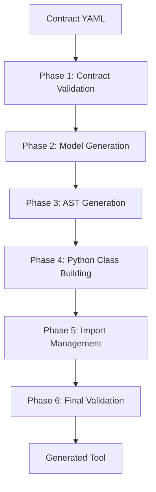

# Omnibase_3 Autogen System Analysis

**Date**: 2025-10-21
**Repository**: `../omnibase_3`
**Purpose**: Evaluate existing autogen code for autonomous node generation pipeline

---

## Executive Summary

Omnibase_3 contains a **comprehensive, production-grade code generation ecosystem** with 14 specialized tools implementing a 6-phase generation pipeline. The system is **36% modernized** to NodeBase patterns and demonstrates sophisticated AST manipulation, contract-driven generation, and event-based orchestration.

**Recommendation**: **REFACTOR & ADAPT** - The system is too sophisticated to discard but requires significant adaptation to work with new omnibase_core patterns.

---

## 1. File Inventory

### 1.1 Generation Tools (14 Total)

#### ✅ NodeBase Pattern Converted (5/14 - 36%)

| Tool | Location | LOC | Purpose | Status |
|------|----------|-----|---------|--------|
| `tool_contract_validator` | `src/omnibase/tools/generation/tool_contract_validator/v1_0_0/` | ~500 | Contract validation and compliance | **CONVERTED** |
| `tool_contract_driven_generator` | `src/omnibase/tools/generation/tool_contract_driven_generator/v1_0_0/` | ~550 | Primary model generation from contracts | **CONVERTED** |
| `tool_ast_generator` | `src/omnibase/tools/generation/tool_ast_generator/v1_0_0/` | ~280 | AST-based code generation | **CONVERTED** |
| `tool_python_class_builder` | `src/omnibase/tools/generation/tool_python_class_builder/v1_0_0/` | ~400 | Python class construction | **CONVERTED** |
| `tool_import_builder` | `src/omnibase/tools/generation/tool_import_builder/v1_0_0/` | ~300 | Import statement management | **CONVERTED** |

#### 🔄 Legacy Pattern - Needs Conversion (9/14 - 64%)

| Tool | Has registry/ | Has tools/ | Priority | Purpose |
|------|---------------|------------|----------|---------|
| `tool_reference_resolver` | ❌ | ❌ | High | Contract reference resolution |
| `tool_workflow_generator` | ❌ | ❌ | Medium | LlamaIndex workflow generation |
| `tool_model_regenerator` | ❌ | ❌ | Medium | Model regeneration utilities |
| `tool_file_writer` | ❌ | ❌ | Medium | File writing operations |
| `tool_protocol_generator` | ❌ | ❌ | Medium | Protocol interface generation |
| `tool_ast_renderer` | ❌ | ❌ | Low | AST to Python code rendering |
| `tool_type_import_registry` | ❌ | ❌ | Low | Type import management |
| `tool_node_stub_generator` | ❌ | ❌ | Low | Node stub generation |
| `tool_subcontract_loader` | ❌ | ❌ | Low | Subcontract loading |

### 1.2 Core Utilities (7 Files - ~2900 LOC)

Located in `src/omnibase/utils/generation/`:

| Utility | LOC | Purpose |
|---------|-----|---------|
| `utility_ast_builder.py` | 479 | AST node generation for Pydantic models/enums |
| `utility_contract_analyzer.py` | 658 | Contract parsing and analysis |
| `utility_enum_generator.py` | 440 | Enum class generation |
| `utility_type_mapper.py` | 330 | Schema type to Python type mapping |
| `utility_reference_resolver.py` | 303 | $ref resolution in contracts |
| `utility_schema_composer.py` | 301 | Schema composition and merging |
| `utility_schema_loader.py` | 205 | YAML schema loading |

### 1.3 Bootstrap Scripts

Located in `scripts/`:

| Script | Purpose | Status |
|--------|---------|--------|
| `bootstrap_model_generator.py` | Wrapper for contract-driven generator | ✅ Active |
| `bootstrap_extraction_tools_generator.py` | Extraction tool generation | ✅ Active |
| `regenerate_registry_artifacts.py` | Registry regeneration | ✅ Active |
| `generate_modern_tool_node.py` | Modern tool generation | ✅ Active |
| `generate_missing_models.py` | Missing model detection/generation | ✅ Active |

### 1.4 Templates

| Template | Location | Purpose |
|----------|----------|---------|
| `CONTRACT_TEMPLATE.yaml` | `templates/` | Unified ONEX contract structure |
| `contract_template_v2.yaml` | `templates/` | Enhanced contract template |
| Docker templates | `src/omnibase/tools/docker/environment_templates/` | Docker environment generation |

### 1.5 Documentation

Key documentation files in generation domain:

- `COMPLETE_GENERATION_FLOW.md` - End-to-end generation pipeline trace
- `README.md` - Comprehensive generation tools guide (680 lines)
- `hub_contract.yaml` - Generation hub orchestration contract
- Multiple PR descriptions documenting evolution

---

## 2. Architecture Summary

### 2.1 6-Phase Generation Pipeline



**Phase Details**:

1. **Contract Validation** (`tool_contract_validator`)
   - YAML syntax validation
   - Required field validation
   - Schema compliance checks
   - Performance: <100ms average

2. **Model Generation** (`tool_contract_driven_generator`)
   - Pydantic model generation from contract definitions
   - Type-safe models with proper imports
   - Zero tolerance for `Any` types
   - Performance: <500ms for complex contracts

3. **AST Generation** (`tool_ast_generator`)
   - Complete ONEX tool directory structure
   - `node.py` with NodeBase pattern
   - Proper `__init__.py` files
   - Contract copying and metadata

4. **Python Class Building** (`tool_python_class_builder`)
   - Python class structures with proper typing
   - Field definitions with constraints
   - Docstring generation

5. **Import Management** (`tool_import_builder`)
   - Import statement generation
   - Dependency resolution
   - Import optimization

6. **Final Validation**
   - Directory structure compliance
   - Import resolution verification
   - No `NotImplementedError` checks
   - Tool executability validation

### 2.2 Core Generation Patterns

#### Pattern 1: NodeBase Integration

```python
# Modern NodeBase pattern (5 converted tools)
class ToolContractDrivenGenerator:
    def __init__(self, container: ONEXContainer):
        self.container = container
        self._node_version = self.container.get_node_version()
        # Protocol-based utilities injected lazily

    @standard_error_handling("Contract-driven generation processing")
    def process(self, input_state) -> output_state:
        # Pure business logic
        pass

def main():
    """One-line main function - NodeBase handles everything."""
    return NodeBase(Path(__file__).parent / CONTRACT_FILENAME)
```

**NodeBase Provides**:
- CLI argument handling (`--introspect`, `--health-check`)
- Event integration (introspection publishing)
- Container setup from contract
- Service lifecycle management

#### Pattern 2: AST Manipulation

The system uses Python's `ast` module extensively:

```python
# From utility_ast_builder.py
def generate_model_class(self, class_name: str, schema: ModelSchema) -> ast.ClassDef:
    """Generate Pydantic model class from schema."""
    bases = [ast.Name(id="BaseModel", ctx=ast.Load())]
    body = [ast.Expr(value=ast.Constant(value=docstring))]

    # Generate fields from properties
    for field_name, field_schema in schema.properties.items():
        field_def = self.create_field_definition(field_name, field_schema, is_required)
        body.append(field_def)

    return ast.ClassDef(name=class_name, bases=bases, body=body, ...)
```

**AST Capabilities**:
- Type annotation generation
- Field definition with constraints
- Enum class generation
- Import statement generation
- Entire module generation

#### Pattern 3: Contract-Driven Generation

```yaml
# Contract template structure
tool_specification:
  main_tool_class: "ToolExampleProcessor"
  registry_class: "RegistryExampleTool"
  business_logic_pattern: "pure_functional"

input_state:
  required: ["action", "input_data"]
  full_schema: {$ref: "contracts/contract_models.yaml#/InputState"}

definitions:
  ModelAction:
    type: object
    properties:
      action_type:
        type: string
        enum: ["process", "validate"]
```

**Contract Features**:
- Hierarchical structure with subcontracts
- AI-optimized quick reference
- Semantic versioning
- Type-safe schemas
- Reference resolution

#### Pattern 4: Event-Driven Orchestration

```yaml
# From hub_contract.yaml
orchestration_workflows:
  generate_models_from_contract:
    event_sequence:
      - emit: "contract.validate"
        wait_for: "validation.complete"
      - emit: "ast.generate"
        wait_for: "ast_batch.generated"
      - emit: "ast.render"
        wait_for: "files.written"
```

**Event Architecture**:
- Event bus coordination between tools
- Sequential and parallel execution
- Workflow state management
- Remote tool execution support (planned)

### 2.3 Generation Hub

Located at `src/omnibase/tools/generation/tool_generation_hub/`:

**Capabilities**:
- Workflow orchestration
- Direct tool execution
- LlamaIndex workflow generation
- Dynamic workflow composition at runtime
- CLI integration

**Available Workflows**:
1. `quick_health_check` - Health check all generation tools
2. `validate_all_tools` - Comprehensive tool validation
3. `generate_tool` - Complete 6-phase tool generation
4. `generate_models_from_contract` - Contract-to-models pipeline
5. `execute_llamaindex_workflow` - Dynamic LlamaIndex execution
6. `compose_and_execute_dynamic_workflow` - Runtime workflow composition

---

## 3. What It Generates

### 3.1 Generated Artifacts

The system generates complete ONEX-compliant tools with:

#### Directory Structure
```
your_generated_tool/
├── v1_0_0/
│   ├── contract.yaml              # Source contract
│   ├── node.py                    # Tool class + NodeBase main()
│   ├── models/                    # Type-safe Pydantic models
│   │   ├── model_input_state.py   # Using ModelSemVer
│   │   ├── model_output_state.py  # No Dict[str, Any]
│   │   ├── model_*.py             # Additional definitions
│   │   └── __init__.py            # Proper exports
│   ├── protocols/                 # Protocol interfaces
│   │   └── protocol_*.py          # Duck typing protocols
│   └── scenarios/                 # Test scenarios
│       ├── scenario_basic.yaml
│       ├── scenario_errors.yaml
│       └── index.yaml
```

#### Generated Code Quality

**Input State Example**:
```python
"""Generated model: ModelToolInputState"""

from typing import Optional, List
from pydantic import BaseModel
from .model_action import ModelAction

class ModelToolInputState(BaseModel):
    """Input state for tool processing."""

    action: ModelAction
    input_data: str
    enable_validation: bool = True
    strict_mode: bool = False
    timeout_ms: int = 30000
```

**Enum Example**:
```python
from enum import Enum

class EnumProcessingStatus(str, Enum):
    """Processing status enumeration from contract definitions."""
    SUCCESS = 'success'
    PARTIAL_SUCCESS = 'partial_success'
    FAILURE = 'failure'
    CANCELLED = 'cancelled'
```

### 3.2 Generation Capabilities

| Capability | Status | Notes |
|------------|--------|-------|
| Pydantic models | ✅ | Full support with type-safe fields |
| Enums | ✅ | String enums with proper naming |
| Protocol interfaces | ✅ | Duck typing abstractions |
| Node.py structure | ✅ | NodeBase pattern with container injection |
| Contract metadata | ✅ | Complete contract copying |
| Test scenarios | 🔄 | Partial - basic scenarios generated |
| CLI integration | ✅ | Full CLI argument support |
| Import management | ✅ | Automatic import generation and optimization |
| Subcontract handling | ✅ | Reference resolution across files |
| Workflow generation | 🔄 | LlamaIndex workflow support |

---

## 4. Compatibility Assessment

### 4.1 Dependency Analysis

**Internal Dependencies** (omnibase_3 specific):
```python
from omnibase.core.node_base import NodeBase
from omnibase.core.onex_container import ONEXContainer
from omnibase.core.core_structured_logging import emit_log_event_sync
from omnibase.core.core_error_codes import CoreErrorCode
from omnibase.exceptions import OnexError
from omnibase.protocol.protocol_ast_builder import ProtocolASTBuilder
from omnibase.utils.generation.utility_ast_builder import UtilityASTBuilder
```

**No omnibase_core imports found** - System is entirely self-contained within omnibase_3.

### 4.2 Compatibility with New Paradigm

#### ❌ Incompatibilities

1. **Base Classes**:
   - Uses `omnibase.core.node_base.NodeBase` (different from omnibase_core)
   - Uses `omnibase.core.onex_container.ONEXContainer` (different DI pattern)
   - Protocol files in `omnibase.protocol.*` (different location)

2. **Error Handling**:
   - Uses `omnibase.exceptions.OnexError`
   - Uses `omnibase.core.core_error_codes.CoreErrorCode`
   - Error patterns may differ from omnibase_core

3. **Logging**:
   - Uses `omnibase.core.core_structured_logging`
   - Different logging infrastructure

4. **Type System**:
   - Uses `omnibase.model.core.model_schema.ModelSchema`
   - Uses `omnibase.model.core.model_semver.ModelSemVer`
   - Type models may differ from omnibase_core equivalents

5. **Contract Structure**:
   - Expects specific contract YAML structure
   - Subcontract loading patterns
   - Reference resolution mechanisms

#### ✅ Reusable Components

1. **AST Manipulation Logic** (~80% reusable):
   - Core AST generation algorithms
   - Type annotation generation
   - Field definition creation
   - Import statement generation
   - **Minimal adaptation needed**: Update import paths, base classes

2. **Contract Parsing Logic** (~70% reusable):
   - YAML loading and validation
   - Schema extraction
   - Reference resolution patterns
   - **Adaptation needed**: Contract format alignment

3. **Generation Patterns** (~90% reusable):
   - Model class generation
   - Enum generation
   - Protocol generation
   - Directory structure creation
   - **Minimal adaptation needed**: Template updates

4. **Workflow Orchestration Concepts** (~60% reusable):
   - 6-phase pipeline concept
   - Event-driven architecture
   - Parallel/sequential execution
   - **Significant adaptation needed**: Event system integration

### 4.3 Adaptation Requirements

#### High Priority (Must Adapt)

1. **Import Path Migration**:
   ```python
   # OLD (omnibase_3)
   from omnibase.core.node_base import NodeBase
   from omnibase.protocol.protocol_ast_builder import ProtocolASTBuilder

   # NEW (omnibase_core based)
   from omnibase_core.base.node_base import NodeBase
   from omnibase_core.protocols.ast_builder import ProtocolASTBuilder
   ```

2. **Contract Format Alignment**:
   - Align with omnibase_core contract schema
   - Update subcontract loading mechanisms
   - Adapt reference resolution

3. **Base Class Updates**:
   - Inherit from omnibase_core base classes
   - Update container injection patterns
   - Align with new protocol abstractions

#### Medium Priority (Should Adapt)

1. **Error Handling Standardization**:
   - Migrate to omnibase_core error types
   - Update error chaining patterns
   - Align error codes

2. **Type System Migration**:
   - Map ModelSchema to omnibase_core equivalents
   - Update ModelSemVer usage
   - Align type annotations

3. **Logging Infrastructure**:
   - Migrate to omnibase_core logging
   - Update log event structures

#### Low Priority (Can Defer)

1. **Event System Integration**:
   - Integrate with new event bus
   - Update workflow orchestration

2. **CLI Integration**:
   - Align with new CLI patterns
   - Update introspection mechanisms

---

## 5. Key Patterns & Utilities

### 5.1 AST Builder Utility

**Core Functionality**:
```python
class UtilityASTBuilder:
    def generate_model_class(self, class_name, schema, base_class="BaseModel"):
        """Generate Pydantic model class from schema."""
        # Creates complete AST ClassDef with:
        # - Proper base classes
        # - Docstrings
        # - Field definitions with type annotations
        # - Field() calls with constraints

    def create_field_definition(self, field_name, field_schema, is_required):
        """Create field with proper type annotation."""
        # Handles:
        # - Type annotation generation
        # - Field() call with constraints
        # - Optional/required field handling

    def get_type_annotation(self, schema):
        """Generate type annotation AST node."""
        # Supports:
        # - Basic types (str, int, float, bool)
        # - Complex types (List, Dict, Optional)
        # - References ($ref)
        # - Enums
        # - Custom model types
```

**Strengths**:
- ✅ Comprehensive type handling
- ✅ Proper AST node generation
- ✅ Reference resolution
- ✅ Enum detection and naming
- ✅ Constraint handling

**Weaknesses**:
- ❌ Some fallback to `Any` type
- ❌ Limited custom type extension
- ❌ Hardcoded naming conventions

### 5.2 Contract Analyzer Utility

**Core Functionality**:
```python
class UtilityContractAnalyzer:
    def load_contract(self, contract_path):
        """Load and parse contract YAML."""
        # YAML parsing with validation

    def extract_definitions(self, contract_data):
        """Extract all definitions from contract."""
        # Handles subcontract references

    def resolve_references(self, schema):
        """Resolve $ref references."""
        # Cross-file reference resolution
```

**Strengths**:
- ✅ Robust YAML parsing
- ✅ Subcontract handling
- ✅ Reference resolution
- ✅ Validation integration

### 5.3 Enum Generator Utility

**Core Functionality**:
```python
class UtilityEnumGenerator:
    def discover_enums_from_contract(self, contract_data):
        """Find all enum definitions in contract."""
        # Detects: type=string + enum array

    def generate_enum_class(self, enum_name, enum_values):
        """Generate enum class AST."""
        # Creates: class EnumX(str, Enum): ...
```

**Strengths**:
- ✅ Automatic enum detection
- ✅ Smart enum naming
- ✅ String enum support
- ✅ Value normalization

### 5.4 Type Mapper Utility

**Core Functionality**:
```python
class UtilityTypeMapper:
    def get_type_string_from_schema(self, schema):
        """Map schema type to Python type string."""
        # Handles:
        # - Basic types
        # - Complex types (List, Dict, Union)
        # - Format-based types (datetime, uuid)
        # - Custom model types

    def get_array_type_string(self, schema):
        """Generate List[X] type string."""

    def get_object_type_string(self, schema):
        """Generate Dict/Model type string."""
```

**Strengths**:
- ✅ Comprehensive type mapping
- ✅ Format detection (datetime, uuid)
- ✅ Nested type support
- ✅ Zero tolerance for `Any` in modern tools

---

## 6. Pros & Cons Analysis

### ✅ Pros

1. **Comprehensive & Production-Ready**:
   - 14 specialized tools with clear responsibilities
   - ~2900 LOC of tested utilities
   - 6-phase pipeline with clear contracts
   - Real-world usage in omnibase_3

2. **Sophisticated AST Manipulation**:
   - Complete AST generation for Pydantic models
   - Proper type annotation handling
   - Import management and optimization
   - Field constraint generation

3. **Contract-Driven Architecture**:
   - Well-designed contract templates
   - Subcontract support
   - Reference resolution
   - Type-safe schema parsing

4. **Modern Patterns** (36% adopted):
   - NodeBase integration
   - Container injection
   - Protocol abstractions
   - Event-driven orchestration

5. **Extensive Documentation**:
   - Complete flow diagrams
   - Pattern documentation
   - Multiple PR descriptions tracking evolution
   - Template examples

6. **Self-Bootstrapping**:
   - Tools generate themselves
   - Progressive modernization
   - Self-validation capabilities

### ❌ Cons

1. **Tight Coupling to omnibase_3**:
   - No omnibase_core compatibility
   - Custom base classes
   - Internal-only imports
   - Different DI patterns

2. **Incomplete Modernization** (64% legacy):
   - 9/14 tools still use legacy patterns
   - Mixed registry vs container injection
   - Inconsistent error handling
   - Performance specs missing

3. **Adaptation Overhead**:
   - All imports need updating
   - Base class migrations required
   - Contract format alignment needed
   - Error handling standardization

4. **Limited Extensibility**:
   - Hardcoded naming conventions
   - Limited custom type support
   - Some `Any` type usage in legacy tools
   - Fixed pipeline structure

5. **Complex Orchestration**:
   - Event bus dependency
   - Multi-tool coordination complexity
   - Workflow state management
   - Learning curve for maintenance

6. **Missing Features**:
   - Incomplete test scenario generation
   - Limited validation rule generation
   - No performance SLA specifications
   - Missing Consul integration

---

## 7. Recommendations

### 7.1 Primary Recommendation: **REFACTOR & ADAPT**

**Rationale**:
- System is too sophisticated and battle-tested to discard
- Core algorithms (AST manipulation, type mapping) are highly reusable
- 6-phase pipeline provides excellent foundation
- Self-bootstrapping capability is valuable

**Adaptation Strategy**: 3-Phase Approach

#### Phase 1: Core Utilities Migration (Week 1-2)

**Extract & Adapt Core Utilities**:
1. `utility_ast_builder.py` → `omniclaude/core/generation/ast_builder.py`
2. `utility_type_mapper.py` → `omniclaude/core/generation/type_mapper.py`
3. `utility_enum_generator.py` → `omniclaude/core/generation/enum_generator.py`
4. `utility_contract_analyzer.py` → `omniclaude/core/generation/contract_analyzer.py`

**Adaptation Work**:
```python
# Update imports
from omnibase_core.base.node_base import NodeBase
from omnibase_core.models.schema import ModelSchema

# Update base classes
class ASTBuilder:  # Remove "Utility" prefix
    def __init__(self, type_mapper=None, reference_resolver=None):
        # Keep same initialization

# Update type mappings to align with omnibase_core
```

**Estimated Effort**: 20-30 hours
**Risk**: Low - Pure utility functions, minimal dependencies

#### Phase 2: Contract-Driven Generator (Week 3-4)

**Adapt Core Generation Tool**:
1. Use adapted utilities from Phase 1
2. Update contract format to align with omnibase_core
3. Integrate with new DI patterns
4. Update error handling

**New Implementation**:
```python
class NodeGenerator(NodeBase):  # Inherit from omnibase_core NodeBase
    def __init__(self, container):
        super().__init__(container)
        self.ast_builder = ASTBuilder()
        self.type_mapper = TypeMapper()

    def generate_from_contract(self, contract_path):
        # Reuse generation logic with adapted utilities
        pass
```

**Estimated Effort**: 40-50 hours
**Risk**: Medium - Requires contract format alignment

#### Phase 3: Pipeline Integration (Week 5-6)

**Build Simplified Pipeline**:
1. 3-phase pipeline (vs 6-phase):
   - Validate contract
   - Generate code
   - Write files
2. Remove event bus dependency initially
3. Add event integration later if needed

**Implementation**:
```python
class GenerationPipeline:
    def __init__(self):
        self.validator = ContractValidator()
        self.generator = NodeGenerator()
        self.writer = FileWriter()

    def execute(self, contract_path, output_dir):
        # Phase 1: Validate
        validation = self.validator.validate(contract_path)

        # Phase 2: Generate
        generated = self.generator.generate_from_contract(contract_path)

        # Phase 3: Write
        self.writer.write_files(generated, output_dir)
```

**Estimated Effort**: 30-40 hours
**Risk**: Low - Simplified architecture

### 7.2 Alternative: Minimal Extraction

If full adaptation is too costly:

**Extract Only Essential Components**:
1. AST manipulation patterns (reference only)
2. Type mapping logic
3. Contract parsing patterns

**Build Simplified Generator**:
- Single-file generator (~500 LOC)
- Inline AST generation
- Simplified contract format
- No event bus dependency

**Estimated Effort**: 15-20 hours
**Risk**: Very Low
**Tradeoff**: Less sophisticated, limited features

### 7.3 Not Recommended: Direct Reuse

**Why Not**:
- ❌ Incompatible with omnibase_core
- ❌ Requires entire omnibase_3 dependency chain
- ❌ 64% legacy code needs modernization anyway
- ❌ Event bus and orchestration overhead
- ❌ Maintenance burden for omnibase_3-specific patterns

---

## 8. Conclusion

The omnibase_3 autogen system represents a **sophisticated, production-grade code generation framework** with ~4000 LOC of specialized tools and utilities. While not directly compatible with omnibase_core, **the core algorithms and patterns are highly valuable** and worth adapting.

**Key Takeaways**:

1. **System Quality**: Production-ready, battle-tested, self-bootstrapping
2. **Reusability**: ~70-80% of core logic is reusable with adaptation
3. **Adaptation Required**: Import paths, base classes, contract formats
4. **Best Approach**: Phased extraction and adaptation of core utilities
5. **Timeline**: 6-8 weeks for full adaptation, 2-3 weeks for minimal extraction

**Next Steps**:

1. ✅ **Decision**: Approve refactor & adapt strategy
2. **Phase 1**: Extract and adapt core utilities (2 weeks)
3. **Phase 2**: Build contract-driven generator (2 weeks)
4. **Phase 3**: Implement simplified pipeline (2 weeks)
5. **Validation**: Test with real node generation scenarios
6. **Documentation**: Create migration guide for future reference

---

## Appendix A: Code Statistics

```
Total Generation Tools:     14
NodeBase Converted:         5 (36%)
Legacy Pattern:             9 (64%)
Core Utilities:             7 files (~2900 LOC)
Bootstrap Scripts:          5 active
Templates:                  3 main templates
Documentation:              10+ markdown files
Test Coverage:              Moderate (scenarios exist)
Production Usage:           Active in omnibase_3
```

## Appendix B: Critical Files for Extraction

**Must Extract** (Core functionality):
1. `utility_ast_builder.py` (479 LOC)
2. `utility_type_mapper.py` (330 LOC)
3. `utility_enum_generator.py` (440 LOC)
4. `tool_contract_driven_generator/v1_0_0/node.py` (550 LOC)

**Should Extract** (Enhanced functionality):
1. `utility_contract_analyzer.py` (658 LOC)
2. `utility_reference_resolver.py` (303 LOC)
3. `tool_ast_generator/v1_0_0/node.py` (280 LOC)

**Nice to Have** (Advanced features):
1. `utility_schema_composer.py` (301 LOC)
2. `tool_workflow_generator/` (workflow generation)
3. Generation hub orchestration

## Appendix C: Compatibility Matrix

| Component | omnibase_3 | omnibase_core | Adaptation Effort |
|-----------|-----------|---------------|-------------------|
| AST Builder | ✅ Full | ⚠️ Needs adaptation | Medium |
| Type Mapper | ✅ Full | ⚠️ Needs adaptation | Low |
| Enum Generator | ✅ Full | ⚠️ Needs adaptation | Low |
| Contract Analyzer | ✅ Full | ❌ Major adaptation | High |
| NodeBase Pattern | ✅ Modern | ❌ Different base class | High |
| Container Injection | ✅ ONEXContainer | ❌ Different DI | Medium |
| Error Handling | ⚠️ Custom OnexError | ❌ Different patterns | Medium |
| Logging | ⚠️ Custom logging | ❌ Different system | Medium |
| Event System | ⚠️ Event bus | ❌ No equivalent | High |

---

**Analysis Complete** - Ready for decision and implementation planning.
