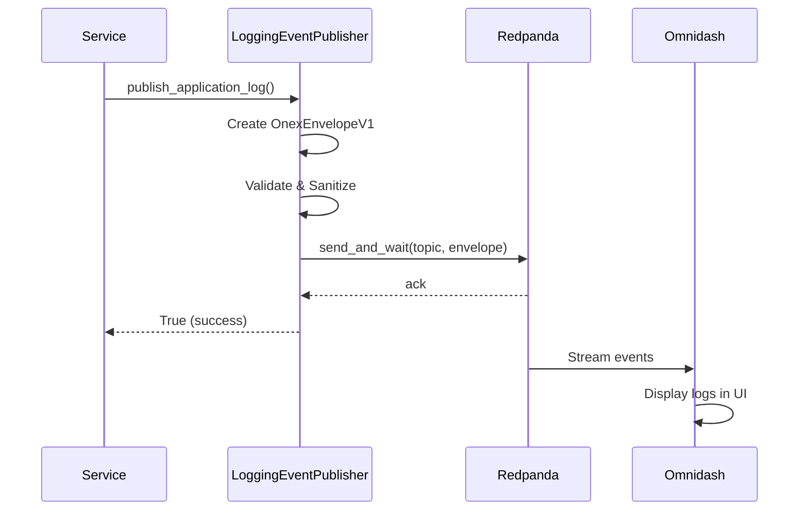

# Logging Event Publisher - Usage Guide

**Module**: `agents/lib/logging_event_publisher.py`
**Created**: 2025-11-13
**Phase**: Event Bus Alignment Phase 2 (OMN-34, OMN-35, OMN-36)

## Overview

The Logging Event Publisher provides structured logging capabilities via Kafka events, enabling real-time log streaming to omnidash and centralized log aggregation. This module publishes three types of logging events:

1. **Application Logs** (`omninode.logging.application.v1`) - Structured application logs
2. **Audit Logs** (`omninode.logging.audit.v1`) - Audit trail for compliance
3. **Security Logs** (`omninode.logging.security.v1`) - Security audit events

## Quick Start

### Basic Usage (One-off Publishing)

```python
from agents.lib.logging_event_publisher import (
    publish_application_log,
    publish_audit_log,
    publish_security_log,
)

# Application log
await publish_application_log(
    service_name="omniclaude",
    instance_id="omniclaude-1",
    level="INFO",
    logger_name="router.pipeline",
    message="Agent execution completed successfully",
    code="AGENT_EXECUTION_COMPLETED",
    context={"agent_name": "agent-api-architect", "duration_ms": 1234},
    correlation_id="abc-123-def-456",
)

# Audit log
await publish_audit_log(
    tenant_id="tenant-123",
    action="agent.execution",
    actor="user-456",
    resource="agent-api-architect",
    outcome="success",
    correlation_id="abc-123-def-456",
)

# Security log
await publish_security_log(
    tenant_id="tenant-123",
    event_type="api_key_used",
    user_id="user-456",
    resource="gemini-api",
    decision="allow",
    correlation_id="abc-123-def-456",
)
```

### Advanced Usage (Persistent Publisher)

For high-frequency logging, use a persistent publisher to avoid connection overhead:

```python
from agents.lib.logging_event_publisher import LoggingEventPublisher

# Initialize publisher
publisher = LoggingEventPublisher(
    bootstrap_servers="localhost:9092",  # Optional: defaults from config
    enable_events=True,  # Feature flag
)

try:
    # Start publisher (creates Kafka producer)
    await publisher.start()

    # Publish multiple logs
    for i in range(100):
        await publisher.publish_application_log(
            service_name="omniclaude",
            instance_id="omniclaude-1",
            level="INFO",
            logger_name="batch.processor",
            message=f"Processed batch {i}",
            code="BATCH_PROCESSED",
            context={"batch_id": i, "items": 50},
        )
finally:
    # Clean up
    await publisher.stop()
```

### Context Manager (Recommended)

```python
from agents.lib.logging_event_publisher import LoggingEventPublisherContext

async with LoggingEventPublisherContext() as publisher:
    await publisher.publish_application_log(
        service_name="omniclaude",
        instance_id="omniclaude-1",
        level="INFO",
        logger_name="router.pipeline",
        message="Agent execution started",
        code="AGENT_EXECUTION_STARTED",
    )

    # Publisher automatically started and stopped
```

## Adoption Strategy

### Recommended Rollout

**Phase 1 (Week 1)**: Critical Services
- Agent routing service
- Agent execution coordinator
- Intelligence collector

**Phase 2 (Week 2-3)**: High-Value Logging
- Quality gate validation
- Provider selection
- Performance metrics

**Phase 3 (Week 4+)**: General Adoption
- Remaining services gradually adopt dual logging
- File logging remains available (no forced migration)

### Best Practices

- **New services** should use dual logging from day 1
- **Dual logging** is the recommended pattern (not a temporary migration step)
- **File logging** will NOT be deprecated
- **Migration is optional** - use event logging where it adds value

### Prioritization Guide

Use event logging for:
- ✅ Audit trails (compliance requirements)
- ✅ Security events (incident response)
- ✅ Performance metrics (analytics)
- ✅ Cross-service correlation (distributed tracing)

Consider skipping for:
- ⚠️ High-volume debug logs (>1000/sec per service)
- ⚠️ Temporary development logging
- ⚠️ Legacy services with complex refactoring

## Architecture

### Event Flow



### Components

**LoggingEventPublisher**
- Async Kafka producer (aiokafka)
- OnexEnvelopeV1 format generation
- PII sanitization
- Graceful degradation

**Redpanda (Kafka)**
- Event bus
- Topic: `logging.{type}.v1`
- Retention: 7 days (default)
- Compression: gzip

**Omnidash**
- Log aggregation UI
- Real-time streaming
- Search and filtering
- Event correlation

## Event Types

### 1. Application Logs (`omninode.logging.application.v1`)

**Purpose**: Structured application logs for real-time monitoring and debugging

**Partition Key**: `service_name` (ensures all logs from same service are ordered)

**Parameters**:
- `service_name` (str, required): Service name (e.g., "omniclaude")
- `instance_id` (str, required): Instance identifier (e.g., "omniclaude-1")
- `level` (str, required): Log level ("INFO", "WARN", "ERROR", "DEBUG")
- `logger_name` (str, required): Logger name (e.g., "router.pipeline", "agent.executor")
- `message` (str, required): Log message
- `code` (str, required): Log code for categorization (e.g., "AGENT_EXECUTION_COMPLETED")
- `context` (dict, optional): Additional context (agent_name, duration_ms, etc.)
- `correlation_id` (str, optional): Correlation ID for request tracing

**Example**:
```python
await publisher.publish_application_log(
    service_name="omniclaude",
    instance_id="omniclaude-1",
    level="INFO",
    logger_name="router.pipeline",
    message="Agent routed successfully",
    code="AGENT_ROUTED",
    context={
        "agent_name": "agent-api-architect",
        "confidence_score": 0.95,
        "routing_time_ms": 7,
    },
    correlation_id="abc-123-def-456",
)
```

**Log Codes** (recommended standard):
- `AGENT_EXECUTION_STARTED` - Agent started
- `AGENT_EXECUTION_COMPLETED` - Agent completed successfully
- `AGENT_EXECUTION_FAILED` - Agent failed
- `AGENT_ROUTED` - Agent routing decision made
- `QUALITY_GATE_PASSED` - Quality gate validation passed
- `QUALITY_GATE_FAILED` - Quality gate validation failed
- `PROVIDER_SELECTED` - AI provider selected
- `KAFKA_EVENT_PUBLISHED` - Event published to Kafka
- `KAFKA_EVENT_FAILED` - Event publish failed

### 2. Audit Logs (`omninode.logging.audit.v1`)

**Purpose**: Audit trail for compliance and regulatory requirements

**Partition Key**: `tenant_id` (ensures all audit logs for same tenant are ordered)

**Parameters**:
- `tenant_id` (str, required): Tenant identifier (UUID or string)
- `action` (str, required): Action performed (e.g., "agent.execution", "api.call")
- `actor` (str, required): User or service that performed the action
- `resource` (str, required): Resource accessed (e.g., agent name, API endpoint)
- `outcome` (str, required): Outcome of the action ("success" or "failure")
- `correlation_id` (str, optional): Correlation ID for request tracing
- `context` (dict, optional): Additional context (duration_ms, quality_score, etc.)

**Example**:
```python
await publisher.publish_audit_log(
    tenant_id="tenant-123",
    action="agent.execution",
    actor="user-456",
    resource="agent-api-architect",
    outcome="success",
    correlation_id="abc-123-def-456",
    context={
        "duration_ms": 5432,
        "quality_score": 0.92,
        "execution_start": "2025-11-13T14:30:00Z",
        "execution_end": "2025-11-13T14:30:05Z",
    },
)
```

**Action Types** (recommended standard):
- `agent.execution` - Agent execution
- `api.call` - API call made
- `data.access` - Data accessed
- `config.change` - Configuration changed
- `user.login` - User login
- `user.logout` - User logout
- `permission.grant` - Permission granted
- `permission.revoke` - Permission revoked

### 3. Security Logs (`omninode.logging.security.v1`)

**Purpose**: Security audit events for monitoring and threat detection

**Partition Key**: `tenant_id` (ensures all security logs for same tenant are ordered)

**Parameters**:
- `tenant_id` (str, required): Tenant identifier (UUID or string)
- `event_type` (str, required): Security event type (e.g., "api_key_used", "permission_check")
- `user_id` (str, required): User identifier
- `resource` (str, required): Resource being accessed
- `decision` (str, required): Security decision ("allow" or "deny")
- `correlation_id` (str, optional): Correlation ID for request tracing
- `context` (dict, optional): Additional context (api_key_hash, ip_address, etc.)

**Example**:
```python
await publisher.publish_security_log(
    tenant_id="tenant-123",
    event_type="api_key_used",
    user_id="user-456",
    resource="gemini-api",
    decision="allow",
    correlation_id="abc-123-def-456",
    context={
        "api_key_hash": "sha256:abc123...",
        "ip_address": "192.168.1.1",
        "user_agent": "omniclaude/1.0.0",
        "request_path": "/api/v1/completion",
    },
)
```

**Event Types** (recommended standard):
- `api_key_used` - API key used for authentication
- `api_key_created` - New API key created
- `api_key_revoked` - API key revoked
- `permission_check` - Permission check performed
- `authentication_success` - Authentication succeeded
- `authentication_failure` - Authentication failed
- `authorization_success` - Authorization granted
- `authorization_failure` - Authorization denied
- `suspicious_activity` - Suspicious activity detected
- `rate_limit_exceeded` - Rate limit exceeded

## Configuration

### Environment Variables

The publisher uses centralized configuration from `config/settings.py`:

```bash
# Kafka configuration (required)
KAFKA_BOOTSTRAP_SERVERS=localhost:9092  # Or 192.168.86.200:29092 for production

# Optional: Feature flag to enable/disable events
KAFKA_ENABLE_LOGGING_EVENTS=true

# Optional: Tenant ID for multi-tenancy
TENANT_ID=default
```

### Publisher Configuration

```python
publisher = LoggingEventPublisher(
    bootstrap_servers="localhost:9092",  # Defaults to settings.kafka_bootstrap_servers
    enable_events=True,  # Feature flag to disable events
)
```

## Integration Examples

### Replace Existing Python Logging

```python
import logging
from agents.lib.logging_event_publisher import LoggingEventPublisher

# Standard Python logger
logger = logging.getLogger(__name__)

# Logging event publisher
logging_publisher = LoggingEventPublisher()
await logging_publisher.start()

try:
    # Your code
    result = await execute_agent_task()

    # Standard logging (file-based)
    logger.info(f"Agent completed: {result}")

    # Event logging (Kafka-based, visible in omnidash)
    await logging_publisher.publish_application_log(
        service_name="omniclaude",
        instance_id="omniclaude-1",
        level="INFO",
        logger_name=__name__,
        message=f"Agent completed: {result}",
        code="AGENT_EXECUTION_COMPLETED",
        context={"result": result},
    )
finally:
    await logging_publisher.stop()
```

### Dual Logging (File + Kafka)

Create a custom logger that logs to both file and Kafka:

```python
import logging
from typing import Optional
from agents.lib.logging_event_publisher import LoggingEventPublisher

class DualLogger:
    """Logger that writes to both file and Kafka."""

    def __init__(self, logger_name: str, service_name: str, instance_id: str):
        self.logger = logging.getLogger(logger_name)
        self.service_name = service_name
        self.instance_id = instance_id
        self.event_publisher = LoggingEventPublisher()

    async def start(self):
        await self.event_publisher.start()

    async def stop(self):
        await self.event_publisher.stop()

    async def info(self, message: str, code: str, context: Optional[dict] = None, correlation_id: Optional[str] = None):
        # File logging (synchronous)
        self.logger.info(message)

        # Event logging (asynchronous)
        await self.event_publisher.publish_application_log(
            service_name=self.service_name,
            instance_id=self.instance_id,
            level="INFO",
            logger_name=self.logger.name,
            message=message,
            code=code,
            context=context or {},
            correlation_id=correlation_id,
        )

    # Similar methods for warn, error, debug...
```

### Audit Trail Integration

```python
async def execute_agent_with_audit(
    tenant_id: str,
    user_id: str,
    agent_name: str,
    user_request: str,
    correlation_id: str,
):
    """Execute agent with complete audit trail."""

    async with LoggingEventPublisherContext() as publisher:
        # Log audit: agent execution started
        await publisher.publish_audit_log(
            tenant_id=tenant_id,
            action="agent.execution.started",
            actor=user_id,
            resource=agent_name,
            outcome="success",
            correlation_id=correlation_id,
        )

        try:
            # Execute agent
            result = await execute_agent(agent_name, user_request, correlation_id)

            # Log audit: agent execution completed
            await publisher.publish_audit_log(
                tenant_id=tenant_id,
                action="agent.execution.completed",
                actor=user_id,
                resource=agent_name,
                outcome="success",
                correlation_id=correlation_id,
                context={"result_summary": result["summary"]},
            )

            return result

        except Exception as e:
            # Log audit: agent execution failed
            await publisher.publish_audit_log(
                tenant_id=tenant_id,
                action="agent.execution.failed",
                actor=user_id,
                resource=agent_name,
                outcome="failure",
                correlation_id=correlation_id,
                context={"error": str(e)},
            )
            raise
```

### Security Monitoring Integration

```python
async def check_api_key_and_log(
    tenant_id: str,
    user_id: str,
    api_key: str,
    resource: str,
    correlation_id: str,
):
    """Check API key validity and log security event."""

    async with LoggingEventPublisherContext() as publisher:
        # Validate API key
        is_valid = await validate_api_key(api_key)

        # Log security event
        await publisher.publish_security_log(
            tenant_id=tenant_id,
            event_type="api_key_used",
            user_id=user_id,
            resource=resource,
            decision="allow" if is_valid else "deny",
            correlation_id=correlation_id,
            context={
                "api_key_hash": hashlib.sha256(api_key.encode()).hexdigest(),
                "validation_result": "valid" if is_valid else "invalid",
            },
        )

        if not is_valid:
            raise UnauthorizedError("Invalid API key")
```

## Event Envelope Structure

All logging events follow the OnexEnvelopeV1 structure:

```json
{
  "event_type": "omninode.logging.application.v1",
  "event_id": "550e8400-e29b-41d4-a716-446655440000",
  "timestamp": "2025-11-13T14:30:00.123456Z",
  "tenant_id": "default",
  "namespace": "omninode",
  "source": "omniclaude",
  "correlation_id": "abc-123-def-456",
  "causation_id": "abc-123-def-456",
  "schema_ref": "registry://omninode/logging/application/v1",
  "payload": {
    "service_name": "omniclaude",
    "instance_id": "omniclaude-1",
    "level": "INFO",
    "logger": "router.pipeline",
    "message": "Agent execution completed successfully",
    "code": "AGENT_EXECUTION_COMPLETED",
    "context": {
      "agent_name": "agent-api-architect",
      "duration_ms": 1234
    }
  }
}
```

## Performance Characteristics

**Publisher Lifecycle**:
- Start overhead: ~50ms (Kafka connection)
- Stop overhead: ~20ms (graceful shutdown)
- Memory overhead: <10MB per publisher instance

**Publishing Performance** (local Kafka):
- Publish time (p50): ~3ms
- Publish time (p95): ~10ms
- Publish time (p99): ~25ms
- Throughput: >1000 events/second per publisher

**Production Performance** (remote Kafka):
- Publish time (p50): ~8ms
- Publish time (p95): ~20ms
- Publish time (p99): ~50ms
- Throughput: >500 events/second per publisher

## Error Handling

### Graceful Degradation

The publisher is designed to never block application execution:

```python
# Publishing returns False on error, never raises exceptions
success = await publisher.publish_application_log(...)

if not success:
    # Log to file as fallback
    logger.error("Failed to publish log event, falling back to file logging")
```

### Feature Flag

Disable events in environments where Kafka is not available:

```python
publisher = LoggingEventPublisher(enable_events=False)

# All publish calls will be no-ops
await publisher.publish_application_log(...)  # Returns False immediately
```

### Connection Failures

Publisher handles Kafka connection failures gracefully:

```python
try:
    await publisher.start()
except KafkaError:
    # Handle error (e.g., use file logging only)
    logger.warning("Kafka unavailable, using file logging only")
    publisher = LoggingEventPublisher(enable_events=False)
```

## Security Best Practices

### ⚠️ NEVER Log Sensitive Data

The following should NEVER appear in `context` or event fields:
- Passwords, API keys, tokens, secrets
- Raw credit card numbers, SSNs
- Unencrypted PII (email, phone, address)

### 🛡️ Automatic PII Sanitization

The publisher **automatically redacts** sensitive data from context dictionaries using **two detection methods**:

**1. Hardcoded Sensitive Keys** (exact match, case-insensitive):
- `password`, `passwd`, `pwd`
- `secret`, `api_key`, `apikey`, `api-key`
- `token`, `auth_token`, `access_token`, `refresh_token`
- `private_key`, `credentials`
- `ssn`, `credit_card`, `email`
- `auth`, `authorization`, `bearer`, `jwt`
- `session`, `cookie`

**2. Regex Pattern Matching** (flexible pattern matching):
- Any key ending with `_key` (e.g., `stripe_key`, `github_api_key`)
- Any key ending with `_token` (e.g., `jwt_token`, `oauth_token`)
- Any key ending with `_secret` (e.g., `oauth_secret`, `client_secret`)
- Any key ending with `password` (e.g., `database_password`, `admin_password`)

**Example - Automatic Redaction**:
```python
await publisher.publish_application_log(
    service_name="omniclaude",
    instance_id="omniclaude-1",
    level="INFO",
    logger_name="database.connection",
    message="Database connection established",
    code="DB_CONNECTED",
    context={
        "database_host": "db.example.com",  # Preserved
        "database_password": "secret123",   # REDACTED (matches regex pattern)
        "connection_pool_size": 10,         # Preserved
        "api_key": "sk-abc123",             # REDACTED (matches hardcoded key)
        "stripe_key": "sk_live_xyz",        # REDACTED (matches regex pattern)
    },
)

# Published context will be:
# {
#     "database_host": "db.example.com",
#     "database_password": "[REDACTED]",
#     "connection_pool_size": 10,
#     "api_key": "[REDACTED]",
#     "stripe_key": "[REDACTED]",
# }
```

**Nested dictionaries** are recursively sanitized up to 10 levels deep:
```python
context = {
    "user": "john_doe",  # Preserved
    "auth": {            # Nested sanitization
        "password": "secret123",      # REDACTED
        "credentials": {
            "api_key": "sk-abc",      # REDACTED
            "normal_field": "value",  # Preserved
        },
    },
}
```

**Note**: While automatic sanitization provides defense-in-depth protection, **best practice** is to never pass sensitive data to the publisher in the first place.

### ✅ Safe Practices

1. **Hash sensitive identifiers**:
   ```python
   import hashlib

   context = {
       "user_id_hash": hashlib.sha256(user_id.encode()).hexdigest(),
       "session_id": session_id,  # OK if not personally identifying
   }
   ```

2. **Redact or truncate**:
   ```python
   context = {
       "email_domain": email.split('@')[1],  # Just domain
       "card_last4": card_number[-4:],  # Last 4 digits only
   }
   ```

3. **Use allowlists, not blocklists**:
   Define what CAN be logged, don't try to filter what can't.

### 🔒 Production Considerations

- Enable Kafka encryption (SSL/TLS) in production
- Use SASL/SCRAM for authentication
- Set up log retention policies (30-90 days max)
- Consider GDPR right-to-deletion for user logs
- Implement audit logging for sensitive operations
- Never log credentials or authentication tokens

## Performance Considerations

### Convenience Functions vs. Persistent Publishers

**Convenience Functions** (`publish_application_log()`, etc.):
- ✅ **Pros**: Simple API, automatic connection management, async context manager
- ⚠️ **Cons**: ~50ms overhead per call (new connection each time)
- **Use when**: Infrequent logging (<10 events/second), simple scripts, one-off operations

**Persistent Publishers** (`LoggingEventPublisher` class):
- ✅ **Pros**: No connection overhead, better throughput (100+ events/second)
- ⚠️ **Cons**: Manual lifecycle management, must call `start()` and `stop()`
- **Use when**: High-frequency logging, long-running services, performance-critical paths

**Example - High-Performance Pattern**:
```python
# Application startup
publisher = LoggingEventPublisher()
await publisher.start()

# In your code (no connection overhead)
for event in events:
    await publisher.publish_application_log(...)

# Application shutdown
await publisher.stop()
```

**Benchmarks**:
- Convenience function: ~50ms per event (includes connection setup/teardown)
- Persistent publisher: ~2-5ms per event (connection already established)
- Throughput: Persistent publisher handles 100+ events/second vs 20/second for convenience

**Recommendation**: Start with convenience functions for simplicity. Migrate to persistent publishers when:
- Event volume exceeds 50/second
- Latency becomes a bottleneck
- Connection churn impacts Kafka broker

## Testing

### Unit Tests

Run unit tests with mocked Kafka:

```bash
pytest agents/tests/test_logging_event_publisher.py -v
```

### Integration Tests

Run integration tests with actual Kafka (requires running Kafka instance):

```bash
pytest agents/tests/test_logging_event_publisher.py -v -m integration
```

## Monitoring

### Kafka Topics

Monitor these topics for logging events:

- `omninode.logging.application.v1` - Application logs
- `omninode.logging.audit.v1` - Audit logs
- `omninode.logging.security.v1` - Security logs

### Consumer Example

```bash
# Consume application logs
kafkacat -b localhost:9092 -t omninode.logging.application.v1 -C -f '%s\n'

# Consume audit logs
kafkacat -b localhost:9092 -t omninode.logging.audit.v1 -C -f '%s\n'

# Consume security logs
kafkacat -b localhost:9092 -t omninode.logging.security.v1 -C -f '%s\n'
```

## Migration Guide

### Migrating from File-Based Logging

**Before**:
```python
import logging

logger = logging.getLogger(__name__)
logger.info("Agent execution completed")
```

**After** (dual logging):
```python
import logging
from agents.lib.logging_event_publisher import publish_application_log

logger = logging.getLogger(__name__)

# File logging (unchanged)
logger.info("Agent execution completed")

# Event logging (new)
await publish_application_log(
    service_name="omniclaude",
    instance_id="omniclaude-1",
    level="INFO",
    logger_name=__name__,
    message="Agent execution completed",
    code="AGENT_EXECUTION_COMPLETED",
)
```

## Best Practices

1. **Use correlation IDs**: Always include correlation_id for request tracing
2. **Use standard log codes**: Follow the recommended log code conventions
3. **Include rich context**: Add relevant context fields for debugging
4. **Use appropriate log levels**: INFO for normal flow, WARN for recoverable issues, ERROR for failures
5. **Partition key policy**: Application logs use service_name, audit/security use tenant_id
6. **Persistent publishers**: For high-frequency logging, use persistent publishers to avoid connection overhead
7. **Graceful degradation**: Always have fallback to file logging if Kafka unavailable

## Adoption Strategy

### Migration Philosophy

**No forced migration** - dual logging (file + Kafka) is the standard approach. File logging will NOT be deprecated.

### Phased Rollout

**Phase 1: Critical Path Services** (Week 1)
Priority services that benefit most from event-based logging:
- Agent routing service
- Agent execution coordinator
- Intelligence collector
- Quality gate validation

**Phase 2: High-Value Logging** (Week 2-3)
Services with valuable observability signals:
- Provider selection and failover
- Performance metrics collection
- Error tracking and recovery
- Workflow orchestration

**Phase 3: Gradual Migration** (Week 4+)
- Remaining services adopt dual logging pattern
- New services use dual logging from day 1
- Legacy services continue file logging indefinitely

### When to Use Event-Based Logging

Choose event-based logging when you need:
- ✅ **Centralized aggregation** across distributed services
- ✅ **Real-time monitoring** with dashboards and alerts
- ✅ **Structured querying** and correlation (correlation_id tracking)
- ✅ **Long-term retention** with searchable history
- ✅ **Multi-tenant isolation** with tenant_id filtering

Continue file logging when you need:
- ✅ **Simple debugging** on local development
- ✅ **Offline analysis** without infrastructure dependencies
- ✅ **Low-overhead logging** for high-frequency events
- ✅ **Legacy compatibility** with existing tools

### Implementation Checklist

For each service adopting event-based logging:

- [ ] Add `LoggingEventPublisher` to service dependencies
- [ ] Configure `KAFKA_BOOTSTRAP_SERVERS` environment variable
- [ ] Choose convenience functions or persistent publisher based on volume
- [ ] Add correlation_id tracking throughout request lifecycle
- [ ] Set appropriate tenant_id for multi-tenant services
- [ ] Test event publishing in development environment
- [ ] Verify events appear in Kafka topics
- [ ] Set up monitoring/alerts for logging failures
- [ ] Document service-specific logging conventions
- [ ] Update runbooks with event-based troubleshooting steps

## Production Deployment Checklist

### Pre-Deployment

Infrastructure:
- [ ] Kafka cluster configured with appropriate retention (7 days recommended)
- [ ] Kafka topics created with correct partition count
- [ ] Kafka authentication configured (SASL/SCRAM if required)
- [ ] Network connectivity verified from all services

Monitoring:
- [ ] Prometheus metrics exported and scraped
- [ ] Grafana dashboards created for logging metrics
- [ ] Alert rules configured:
  - High error rate (>10 events/min with `status=error`)
  - Publish latency > 100ms (p95)
  - Kafka connection failures

Integration:
- [ ] Omnidash configured to consume logging topics
- [ ] Log retention policies aligned with compliance requirements
- [ ] PII scrubbing verified for sensitive services

Testing:
- [ ] Load testing completed (>1000 events/sec for 10 minutes)
- [ ] Failover tested (Kafka down, publisher degradation verified)
- [ ] Large payload handling tested (1MB limit enforcement)

### Deployment

- [ ] Deploy to staging first
- [ ] Verify events in Omnidash staging instance
- [ ] Monitor Kafka lag and consumer group health
- [ ] Gradual rollout (10% → 50% → 100%)

### Post-Deployment Monitoring

**Metrics to Track**:
- `logging_events_published_total` (by event_type, status)
- `logging_publish_latency_seconds` (p50, p95, p99)
- `logging_kafka_errors_total` (by error_type)
- `logging_publisher_started` (gauge - should be 1)

**Kafka Metrics**:
- Broker lag
- Producer connection count
- Topic size and retention

**Alerts**:
- Error rate > 10/min for 5 minutes
- p95 latency > 100ms for 5 minutes
- Kafka connection failures
- Publisher stopped unexpectedly

### Rollback Plan

- [ ] Feature flag `KAFKA_ENABLE_LOGGING_EVENTS=false` tested
- [ ] File logging confirmed as fallback
- [ ] Rollback procedure documented
- [ ] Zero-downtime rollback tested

### Production Readiness Criteria

All must be met before production deployment:
- ✅ All pre-deployment checks passed
- ✅ Staging tested for 24 hours without issues
- ✅ Monitoring and alerts configured
- ✅ Runbook created for common issues
- ✅ On-call team trained on troubleshooting

## Troubleshooting

### Events Not Appearing in Kafka

1. Check Kafka connectivity:
   ```bash
   kafkacat -b localhost:9092 -L
   ```

2. Verify feature flag:
   ```python
   publisher = LoggingEventPublisher(enable_events=True)  # Must be True
   ```

3. Check publisher is started:
   ```python
   await publisher.start()  # Must be called before publishing
   ```

### Slow Publishing

1. Use persistent publisher instead of one-off convenience functions
2. Check network latency to Kafka broker
3. Consider batching logs (e.g., batch 100 logs, publish every 1 second)

### High Memory Usage

1. Stop publishers when no longer needed:
   ```python
   await publisher.stop()
   ```

2. Use context manager for automatic cleanup:
   ```python
   async with LoggingEventPublisherContext() as publisher:
       # Automatically stopped on exit
   ```

## See Also

- [Event Bus Integration Guide](../../docs/events/EVENT_BUS_INTEGRATION_GUIDE.md)
- [Event Alignment Plan](../../docs/events/EVENT_ALIGNMENT_PLAN.md) - Phase 2
- [Agent Execution Publisher](./AGENT_EXECUTION_PUBLISHER_USAGE.md)
- [Partition Key Policy](./README_PARTITION_KEY_POLICY.md)

## Support

For questions or issues:
- GitHub Issues: https://github.com/OmniNode-ai/omniclaude/issues
- Internal Slack: #omniclaude-support
