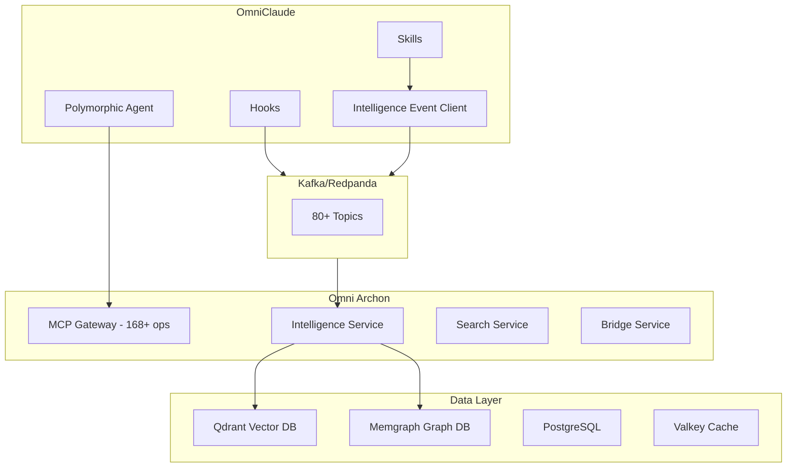

# Comprehensive System Architecture Documentation - Plan

**Status**: Planned, Awaiting Re-ingestion Completion
**Created**: 2025-10-24
**Target**: Post omniarchon re-ingestion (Qdrant + Memgraph)

## Overview

Create comprehensive architecture documentation with diagrams covering the entire system (omniclaude + omniarchon + infrastructure), leveraging intelligence gathered from Qdrant vector search and Memgraph relationship analysis after re-ingestion completes.

## Execution Strategy

**Hybrid Approach** (Option B from planning session):
- Use existing intelligence operations + manual assembly
- Leverage intelligence service for pattern discovery
- Use Polly research agent for codebase analysis
- Gather service metadata via health checks
- Manually create Mermaid diagrams from discovered info
- Assemble documentation with intelligence-gathered data

**Effort**: 2-3 hours after re-ingestion
**Readiness**: 95% - Can use infrastructure built today

## Phase Breakdown

### Phase 1: Service Discovery via Health Checks and Docker Introspection

**Tools**:
- Docker introspection: `docker ps`, `docker inspect`
- Service health checks: `curl http://localhost:*/health`
- Port mapping analysis

**Deliverables**:
- Complete service inventory (11 omniarchon services + omniclaude components)
- Port mappings and network topology
- Service dependencies and startup order
- Health status and connection matrix

**Commands**:
```bash
# Service discovery
docker ps --format "table {{.Names}}\t{{.Status}}\t{{.Ports}}"

# Health checks
for port in 8051 8053 8054 8055 8181; do
  curl -s http://localhost:$port/health | jq .
done

# Network topology
docker network inspect omninode_bridge_omninode-bridge-network
```

### Phase 2: Pattern Analysis Using /request-intelligence

**Operations**:
- Pattern discovery for integration points
- Code analysis for key components
- Quality assessment for critical paths

**Commands**:
```bash
# Discover effect nodes
/request-intelligence \
  --operation pattern-discovery \
  --source-path "node_*_effect.py" \
  --language python

# Discover orchestrators
/request-intelligence \
  --operation pattern-discovery \
  --source-path "node_*_orchestrator.py" \
  --language python

# Analyze event handlers
/request-intelligence \
  --operation code-analysis \
  --file path/to/handler.py \
  --include-metrics
```

**Deliverables**:
- Integration pattern catalog
- Event handler inventory
- Node type distribution
- Code quality metrics

### Phase 3: Research Both Codebases via Polly

**Dispatch Polly with research role**:
```
Research omniclaude codebase structure and key components
Research omniarchon microservices architecture and integration points
Analyze event bus infrastructure and topic topology
```

**Focus Areas**:
- omniclaude: Hooks, Skills, Agents, Event Infrastructure
- omniarchon: 11 microservices, Intelligence Adapter, Event Handlers
- Integration: Kafka topics, MCP protocol, Shared patterns

**Deliverables**:
- Codebase structure analysis
- Component relationships
- Integration patterns
- Key file locations

### Phase 4: Wait for Omniarchon Re-ingestion (Qdrant + Memgraph)

**Prerequisites**:
- ✅ Multi-codebase indexing into Qdrant
- ✅ Relationship extraction into Memgraph
- ✅ Pattern storage and traceability
- ✅ Document freshness system active

**Status Check**:
```bash
# Check Qdrant collections
curl http://localhost:6333/collections

# Check Memgraph data
echo "MATCH (n) RETURN count(n);" | docker exec -i archon-memgraph mgconsole

# Verify intelligence adapter
curl http://localhost:8053/health
```

**Estimated Timeline**: Running in parallel (user's separate workflow)

### Phase 5: Query Qdrant/Memgraph for Relationship Insights

**Qdrant Queries** (via /request-intelligence):
```bash
# Find similar patterns across codebases
/request-intelligence \
  --operation pattern-discovery \
  --source-path "integration_patterns" \
  --language python

# Analyze code relationships
/request-intelligence \
  --operation code-analysis \
  --source-path "event_handlers" \
  --include-metrics
```

**Memgraph Queries** (direct Cypher):
```cypher
-- Service dependencies
MATCH (s1:Service)-[r:DEPENDS_ON]->(s2:Service)
RETURN s1.name, type(r), s2.name;

-- Integration points
MATCH (c:Component)-[r:INTEGRATES_WITH]->(s:Service)
RETURN c.name, r.method, s.name;

-- Event flow topology
MATCH (p:Producer)-[:PUBLISHES]->(t:Topic)<-[:CONSUMES]-(c:Consumer)
RETURN p.name, t.name, c.name;

-- Cross-repo relationships
MATCH (oc:OmniClaudeComponent)-[r]-(oa:OmniArchonService)
RETURN oc.name, type(r), oa.name;
```

**Deliverables**:
- Service dependency graph
- Integration point map
- Event flow topology
- Cross-repo relationship matrix

### Phase 6: Generate Mermaid Diagrams

**Diagrams to Create**:

#### 6.1 Overall System Architecture


#### 6.2 Service Interaction Map
- 11 omniarchon microservices
- HTTP endpoints and port mappings
- MCP protocol integration
- Kafka event subscriptions

#### 6.3 Event Bus Topology
- 80+ Kafka topics
- Producer/consumer relationships
- Event types and payloads
- Request/response patterns

#### 6.4 Data Flow Diagram
- Intelligence request flow
- Pattern discovery workflow
- Hook event publishing
- Caching and persistence

**Tools**: Mermaid syntax, PlantUML (optional)

### Phase 7: Assemble Comprehensive Documentation

**Master Document Structure**:

```markdown
# Comprehensive System Architecture

## 1. Executive Summary
- System overview
- Key components
- Integration highlights
- Performance metrics

## 2. System Architecture
### 2.1 Overall Architecture [Diagram from 6.1]
### 2.2 Component Breakdown
- omniclaude components
- omniarchon services
- Infrastructure services

## 3. Service Catalog
### 3.1 OmniArchon Services (11 total)
[For each service: purpose, port, endpoints, dependencies]

### 3.2 OmniClaude Components
[Hooks, Skills, Agents, Event Infrastructure]

## 4. Integration Architecture
### 4.1 Kafka Event Bus [Diagram from 6.3]
### 4.2 MCP Protocol Integration
### 4.3 Intelligence Service Integration
### 4.4 Data Layer Integration

## 5. Event-Driven Architecture
### 5.1 Event Topics (80+)
### 5.2 Event Handlers (21+ registered)
### 5.3 Request-Response Patterns
### 5.4 Event Flow Examples

## 6. Data Architecture
### 6.1 Qdrant Vector Search
### 6.2 Memgraph Relationships
### 6.3 PostgreSQL Persistence
### 6.4 Valkey Caching

## 7. Intelligence Infrastructure
### 7.1 Intelligence Adapter
### 7.2 Pattern Discovery
### 7.3 Code Analysis
### 7.4 Quality Assessment

## 8. Network Topology
### 8.1 Port Mappings
### 8.2 Docker Networks
### 8.3 Service Discovery
### 8.4 Load Balancing

## 9. Deployment Architecture
### 9.1 Docker Compose
### 9.2 Container Dependencies
### 9.3 Volume Mounts
### 9.4 Environment Configuration

## 10. Performance Characteristics
### 10.1 Response Times
### 10.2 Throughput Metrics
### 10.3 Resource Utilization
### 10.4 Optimization Opportunities

## Appendices
### A. Port Reference Guide
### B. Kafka Topic Catalog
### C. MCP Operation Index
### D. Environment Variables
### E. Troubleshooting Guide
```

**Deliverable**: `docs/COMPREHENSIVE_SYSTEM_ARCHITECTURE.md`

## Success Criteria

✅ **Completeness**:
- All 11 omniarchon services documented
- All omniclaude components covered
- All integration points mapped
- All event topics cataloged

✅ **Accuracy**:
- Diagrams match actual implementation
- Port mappings verified
- Service dependencies validated
- Event flows tested

✅ **Utility**:
- Onboarding documentation for new developers
- Reference for debugging integration issues
- Planning guide for new features
- Troubleshooting resource

## Prerequisites

- [x] Intelligence service integration complete (TODAY)
- [x] Event infrastructure operational (TODAY)
- [x] Pattern discovery capability (stub working)
- [ ] Omniarchon re-ingestion complete (IN PROGRESS)
- [ ] Qdrant data available for queries
- [ ] Memgraph relationships populated

## Execution Timeline

**After Re-ingestion Complete**:
- Day 1: Phases 1-3 (Service discovery, Pattern analysis, Research) - 2-3 hours
- Day 2: Phase 5 (Qdrant/Memgraph queries) - 1-2 hours
- Day 3: Phases 6-7 (Diagrams + Assembly) - 3-4 hours

**Total**: ~6-9 hours spread over 3 days

## Synergy with Current Work

### Intelligence Infrastructure (Built Today)
- ✅ `/request-intelligence` skill ready for pattern queries
- ✅ Event client can gather intelligence
- ✅ Hook adapter can publish observability events
- ✅ Polly can dispatch research tasks

### Re-ingestion Workflow (Parallel Work)
- Provides Qdrant data for Phase 5 queries
- Populates Memgraph with relationships
- Enables full pattern discovery
- Gives comprehensive codebase insights

### Future Automation
Once documentation is assembled manually, we can:
1. Create automated documentation generation handler in omniarchon
2. Trigger documentation updates on codebase changes
3. Auto-generate diagrams from Memgraph queries
4. Maintain living documentation system

## Related Documentation

- `INTELLIGENCE_SERVICE_INTEGRATION_STATUS.md` - Integration status
- `UNIFIED_EVENT_INFRASTRUCTURE.md` - Event architecture
- `KAFKA_PORT_CONFIGURATION.md` - Port mappings
- `PATTERN_DISCOVERY_INTEGRATION.md` - Pattern discovery design

## Notes

- **Non-Blocking**: Can proceed with other work while waiting for re-ingestion
- **Incremental**: Phases 1-3 can be done now, Phases 4-7 after re-ingestion
- **Collaborative**: Leverages both manual and automated intelligence gathering
- **Living Document**: Can be updated as system evolves

---

**Status**: Plan captured, ready to execute post-re-ingestion
**Next Action**: Wait for re-ingestion completion notification
**Estimated Start**: When user confirms Qdrant/Memgraph data ready
