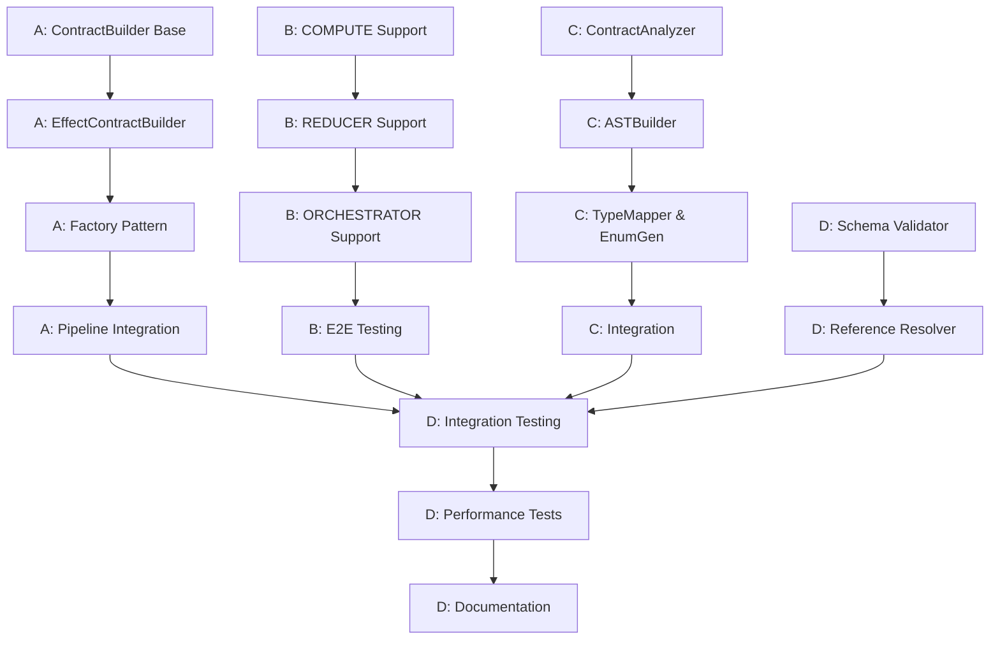

# Phase 2 Parallel Execution Matrix

**Generated**: 2025-10-21
**Purpose**: Coordination strategy for 4-agent parallel execution

---

## Overview

This matrix defines which tasks can run concurrently, dependencies between streams, resource allocation, and synchronization points.

---

## Work Stream Assignment

| Stream | Agent | Primary Focus | Duration | Risk Level |
|--------|-------|---------------|----------|------------|
| **A** | Agent-Contract | Contract Model Integration | 2 weeks | Low-Medium |
| **B** | Agent-NodeTypes | Node Type Support (4 types) | 2 weeks | Medium |
| **C** | Agent-Utils | omnibase_3 Utilities Migration | 2 weeks | Medium-High |
| **D** | Agent-QA | Enhanced Validation & Testing | 2 weeks | Low |

---

## Week 1: Independent Parallel Execution

### Monday - Tuesday (Days 1-2)

| Hour | Agent-Contract (A) | Agent-NodeTypes (B) | Agent-Utils (C) | Agent-QA (D) |
|------|-------------------|---------------------|-----------------|--------------|
| 0-4  | Create ContractBuilder base | Update PromptParser (COMPUTE) | Port ContractAnalyzer | Implement schema validator |
| 4-8  | Implement EffectContractBuilder | Create COMPUTE template | Port ASTBuilder | Add reference resolution |

**Dependencies**: None - all tasks independent
**Merge Risk**: Low (no shared files)
**Sync Meeting**: End of Day 2 (30 min standup)

### Wednesday - Thursday (Days 3-4)

| Hour | Agent-Contract (A) | Agent-NodeTypes (B) | Agent-Utils (C) | Agent-QA (D) |
|------|-------------------|---------------------|-----------------|--------------|
| 0-4  | Create ContractBuilderFactory | Add REDUCER node support | Port TypeMapper | Create unit test suite |
| 4-8  | Add validation hooks | Update validation gates | Port EnumGenerator | Add integration tests |

**Dependencies**: None
**Merge Risk**: Low
**Sync Meeting**: End of Day 4 (30 min standup)

### Friday (Day 5) - Week 1 Gate

| Hour | All Agents |
|------|------------|
| 0-4  | Complete Week 1 deliverables |
| 4-6  | Prepare demos for Gate 1 review |
| 6-7  | **Gate 1 Review Meeting** |
| 7-8  | Address feedback, plan Week 2 |

**Gate 1 Criteria**:
- ✅ Stream A: ContractBuilder base + EffectContractBuilder complete
- ✅ Stream B: COMPUTE detection + template ready
- ✅ Stream C: ContractAnalyzer + ASTBuilder ported
- ✅ Stream D: Schema validator + tests complete

---

## Week 2: Integration & Synchronization

### Monday - Tuesday (Days 6-7)

| Hour | Agent-Contract (A) | Agent-NodeTypes (B) | Agent-Utils (C) | Agent-QA (D) |
|------|-------------------|---------------------|-----------------|--------------|
| 0-4  | Integrate into Pipeline | Add ORCHESTRATOR support | Integrate utilities | Test contract builders (A) |
| 4-8  | Add contract validation | End-to-end testing (all 4) | Test AST generation | Test all 4 node types (B) |

**Dependencies**:
- Agent-QA depends on Agent-A completing integration (Day 6, Hour 4)
- Agent-QA depends on Agent-B completing ORCHESTRATOR (Day 6, Hour 4)

**Merge Risk**: Medium (GenerationPipeline shared by A & B)
**Sync Meeting**: Daily 30 min standups (morning)

### Wednesday - Thursday (Days 8-9)

| Hour | Agent-Contract (A) | Agent-NodeTypes (B) | Agent-Utils (C) | Agent-QA (D) |
|------|-------------------|---------------------|-----------------|--------------|
| 0-4  | Testing & documentation | Fix bugs from D's testing | Performance benchmarks | Integration testing (all) |
| 4-8  | Code review fixes | Code review fixes | Code review fixes | Performance optimization |

**Dependencies**:
- All agents support Agent-D's integration testing
- Agent-D blocks final merge until all tests pass

**Merge Risk**: High (final integration)
**Sync Meeting**: Daily 1 hour integration meetings

### Friday (Day 10) - Week 2 Gate

| Hour | All Agents |
|------|------------|
| 0-4  | Final bug fixes |
| 4-6  | Prepare demos for Gate 2 review |
| 6-7  | **Gate 2 Review Meeting** |
| 7-8  | Create production deployment plan |

**Gate 2 Criteria**:
- ✅ All 4 contract builders complete
- ✅ All 4 node types supported
- ✅ All utilities ported and integrated
- ✅ All tests passing (>90% coverage)
- ✅ Performance targets met

---

## Dependency Graph



---

## Critical Path Analysis

### Critical Path (Longest Duration)

**Path**: D1 → D2 → D3 → D4 → D5 (Total: 36 hours / 2 weeks)

**Components**:
1. D1: Schema Validator (8h) - Blocking all contract validation
2. D2: Reference Resolver (6h) - Required for complex contracts
3. D3: Integration Testing (10h) - Waits for A, B, C completion
4. D4: Performance Tests (6h) - Final validation
5. D5: Documentation (6h) - Production readiness

**Risk**: If Stream D delays, entire Phase 2 delays

**Mitigation**:
- Start D1 & D2 in Week 1 (no dependencies)
- Prepare test infrastructure early
- Pre-write test cases before code ready

---

## Shared Resource Management

### Shared Files (Merge Conflicts Likely)

| File | Streams | Conflict Risk | Resolution Strategy |
|------|---------|---------------|---------------------|
| `generation_pipeline.py` | A, B | High | Sequential merges: A first, B second |
| `prompt_parser.py` | B | Medium | B owns this file exclusively |
| `contract_validator.py` | A, D | Medium | A creates, D extends |
| `test_*.py` | All | Low | Each stream has separate test files |

### Merge Strategy

**Week 1** (No conflicts expected):
- Each stream works in separate files
- Commit to separate branches: `stream-a`, `stream-b`, `stream-c`, `stream-d`
- No merges to `main` until Week 2

**Week 2** (Coordinated merges):
1. Day 6 (Monday AM): Merge Stream A to `integration` branch
2. Day 6 (Monday PM): Merge Stream B to `integration` branch (resolve conflicts)
3. Day 7 (Tuesday AM): Merge Stream C to `integration` branch
4. Day 7 (Tuesday PM): Stream D runs tests on `integration` branch
5. Day 10 (Friday): Merge `integration` to `main` after Gate 2 pass

---

## Communication Protocol

### Daily Standups (15 min)

**Time**: 9:00 AM daily
**Attendees**: All 4 agents + PM
**Format**:
- What did you complete yesterday?
- What will you do today?
- Any blockers?

### Sync Points (30-60 min)

**Day 2 (Tuesday EOD)**: Week 1 progress check
**Day 5 (Friday)**: Gate 1 review
**Day 7 (Tuesday)**: Integration coordination
**Day 10 (Friday)**: Gate 2 review

### Emergency Escalation

**Blocker Severity Levels**:
- 🔴 **Critical**: Blocks other streams (resolve within 4 hours)
- 🟡 **High**: Delays own stream (resolve within 1 day)
- 🟢 **Medium**: Can be deferred (resolve within 2 days)

**Escalation Path**:
1. Slack message to affected agent(s)
2. If no response in 1 hour → ping PM
3. If no resolution in 4 hours → emergency meeting

---

## Resource Allocation

### Agent Skill Requirements

**Agent-Contract (Stream A)**:
- **Required**: Pydantic expert, Python typing, design patterns
- **Nice to have**: YAML schema knowledge
- **Estimated effort**: 34 hours

**Agent-NodeTypes (Stream B)**:
- **Required**: ONEX architecture knowledge, template systems
- **Nice to have**: Regex, natural language processing
- **Estimated effort**: 40 hours

**Agent-Utils (Stream C)**:
- **Required**: AST manipulation, code refactoring, import migration
- **Nice to have**: omnibase_3 familiarity
- **Estimated effort**: 38 hours

**Agent-QA (Stream D)**:
- **Required**: Testing expertise, pytest, performance profiling
- **Nice to have**: CI/CD, documentation
- **Estimated effort**: 36 hours

### Backup Plan (Resource Loss)

**If Agent-Contract (A) unavailable**:
- Agent-QA (D) takes over Stream A
- Extend timeline by 3 days

**If Agent-NodeTypes (B) unavailable**:
- Agent-Utils (C) takes over Stream B (C less critical)
- Extend timeline by 3 days

**If Agent-Utils (C) unavailable**:
- Phase 2 proceeds without AST generation
- Defer omnibase_3 utilities to Phase 3

**If Agent-QA (D) unavailable**:
- Each stream does own testing
- Extend timeline by 5 days for integration

---

## Performance Tracking

### Daily Metrics

| Metric | Target | How to Measure |
|--------|--------|----------------|
| Tasks completed | ≥ 2/day | Task board updates |
| Tests passing | 100% | CI/CD pipeline |
| Code coverage | ≥ 85% | pytest-cov |
| Merge conflicts | ≤ 2/week | Git metrics |
| Blockers | 0 critical | Standup reports |

### Weekly Metrics

| Metric | Week 1 Target | Week 2 Target |
|--------|---------------|---------------|
| Stories completed | ≥ 12/16 | ≥ 15/16 |
| Test coverage | ≥ 80% | ≥ 90% |
| Code reviews | All streams reviewed | All streams reviewed |
| Integration tests | N/A | 100% passing |

---

## Timeline Visualization

```
Week 1: Independent Execution
━━━━━━━━━━━━━━━━━━━━━━━━━━━━━━━━━━━━━━━━━━━━━━━━━━━━━━━━━━
Stream A: [███████████████████████████████████████████] Contract Builder
Stream B: [███████████████████████████████████████████] COMPUTE & REDUCER
Stream C: [███████████████████████████████████████████] Port Analyzer & AST
Stream D: [███████████████████████████████████████████] Schema Validation
━━━━━━━━━━━━━━━━━━━━━━━━━━━━━━━━━━━━━━━━━━━━━━━━━━━━━━━━━━
         Mon        Tue        Wed        Thu        Fri
                                                    [GATE 1]

Week 2: Integration & Testing
━━━━━━━━━━━━━━━━━━━━━━━━━━━━━━━━━━━━━━━━━━━━━━━━━━━━━━━━━━
Stream A: [████████████████████] → [Testing/Docs]
Stream B: [█████████████████████████] → [Bug Fixes]
Stream C: [█████████████████] → [Benchmarks]
Stream D: [████████████████████████████████████████] Integration Testing
━━━━━━━━━━━━━━━━━━━━━━━━━━━━━━━━━━━━━━━━━━━━━━━━━━━━━━━━━━
         Mon        Tue        Wed        Thu        Fri
                   [SYNC]     [SYNC]     [SYNC]    [GATE 2]
```

---

## Success Criteria

### Week 1 Success

- ✅ All streams complete planned tasks
- ✅ No critical blockers
- ✅ Gate 1 review passed
- ✅ Code quality metrics met

### Week 2 Success

- ✅ All streams integrated
- ✅ All tests passing (>90% coverage)
- ✅ Performance targets met
- ✅ Gate 2 review passed
- ✅ Ready for production deployment

---

## Appendix: Task Dependency Matrix

| Task | Depends On | Blocks | Can Run Parallel With |
|------|------------|--------|----------------------|
| A1: ContractBuilder base | None | A2 | B1, C1, D1 |
| A2: EffectContractBuilder | A1 | A3, D3 | B1, C1, D1 |
| A3: Factory | A2 | A4 | B2, C2, D1 |
| A4: Pipeline Integration | A3 | D3 | B3, C3, D2 |
| B1: COMPUTE support | None | B2 | A1, C1, D1 |
| B2: REDUCER support | B1 | B3 | A2, C2, D1 |
| B3: ORCHESTRATOR support | B2 | B4, D3 | A3, C3, D2 |
| B4: E2E Testing | B3 | D3 | A4, C4 |
| C1: ContractAnalyzer | None | C2 | A1, B1, D1 |
| C2: ASTBuilder | C1 | C3 | A2, B2, D1 |
| C3: TypeMapper & EnumGen | C2 | C4 | A3, B3, D2 |
| C4: Integration | C3 | D3 | A4, B4 |
| D1: Schema Validator | None | D2 | A1, B1, C1 |
| D2: Reference Resolver | D1 | D3 | A3, B3, C3 |
| D3: Integration Testing | A4, B4, C4 | D4 | None |
| D4: Performance Tests | D3 | D5 | None |
| D5: Documentation | D4 | None | None |

---

**End of Parallel Execution Matrix**

**Key Insights**:
- 60% of work (Week 1) can run fully in parallel
- 40% of work (Week 2) requires coordination
- Critical path: Stream D (36 hours)
- Maximum parallelization: 4 agents
- Optimal team size: 4 senior developers
- Estimated duration: 2-3 weeks (parallel) vs 4-6 weeks (sequential)
