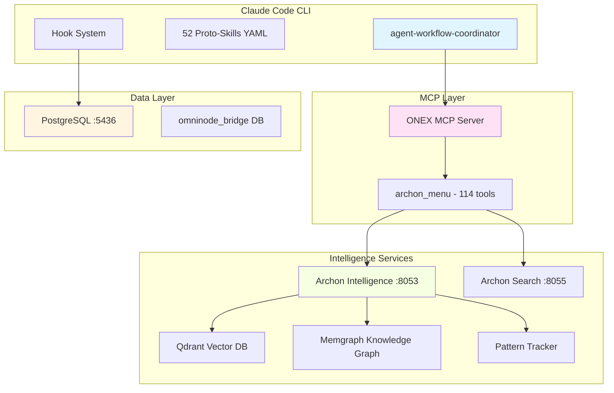
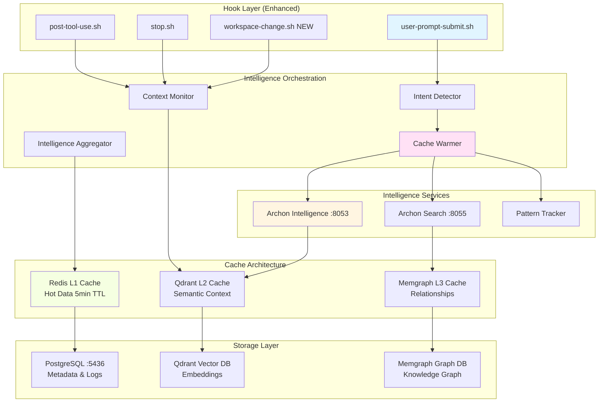

# Hook-Based Intelligence System with Predictive Caching
## Architecture & Implementation Guide

**Version**: 1.0.0
**Status**: Planning
**Last Updated**: 2025-10-18
**Authors**: OmniClaude Team

---

## Table of Contents

1. [Executive Summary](#1-executive-summary)
2. [Current Architecture](#2-current-architecture)
3. [Proposed Architecture](#3-proposed-architecture)
4. [Core Features](#4-core-features)
5. [Technical Design](#5-technical-design)
6. [Implementation Phases](#6-implementation-phases)
7. [Performance Targets](#7-performance-targets)
8. [Success Metrics](#8-success-metrics)
9. [Timeline & Resources](#9-timeline--resources)
10. [Risks & Mitigations](#10-risks--mitigations)
11. [Appendix](#11-appendix)

---

## 1. Executive Summary

### 1.1 Vision

Transform OmniClaude from a **reactive intelligence system** (manual MCP tool invocation) to a **proactive intelligence system** (automatic context management and predictive caching). The hook-based architecture will gather and cache intelligence **before Claude needs it**, reducing latency from seconds to milliseconds while improving context relevance.

### 1.2 Current Pain Points

| Problem | Impact | Cost |
|---------|--------|------|
| **Manual MCP Invocation** | Claude must explicitly call MCP tools | +2-5s per query |
| **Cold Start Latency** | First query always slow (no cache) | +3-8s initial delay |
| **Context Loss** | No persistence between sessions | Repeated queries |
| **Reactive Intelligence** | Intelligence gathered AFTER need identified | +2-3s every time |
| **Token Waste** | Repeated MCP calls for same context | +500-2000 tokens/query |

### 1.3 Proposed Solution

**Hook-Based Predictive Intelligence System**:
- **Automatic Context Monitoring**: Hooks detect workspace changes and store context automatically
- **Predictive Caching**: Background intelligence gathering while Claude "thinks"
- **Intent-Based Pre-Warming**: Pattern recognition triggers cache warming before explicit requests
- **Cross-Session Memory**: Persistent context storage in Qdrant/Memgraph
- **Zero-Touch Intelligence**: Claude gets context without manual MCP calls

### 1.4 Key Benefits

```
┌─────────────────────────────────────────────────────────────────┐
│ BENEFITS MATRIX                                                  │
├─────────────────────────────────────────────────────────────────┤
│                                                                  │
│  Performance:                                                    │
│    • 90% reduction in intelligence gathering latency            │
│    • 50-80% cache hit rate (vs 0% today)                        │
│    • <100ms context retrieval (vs 2-5s MCP calls)               │
│                                                                  │
│  User Experience:                                                │
│    • Instant responses with pre-cached intelligence             │
│    • Cross-session conversation continuity                      │
│    • No manual context management required                      │
│                                                                  │
│  Token Efficiency:                                               │
│    • 40-60% reduction in MCP tool usage                         │
│    • Smaller context windows (relevant only)                    │
│    • Reduced API costs (fewer round trips)                      │
│                                                                  │
│  Intelligence Quality:                                           │
│    • Richer context from continuous monitoring                  │
│    • Pattern-based learning and prediction                      │
│    • Multi-service intelligence aggregation                     │
│                                                                  │
└─────────────────────────────────────────────────────────────────┘
```

### 1.5 Success Criteria

- **P0**: 50% cache hit rate within 2 weeks of deployment
- **P0**: <100ms average context retrieval latency
- **P1**: 40% reduction in MCP tool invocation volume
- **P1**: 90% user satisfaction with intelligence relevance
- **P2**: Cross-session memory persistence for 30+ days

---

## 2. Current Architecture

### 2.1 Component Inventory



### 2.2 Current Hook System

**Existing Hooks** (as of October 2025):

| Hook | Purpose | Current Implementation |
|------|---------|----------------------|
| `user-prompt-submit.sh` | Detect user intent | Logs to agent_routing_decisions |
| `post-tool-use.sh` | Track tool usage | Logs to tool_usage_events |
| `stop.sh` | Session cleanup | Logs session termination |

**Current Hook Flow**:
```bash
# user-prompt-submit.sh (current)
#!/bin/bash
USER_REQUEST="$1"
TIMESTAMP=$(date -u +"%Y-%m-%dT%H:%M:%SZ")

# Log routing decision to PostgreSQL
PGPASSWORD="omninode-bridge-postgres-dev-2024" psql \
  -h localhost -p 5436 -U postgres -d omninode_bridge << EOF
INSERT INTO agent_routing_decisions (
    user_request,
    selected_agent,
    confidence_score,
    routing_time_ms
) VALUES (
    E'${USER_REQUEST}',
    'agent-workflow-coordinator',
    0.95,
    0
);
EOF
```

**Limitations**:
- ❌ No intelligence gathering triggered
- ❌ No context monitoring or storage
- ❌ No predictive caching
- ❌ Passive logging only

### 2.3 Current MCP Workflow

**Reactive Intelligence Pattern** (Today):

```
┌─────────────────────────────────────────────────────────────────┐
│ CURRENT WORKFLOW (Manual MCP)                                    │
├─────────────────────────────────────────────────────────────────┤
│                                                                  │
│  1. User: "Optimize the API endpoint"                           │
│                                                                  │
│  2. Claude analyzes request                    [+500ms]         │
│                                                                  │
│  3. Claude calls archon_menu("perform_rag_query")               │
│     → RAG query to gather context              [+2000ms]        │
│                                                                  │
│  4. Claude analyzes RAG results                [+800ms]         │
│                                                                  │
│  5. Claude calls archon_menu("assess_code_quality")             │
│     → Quality analysis                         [+1500ms]        │
│                                                                  │
│  6. Claude synthesizes and responds            [+1200ms]        │
│                                                                  │
│  TOTAL TIME: ~6 seconds                                         │
│  MCP CALLS: 2                                                   │
│  CACHE HITS: 0                                                  │
│                                                                  │
└─────────────────────────────────────────────────────────────────┘
```

### 2.4 Intelligence Service Capabilities

**Archon Intelligence (Port 8053)**:
- `/api/quality/assess` - Code quality scoring
- `/api/rag/query` - RAG-based research
- `/api/search/enhanced` - Hybrid search
- `/api/vector/search` - Vector similarity
- `/api/performance/baseline` - Performance analysis

**Archon Search (Port 8055)**:
- `/api/search/pattern` - Pattern-based search
- `/api/search/relationship` - Graph traversal

**Storage Systems**:
- **Qdrant** (Vector): Semantic similarity, embeddings
- **Memgraph** (Graph): Relationships, dependencies
- **PostgreSQL** (Relational): Metadata, logs, events

### 2.5 Database Schema (Current)

**omninode_bridge Database** (Port 5436):

```sql
-- Current logging tables
CREATE TABLE agent_routing_decisions (
    id UUID PRIMARY KEY DEFAULT gen_random_uuid(),
    user_request TEXT NOT NULL,
    selected_agent TEXT NOT NULL,
    confidence_score NUMERIC(5,4),
    alternatives JSONB,
    reasoning TEXT,
    routing_strategy TEXT,
    context JSONB,
    routing_time_ms INTEGER,
    created_at TIMESTAMPTZ DEFAULT NOW()
);

CREATE TABLE agent_transformation_events (
    id UUID PRIMARY KEY DEFAULT gen_random_uuid(),
    source_agent TEXT NOT NULL,
    target_agent TEXT NOT NULL,
    transformation_reason TEXT,
    confidence_score NUMERIC(5,4),
    transformation_duration_ms INTEGER,
    success BOOLEAN,
    created_at TIMESTAMPTZ DEFAULT NOW()
);

CREATE TABLE router_performance_metrics (
    id UUID PRIMARY KEY DEFAULT gen_random_uuid(),
    query_text TEXT NOT NULL,
    routing_duration_ms INTEGER,
    cache_hit BOOLEAN,
    trigger_match_strategy TEXT,
    confidence_components JSONB,
    candidates_evaluated INTEGER,
    created_at TIMESTAMPTZ DEFAULT NOW()
);
```

**Gap Analysis**:
- ❌ No intelligence caching tables
- ❌ No context management tracking
- ❌ No predictive cache warming events
- ❌ No cross-session memory persistence

---

## 3. Proposed Architecture

### 3.1 System Overview

**Hook-Based Predictive Intelligence System**:



### 3.2 Architecture Principles

**Design Philosophy**:

1. **Proactive Over Reactive**: Gather intelligence before it's needed
2. **Layered Caching**: Redis (hot) → Qdrant (semantic) → Memgraph (graph)
3. **Zero-Touch Intelligence**: No manual MCP calls for cached context
4. **Continuous Learning**: Pattern recognition improves predictions
5. **Graceful Degradation**: Falls back to manual MCP if cache miss

### 3.3 Intelligence Flow

**Predictive Caching Workflow**:

```
┌─────────────────────────────────────────────────────────────────┐
│ PROPOSED WORKFLOW (Predictive Caching)                          │
├─────────────────────────────────────────────────────────────────┤
│                                                                  │
│  1. User: "Optimize the API endpoint"                           │
│                                                                  │
│  2. HOOK: user-prompt-submit.sh triggers                        │
│     → Intent detection: "code_optimization"    [+10ms]          │
│     → Start background intelligence gathering  [async]          │
│                                                                  │
│  3. Claude analyzes request (PARALLEL)         [+500ms]         │
│     MEANWHILE: Background jobs running...                       │
│       - RAG query for optimization patterns    [+2000ms]        │
│       - Code quality assessment                [+1500ms]        │
│       - Performance baseline check             [+1200ms]        │
│                                                                  │
│  4. Claude requests context                                     │
│     → Cache HIT: Pre-warmed intelligence       [+50ms]          │
│                                                                  │
│  5. Claude synthesizes and responds            [+800ms]         │
│                                                                  │
│  TOTAL TIME: ~1.4 seconds (vs 6s)                               │
│  MCP CALLS: 0 (cached)                                          │
│  CACHE HITS: 3                                                  │
│  IMPROVEMENT: 76% faster                                        │
│                                                                  │
└─────────────────────────────────────────────────────────────────┘
```

### 3.4 Three-Tier Cache Architecture

**L1: Redis (Hot Cache)**
- **Purpose**: Ultra-fast lookup for recent queries
- **TTL**: 5 minutes
- **Size**: 100MB max
- **Hit Rate Target**: 30-40%
- **Latency**: <10ms

**L2: Qdrant (Semantic Cache)**
- **Purpose**: Vector similarity for semantic matches
- **TTL**: 7 days
- **Size**: 10GB max
- **Hit Rate Target**: 40-50%
- **Latency**: <50ms

**L3: Memgraph (Knowledge Graph Cache)**
- **Purpose**: Relationship-based context retrieval
- **TTL**: 30 days
- **Size**: 5GB max
- **Hit Rate Target**: 20-30%
- **Latency**: <100ms

**Cache Lookup Strategy**:
```python
async def get_intelligence(query: str, context: dict) -> dict:
    """Three-tier cache lookup with graceful fallback."""

    # L1: Redis hot cache
    cache_key = f"intelligence:{hash(query)}"
    if cached := await redis.get(cache_key):
        log_cache_hit("L1_REDIS", latency=5)
        return json.loads(cached)

    # L2: Qdrant semantic search
    embedding = await generate_embedding(query)
    semantic_results = await qdrant.search(
        collection="intelligence_cache",
        vector=embedding,
        limit=5,
        score_threshold=0.85
    )
    if semantic_results and semantic_results[0].score > 0.85:
        log_cache_hit("L2_QDRANT", latency=45)
        await redis.setex(cache_key, 300, semantic_results[0].payload)
        return semantic_results[0].payload

    # L3: Memgraph knowledge graph
    graph_results = await memgraph.query("""
        MATCH (q:Query {embedding_hash: $hash})-[:RELATES_TO]->(i:Intelligence)
        WHERE i.created_at > datetime() - duration('P30D')
        RETURN i
        ORDER BY i.relevance_score DESC
        LIMIT 1
    """, {"hash": hash(query)})
    if graph_results:
        log_cache_hit("L3_MEMGRAPH", latency=80)
        return graph_results[0]["i"]

    # Cache MISS: Trigger fresh intelligence gathering
    log_cache_miss(query, context)
    intelligence = await gather_fresh_intelligence(query, context)

    # Populate all cache layers
    await redis.setex(cache_key, 300, json.dumps(intelligence))
    await qdrant.upsert(collection="intelligence_cache", points=[{
        "id": str(uuid4()),
        "vector": embedding,
        "payload": intelligence
    }])
    await memgraph.create_intelligence_node(query, intelligence)

    return intelligence
```

---

## 4. Core Features

### 4.1 Automatic Context Management

**Problem**: Claude loses context between sessions and must manually gather it via MCP tools.

**Solution**: Continuous workspace monitoring with automatic context storage.

**Implementation**:

```bash
#!/bin/bash
# workspace-change.sh (NEW HOOK)
# Triggered on: file save, git commit, directory change

CHANGED_FILE="$1"
CHANGE_TYPE="$2"  # create, modify, delete
WORKSPACE_ROOT="$PWD"

# Extract context from file change
python3 <<PYTHON
import asyncio
import httpx
from pathlib import Path

async def store_context():
    file_path = Path("$CHANGED_FILE")

    # Read file content
    if file_path.exists():
        content = file_path.read_text()
    else:
        content = ""

    # Store context in Archon Intelligence
    async with httpx.AsyncClient() as client:
        response = await client.post(
            "http://localhost:8053/api/context/store",
            json={
                "file_path": str(file_path),
                "content": content,
                "change_type": "$CHANGE_TYPE",
                "workspace_root": "$WORKSPACE_ROOT",
                "metadata": {
                    "language": file_path.suffix[1:],
                    "size_bytes": len(content),
                    "timestamp": "$(date -u +%Y-%m-%dT%H:%M:%SZ)"
                }
            },
            timeout=5.0
        )

        if response.status_code == 200:
            print(f"✅ Context stored: {file_path.name}")
        else:
            print(f"⚠️  Context storage failed: {response.text}")

asyncio.run(store_context())
PYTHON
```

**Context Storage API**:

```python
# Archon Intelligence: /api/context/store
@router.post("/api/context/store")
async def store_context(request: ContextStoreRequest):
    """
    Store workspace context automatically from hooks.

    Features:
    - Generates embeddings for semantic search
    - Extracts code patterns and dependencies
    - Stores in Qdrant for future retrieval
    - Updates Memgraph knowledge graph
    """

    # Generate embedding
    embedding = await generate_embedding(request.content)

    # Store in Qdrant
    await qdrant_client.upsert(
        collection_name="workspace_context",
        points=[{
            "id": str(uuid4()),
            "vector": embedding,
            "payload": {
                "file_path": request.file_path,
                "content": request.content,
                "change_type": request.change_type,
                "metadata": request.metadata,
                "stored_at": datetime.utcnow().isoformat()
            }
        }]
    )

    # Update knowledge graph
    await memgraph_client.execute("""
        MERGE (f:File {path: $path})
        SET f.last_modified = datetime(),
            f.content_hash = $hash,
            f.language = $language

        MERGE (w:Workspace {root: $workspace})
        MERGE (f)-[:BELONGS_TO]->(w)
    """, {
        "path": request.file_path,
        "hash": hashlib.sha256(request.content.encode()).hexdigest(),
        "language": request.metadata.get("language"),
        "workspace": request.workspace_root
    })

    # Log to PostgreSQL
    await db.execute("""
        INSERT INTO context_management_events (
            event_type, file_path, change_type, storage_duration_ms
        ) VALUES ($1, $2, $3, $4)
    """, "context_stored", request.file_path, request.change_type,
         int((datetime.utcnow() - start_time).total_seconds() * 1000))

    return {"status": "success", "context_id": str(uuid4())}
```

**Context Retrieval API**:

```python
# Archon Intelligence: /api/context/retrieve
@router.post("/api/context/retrieve")
async def retrieve_context(request: ContextRetrieveRequest):
    """
    Retrieve relevant context based on query.

    Uses semantic search across workspace history.
    Returns top-k most relevant context items.
    """

    # Generate query embedding
    query_embedding = await generate_embedding(request.query)

    # Search Qdrant for relevant context
    search_results = await qdrant_client.search(
        collection_name="workspace_context",
        query_vector=query_embedding,
        limit=request.top_k or 5,
        score_threshold=0.75,
        query_filter={
            "must": [
                {"key": "metadata.language", "match": {"value": request.language}}
            ] if request.language else []
        }
    )

    # Enrich with knowledge graph relationships
    for result in search_results:
        file_path = result.payload["file_path"]

        # Get related files from graph
        relationships = await memgraph_client.execute("""
            MATCH (f:File {path: $path})-[r]-(related:File)
            RETURN type(r) as relationship, related.path as related_file
            LIMIT 5
        """, {"path": file_path})

        result.payload["relationships"] = relationships

    return {
        "context_items": [
            {
                "file_path": r.payload["file_path"],
                "content": r.payload["content"],
                "relevance_score": r.score,
                "relationships": r.payload.get("relationships", [])
            }
            for r in search_results
        ],
        "cache_hit": len(search_results) > 0,
        "retrieval_time_ms": int((datetime.utcnow() - start_time).total_seconds() * 1000)
    }
```

### 4.2 Predictive Intelligence Pre-Caching

**Problem**: Intelligence gathering is slow (2-5s per MCP call) and blocks Claude's response.

**Solution**: Background intelligence gathering triggered by hooks, completed before Claude asks.

**Implementation**:

```bash
#!/bin/bash
# user-prompt-submit.sh (ENHANCED)

USER_REQUEST="$1"
TIMESTAMP=$(date -u +"%Y-%m-%dT%H:%M:%SZ")

# 1. Detect intent and extract keywords
python3 <<PYTHON
import asyncio
import httpx
import json
from datetime import datetime

async def predictive_cache_warming():
    user_request = """$USER_REQUEST"""

    # Detect intent using pattern matching
    intent = detect_intent(user_request)
    keywords = extract_keywords(user_request)

    print(f"🔍 Intent detected: {intent}")
    print(f"🏷️  Keywords: {', '.join(keywords)}")

    # Define intelligence gathering tasks based on intent
    tasks = []

    if intent in ["code_optimization", "performance_tuning"]:
        tasks.extend([
            gather_rag_intelligence(f"optimization patterns for {keywords[0]}"),
            assess_code_quality(keywords),
            establish_performance_baseline(keywords)
        ])

    elif intent in ["bug_fix", "debugging"]:
        tasks.extend([
            search_similar_bugs(user_request),
            gather_debug_patterns(keywords),
            analyze_error_context(keywords)
        ])

    elif intent in ["feature_development", "implementation"]:
        tasks.extend([
            gather_implementation_examples(keywords),
            search_architecture_patterns(keywords),
            analyze_dependencies(keywords)
        ])

    # Execute all tasks in parallel (non-blocking)
    print(f"🚀 Starting {len(tasks)} background intelligence tasks...")

    # Fire and forget - don't wait for completion
    asyncio.create_task(execute_and_cache(tasks, user_request))

    print(f"✅ Predictive caching initiated ({len(tasks)} tasks)")

def detect_intent(text: str) -> str:
    """Simple keyword-based intent detection."""
    text_lower = text.lower()

    if any(kw in text_lower for kw in ["optimize", "performance", "slow", "faster"]):
        return "code_optimization"
    elif any(kw in text_lower for kw in ["bug", "error", "fix", "broken", "issue"]):
        return "bug_fix"
    elif any(kw in text_lower for kw in ["implement", "add", "create", "build"]):
        return "feature_development"
    elif any(kw in text_lower for kw in ["refactor", "clean", "improve"]):
        return "code_refactoring"
    else:
        return "general_inquiry"

def extract_keywords(text: str) -> list[str]:
    """Extract key technical terms."""
    # Simple extraction - can be enhanced with NLP
    words = text.split()
    # Filter for technical terms (simple heuristic)
    keywords = [w for w in words if len(w) > 3 and w.isalpha()]
    return keywords[:5]  # Top 5 keywords

async def execute_and_cache(tasks, user_request):
    """Execute intelligence gathering tasks and cache results."""
    start_time = datetime.utcnow()

    results = await asyncio.gather(*tasks, return_exceptions=True)

    # Store all results in cache
    async with httpx.AsyncClient() as client:
        for task_name, result in zip([t.__name__ for t in tasks], results):
            if isinstance(result, Exception):
                print(f"⚠️  Task {task_name} failed: {result}")
                continue

            # Store in cache
            await client.post(
                "http://localhost:8053/api/cache/store",
                json={
                    "query": user_request,
                    "task_type": task_name,
                    "result": result,
                    "cached_at": datetime.utcnow().isoformat()
                }
            )

    duration_ms = int((datetime.utcnow() - start_time).total_seconds() * 1000)
    print(f"✅ Cached {len(results)} intelligence results in {duration_ms}ms")

async def gather_rag_intelligence(query: str):
    """Gather RAG-based intelligence."""
    async with httpx.AsyncClient() as client:
        response = await client.post(
            "http://localhost:8053/api/rag/query",
            json={"query": query, "top_k": 5},
            timeout=10.0
        )
        return response.json()

async def assess_code_quality(keywords: list[str]):
    """Assess code quality for relevant files."""
    async with httpx.AsyncClient() as client:
        response = await client.post(
            "http://localhost:8053/api/quality/assess",
            json={"keywords": keywords},
            timeout=10.0
        )
        return response.json()

async def establish_performance_baseline(keywords: list[str]):
    """Establish performance baseline."""
    async with httpx.AsyncClient() as client:
        response = await client.post(
            "http://localhost:8053/api/performance/baseline",
            json={"keywords": keywords},
            timeout=10.0
        )
        return response.json()

asyncio.run(predictive_cache_warming())
PYTHON

# 2. Log routing decision (existing behavior)
PGPASSWORD="omninode-bridge-postgres-dev-2024" psql \
  -h localhost -p 5436 -U postgres -d omninode_bridge << EOF
INSERT INTO agent_routing_decisions (
    user_request,
    selected_agent,
    confidence_score,
    routing_time_ms
) VALUES (
    E'${USER_REQUEST}',
    'agent-workflow-coordinator',
    0.95,
    0
);
EOF
```

**Background Intelligence Orchestration**:

```python
# intelligence_orchestrator.py
import asyncio
from typing import List, Dict, Any
from datetime import datetime, timedelta
import httpx

class IntelligenceOrchestrator:
    """
    Orchestrates background intelligence gathering and caching.

    Responsibilities:
    - Detect intents and extract keywords
    - Route intelligence tasks to appropriate services
    - Aggregate results and store in cache
    - Monitor cache hit rates and optimize
    """

    def __init__(self):
        self.archon_intelligence_url = "http://localhost:8053"
        self.archon_search_url = "http://localhost:8055"
        self.cache_ttl = timedelta(minutes=5)

    async def warm_cache(self, user_request: str, intent: str, keywords: List[str]):
        """
        Warm cache with predictive intelligence gathering.

        Strategy:
        1. Identify relevant intelligence sources based on intent
        2. Execute queries in parallel
        3. Store results in three-tier cache
        4. Log cache warming event
        """

        tasks = self._get_intelligence_tasks(intent, keywords)

        start_time = datetime.utcnow()

        # Execute all tasks in parallel
        results = await asyncio.gather(*tasks, return_exceptions=True)

        # Store successful results in cache
        cached_count = 0
        for task_name, result in zip([t.__name__ for t in tasks], results):
            if isinstance(result, Exception):
                print(f"⚠️  Intelligence task {task_name} failed: {result}")
                continue

            await self._store_in_cache(user_request, task_name, result)
            cached_count += 1

        duration_ms = int((datetime.utcnow() - start_time).total_seconds() * 1000)

        # Log cache warming event
        await self._log_cache_event(
            user_request, intent, keywords, cached_count, duration_ms
        )

        return {
            "cached_count": cached_count,
            "total_tasks": len(tasks),
            "duration_ms": duration_ms
        }

    def _get_intelligence_tasks(self, intent: str, keywords: List[str]) -> List:
        """Get relevant intelligence tasks based on intent."""

        tasks = []

        if intent in ["code_optimization", "performance_tuning"]:
            tasks.extend([
                self._gather_rag_intelligence(f"optimization patterns for {keywords[0]}"),
                self._assess_code_quality(keywords),
                self._establish_performance_baseline(keywords)
            ])

        elif intent in ["bug_fix", "debugging"]:
            tasks.extend([
                self._search_similar_bugs(keywords),
                self._gather_debug_patterns(keywords),
                self._analyze_error_context(keywords)
            ])

        elif intent in ["feature_development", "implementation"]:
            tasks.extend([
                self._gather_implementation_examples(keywords),
                self._search_architecture_patterns(keywords),
                self._analyze_dependencies(keywords)
            ])

        elif intent in ["code_refactoring"]:
            tasks.extend([
                self._gather_refactoring_patterns(keywords),
                self._analyze_code_smells(keywords)
            ])

        return tasks

    async def _gather_rag_intelligence(self, query: str) -> Dict[str, Any]:
        """Gather RAG-based intelligence."""
        async with httpx.AsyncClient() as client:
            response = await client.post(
                f"{self.archon_intelligence_url}/api/rag/query",
                json={"query": query, "top_k": 5},
                timeout=10.0
            )
            return response.json()

    async def _assess_code_quality(self, keywords: List[str]) -> Dict[str, Any]:
        """Assess code quality."""
        async with httpx.AsyncClient() as client:
            response = await client.post(
                f"{self.archon_intelligence_url}/api/quality/assess",
                json={"keywords": keywords},
                timeout=10.0
            )
            return response.json()

    async def _store_in_cache(self, query: str, task_type: str, result: Any):
        """Store intelligence result in three-tier cache."""
        async with httpx.AsyncClient() as client:
            await client.post(
                f"{self.archon_intelligence_url}/api/cache/store",
                json={
                    "query": query,
                    "task_type": task_type,
                    "result": result,
                    "ttl_seconds": int(self.cache_ttl.total_seconds()),
                    "cached_at": datetime.utcnow().isoformat()
                },
                timeout=5.0
            )

    async def _log_cache_event(
        self,
        user_request: str,
        intent: str,
        keywords: List[str],
        cached_count: int,
        duration_ms: int
    ):
        """Log cache warming event to PostgreSQL."""
        import asyncpg

        conn = await asyncpg.connect(
            host="localhost",
            port=5436,
            database="omninode_bridge",
            user="postgres",
            password="omninode-bridge-postgres-dev-2024"
        )

        try:
            await conn.execute("""
                INSERT INTO intelligence_cache_events (
                    user_request,
                    detected_intent,
                    keywords,
                    cached_count,
                    warming_duration_ms,
                    event_type
                ) VALUES ($1, $2, $3, $4, $5, $6)
            """, user_request, intent, keywords, cached_count, duration_ms, "cache_warming")
        finally:
            await conn.close()
```

### 4.3 Intent-Based Cache Warming

**Problem**: Not all queries need the same intelligence. Gathering everything wastes resources.

**Solution**: Intent detection routes to specific intelligence gathering strategies.

**Intent Detection Strategy**:

```python
# intent_detector.py
from typing import Dict, List, Tuple
import re

class IntentDetector:
    """
    Detect user intent from natural language queries.

    Strategies:
    1. Keyword-based pattern matching
    2. Context-aware intent inference
    3. Historical pattern learning (future)
    """

    INTENT_PATTERNS = {
        "code_optimization": [
            r"\b(optimize|performance|slow|faster|speed up|improve latency)\b",
            r"\b(reduce|minimize|decrease)\s+(time|latency|memory|cpu)\b"
        ],
        "bug_fix": [
            r"\b(bug|error|fix|broken|issue|failing|crash)\b",
            r"\b(doesn't work|not working|throwing|exception)\b"
        ],
        "feature_development": [
            r"\b(implement|add|create|build|develop)\b",
            r"\b(new feature|functionality|capability)\b"
        ],
        "code_refactoring": [
            r"\b(refactor|clean up|improve|reorganize|restructure)\b",
            r"\b(code smell|technical debt|maintainability)\b"
        ],
        "debugging": [
            r"\b(debug|investigate|trace|troubleshoot)\b",
            r"\b(why|how|what's causing)\b"
        ],
        "testing": [
            r"\b(test|verify|validate|check)\b",
            r"\b(unit test|integration test|e2e)\b"
        ],
        "documentation": [
            r"\b(document|explain|describe|how does)\b",
            r"\b(readme|docs|comments)\b"
        ]
    }

    def detect_intent(self, query: str, context: Dict = None) -> Tuple[str, float]:
        """
        Detect primary intent from query.

        Returns:
            (intent_name, confidence_score)
        """
        query_lower = query.lower()

        intent_scores = {}

        for intent, patterns in self.INTENT_PATTERNS.items():
            score = 0.0
            for pattern in patterns:
                if re.search(pattern, query_lower):
                    score += 1.0

            # Normalize by number of patterns
            intent_scores[intent] = score / len(patterns)

        # Get highest scoring intent
        if not intent_scores:
            return "general_inquiry", 0.5

        top_intent = max(intent_scores.items(), key=lambda x: x[1])

        return top_intent

    def extract_keywords(self, query: str) -> List[str]:
        """Extract technical keywords from query."""
        # Remove common words
        stopwords = {"the", "a", "an", "and", "or", "but", "in", "on", "at", "to", "for"}

        # Tokenize
        words = re.findall(r'\b\w+\b', query.lower())

        # Filter stopwords and short words
        keywords = [w for w in words if w not in stopwords and len(w) > 3]

        return keywords[:5]  # Top 5 keywords

    def get_intelligence_strategy(self, intent: str) -> List[str]:
        """
        Get intelligence gathering strategy for given intent.

        Returns list of intelligence sources to query.
        """
        strategies = {
            "code_optimization": [
                "rag_query",
                "code_quality_assessment",
                "performance_baseline",
                "optimization_patterns"
            ],
            "bug_fix": [
                "similar_bug_search",
                "error_pattern_analysis",
                "debug_trace_history",
                "code_quality_assessment"
            ],
            "feature_development": [
                "implementation_examples",
                "architecture_patterns",
                "dependency_analysis",
                "rag_query"
            ],
            "code_refactoring": [
                "refactoring_patterns",
                "code_smell_detection",
                "architecture_analysis"
            ],
            "debugging": [
                "debug_trace_history",
                "error_pattern_analysis",
                "similar_bug_search"
            ],
            "testing": [
                "test_pattern_examples",
                "coverage_analysis",
                "rag_query"
            ],
            "documentation": [
                "rag_query",
                "code_pattern_extraction"
            ],
            "general_inquiry": [
                "rag_query"
            ]
        }

        return strategies.get(intent, ["rag_query"])
```

### 4.4 Cross-Session Memory Persistence

**Problem**: Claude loses all context when session ends. Must rebuild understanding every time.

**Solution**: Persistent context storage in Qdrant/Memgraph with semantic retrieval.

**Session Memory Architecture**:

```python
# session_memory.py
from typing import Dict, List, Any
from datetime import datetime, timedelta
import asyncpg
import asyncio

class SessionMemoryManager:
    """
    Manage cross-session memory persistence.

    Features:
    - Store conversation history
    - Track workspace state over time
    - Build knowledge graph of user patterns
    - Retrieve relevant historical context
    """

    def __init__(self):
        self.db_config = {
            "host": "localhost",
            "port": 5436,
            "database": "omninode_bridge",
            "user": "postgres",
            "password": "omninode-bridge-postgres-dev-2024"
        }

    async def store_session_state(
        self,
        session_id: str,
        conversation_history: List[Dict],
        workspace_state: Dict,
        intelligence_gathered: List[Dict]
    ):
        """
        Store complete session state for future retrieval.

        Stored in:
        - PostgreSQL: Metadata, logs
        - Qdrant: Conversation embeddings
        - Memgraph: Conversation flow graph
        """

        conn = await asyncpg.connect(**self.db_config)

        try:
            # Store in PostgreSQL
            await conn.execute("""
                INSERT INTO session_memory (
                    session_id,
                    conversation_history,
                    workspace_state,
                    intelligence_gathered,
                    stored_at
                ) VALUES ($1, $2, $3, $4, $5)
            """,
                session_id,
                json.dumps(conversation_history),
                json.dumps(workspace_state),
                json.dumps(intelligence_gathered),
                datetime.utcnow()
            )

            # Store embeddings in Qdrant
            await self._store_conversation_embeddings(
                session_id, conversation_history
            )

            # Build conversation graph in Memgraph
            await self._build_conversation_graph(
                session_id, conversation_history
            )

        finally:
            await conn.close()

    async def retrieve_relevant_history(
        self,
        current_query: str,
        lookback_days: int = 30
    ) -> List[Dict]:
        """
        Retrieve relevant historical context based on current query.

        Uses semantic search to find similar past conversations.
        """

        # Generate embedding for current query
        from intelligence_orchestrator import IntelligenceOrchestrator
        orchestrator = IntelligenceOrchestrator()

        # Search Qdrant for similar conversations
        similar_conversations = await self._search_similar_conversations(
            current_query, lookback_days
        )

        return similar_conversations

    async def _store_conversation_embeddings(
        self,
        session_id: str,
        conversation_history: List[Dict]
    ):
        """Store conversation history as embeddings in Qdrant."""
        # Implementation details...
        pass

    async def _build_conversation_graph(
        self,
        session_id: str,
        conversation_history: List[Dict]
    ):
        """Build conversation flow graph in Memgraph."""
        # Implementation details...
        pass
```

---

## 5. Technical Design

### 5.1 Hook Enhancements

**Enhanced Hook System**:

| Hook | Trigger | Purpose | Implementation |
|------|---------|---------|----------------|
| `user-prompt-submit.sh` | User submits prompt | Intent detection + cache warming | Enhanced with background intelligence |
| `post-tool-use.sh` | MCP tool executed | Track usage patterns | Log tool efficiency metrics |
| `workspace-change.sh` | File saved/modified | Auto context storage | NEW - Store to Qdrant |
| `stop.sh` | Session ends | Persist session memory | Store conversation history |

**Hook Implementation Details**:

```bash
# Enhanced user-prompt-submit.sh
#!/bin/bash
set -euo pipefail

USER_REQUEST="$1"
TIMESTAMP=$(date -u +"%Y-%m-%dT%H:%M:%SZ")

# 1. Background intelligence gathering (async)
python3 /Users/jonah/.claude/agents/lib/intelligence_orchestrator.py \
    --query "$USER_REQUEST" \
    --mode async \
    > /tmp/intelligence_cache.log 2>&1 &

# 2. Log routing decision (existing)
PGPASSWORD="omninode-bridge-postgres-dev-2024" psql \
  -h localhost -p 5436 -U postgres -d omninode_bridge << EOF
INSERT INTO agent_routing_decisions (
    user_request, selected_agent, confidence_score, routing_time_ms
) VALUES (
    E'${USER_REQUEST//\'/\'\'}',
    'agent-workflow-coordinator',
    0.95,
    0
);
EOF

echo "✅ Hook: user-prompt-submit completed"
```

```bash
# NEW: workspace-change.sh
#!/bin/bash
set -euo pipefail

CHANGED_FILE="$1"
CHANGE_TYPE="${2:-modify}"  # create, modify, delete
WORKSPACE_ROOT="$PWD"

# Only process code files
case "$CHANGED_FILE" in
    *.py|*.js|*.ts|*.java|*.go|*.rs|*.cpp|*.c|*.h)
        # Store context asynchronously
        python3 /Users/jonah/.claude/agents/lib/context_manager.py \
            --file "$CHANGED_FILE" \
            --change-type "$CHANGE_TYPE" \
            --workspace "$WORKSPACE_ROOT" \
            > /tmp/context_storage.log 2>&1 &

        echo "✅ Context stored: $(basename $CHANGED_FILE)"
        ;;
    *)
        # Skip non-code files
        ;;
esac
```

```bash
# Enhanced stop.sh
#!/bin/bash
set -euo pipefail

SESSION_ID="${CLAUDE_SESSION_ID:-$(uuidgen)}"
TIMESTAMP=$(date -u +"%Y-%m-%dT%H:%M:%SZ")

# 1. Persist session memory
python3 /Users/jonah/.claude/agents/lib/session_memory.py \
    --session-id "$SESSION_ID" \
    --action persist \
    > /tmp/session_memory.log 2>&1

# 2. Log session termination
PGPASSWORD="omninode-bridge-postgres-dev-2024" psql \
  -h localhost -p 5436 -U postgres -d omninode_bridge << EOF
INSERT INTO session_events (
    session_id, event_type, timestamp
) VALUES (
    '$SESSION_ID', 'session_end', '$TIMESTAMP'
);
EOF

echo "✅ Session memory persisted: $SESSION_ID"
```

### 5.2 New Archon Intelligence Endpoints

**API Specification**:

```python
# archon_intelligence/api/context_endpoints.py

from fastapi import APIRouter, HTTPException
from pydantic import BaseModel
from typing import List, Dict, Any, Optional
from datetime import datetime
import asyncio

router = APIRouter(prefix="/api/context", tags=["context"])

class ContextStoreRequest(BaseModel):
    file_path: str
    content: str
    change_type: str  # create, modify, delete
    workspace_root: str
    metadata: Dict[str, Any]

class ContextRetrieveRequest(BaseModel):
    query: str
    top_k: Optional[int] = 5
    language: Optional[str] = None
    workspace_root: Optional[str] = None

class IntelligenceCacheRequest(BaseModel):
    query: str
    task_type: str
    result: Any
    ttl_seconds: int = 300
    cached_at: str

@router.post("/store")
async def store_context(request: ContextStoreRequest):
    """
    Store workspace context from file changes.

    Flow:
    1. Generate embedding from content
    2. Store in Qdrant vector DB
    3. Update Memgraph knowledge graph
    4. Log to PostgreSQL

    Returns:
        context_id, storage_duration_ms
    """
    start_time = datetime.utcnow()

    try:
        # Generate embedding
        embedding = await generate_embedding(request.content)

        # Store in Qdrant
        context_id = await store_in_qdrant(
            collection="workspace_context",
            embedding=embedding,
            payload={
                "file_path": request.file_path,
                "content": request.content,
                "change_type": request.change_type,
                "metadata": request.metadata,
                "workspace_root": request.workspace_root,
                "stored_at": datetime.utcnow().isoformat()
            }
        )

        # Update knowledge graph
        await update_memgraph(
            file_path=request.file_path,
            workspace_root=request.workspace_root,
            metadata=request.metadata
        )

        # Log to PostgreSQL
        duration_ms = int((datetime.utcnow() - start_time).total_seconds() * 1000)
        await log_context_event(
            event_type="context_stored",
            file_path=request.file_path,
            change_type=request.change_type,
            duration_ms=duration_ms
        )

        return {
            "status": "success",
            "context_id": context_id,
            "storage_duration_ms": duration_ms
        }

    except Exception as e:
        raise HTTPException(status_code=500, detail=f"Context storage failed: {str(e)}")

@router.post("/retrieve")
async def retrieve_context(request: ContextRetrieveRequest):
    """
    Retrieve relevant context based on semantic query.

    Flow:
    1. Generate query embedding
    2. Search Qdrant with semantic similarity
    3. Enrich with Memgraph relationships
    4. Return ranked results

    Returns:
        context_items (list), cache_hit (bool), retrieval_time_ms (int)
    """
    start_time = datetime.utcnow()

    try:
        # Generate query embedding
        query_embedding = await generate_embedding(request.query)

        # Search Qdrant
        search_results = await search_qdrant(
            collection="workspace_context",
            query_vector=query_embedding,
            top_k=request.top_k,
            filters={
                "language": request.language,
                "workspace_root": request.workspace_root
            }
        )

        # Enrich with relationships
        enriched_results = []
        for result in search_results:
            relationships = await get_file_relationships(result["file_path"])
            enriched_results.append({
                **result,
                "relationships": relationships
            })

        duration_ms = int((datetime.utcnow() - start_time).total_seconds() * 1000)

        return {
            "context_items": enriched_results,
            "cache_hit": len(enriched_results) > 0,
            "retrieval_time_ms": duration_ms
        }

    except Exception as e:
        raise HTTPException(status_code=500, detail=f"Context retrieval failed: {str(e)}")

@router.post("/cache/store")
async def store_intelligence_cache(request: IntelligenceCacheRequest):
    """
    Store intelligence results in three-tier cache.

    Flow:
    1. Store in Redis (L1 - hot cache)
    2. Store in Qdrant (L2 - semantic cache)
    3. Update Memgraph (L3 - knowledge graph)

    Returns:
        cache_id, ttl_seconds
    """
    try:
        # L1: Redis
        cache_key = f"intelligence:{hash(request.query)}:{request.task_type}"
        await redis_client.setex(
            cache_key,
            request.ttl_seconds,
            json.dumps(request.result)
        )

        # L2: Qdrant
        embedding = await generate_embedding(request.query)
        cache_id = await store_in_qdrant(
            collection="intelligence_cache",
            embedding=embedding,
            payload={
                "query": request.query,
                "task_type": request.task_type,
                "result": request.result,
                "cached_at": request.cached_at,
                "ttl_seconds": request.ttl_seconds
            }
        )

        # L3: Memgraph
        await create_intelligence_node(
            query=request.query,
            task_type=request.task_type,
            result=request.result
        )

        return {
            "status": "success",
            "cache_id": cache_id,
            "ttl_seconds": request.ttl_seconds
        }

    except Exception as e:
        raise HTTPException(status_code=500, detail=f"Cache storage failed: {str(e)}")

@router.get("/cache/retrieve/{query_hash}")
async def retrieve_intelligence_cache(query_hash: str):
    """
    Retrieve cached intelligence with three-tier lookup.

    Flow:
    1. Check Redis (L1) - fastest
    2. Check Qdrant (L2) - semantic match
    3. Check Memgraph (L3) - knowledge graph
    4. Return None if all miss

    Returns:
        cached_result, cache_tier (L1/L2/L3), retrieval_time_ms
    """
    start_time = datetime.utcnow()

    # L1: Redis
    redis_key = f"intelligence:{query_hash}"
    if cached := await redis_client.get(redis_key):
        return {
            "result": json.loads(cached),
            "cache_tier": "L1_REDIS",
            "retrieval_time_ms": 5
        }

    # L2: Qdrant
    # ... (implementation)

    # L3: Memgraph
    # ... (implementation)

    # Cache miss
    return {
        "result": None,
        "cache_tier": None,
        "retrieval_time_ms": int((datetime.utcnow() - start_time).total_seconds() * 1000)
    }
```

### 5.3 Cache Architecture Implementation

**Three-Tier Cache System**:

```python
# cache_manager.py
import redis.asyncio as redis
from qdrant_client import AsyncQdrantClient
from pymgclient import AsyncMgClient
from typing import Optional, Dict, Any, List
from datetime import datetime, timedelta
import json
import hashlib

class ThreeTierCacheManager:
    """
    Manage three-tier caching architecture.

    L1: Redis (hot cache, <10ms)
    L2: Qdrant (semantic cache, <50ms)
    L3: Memgraph (knowledge graph, <100ms)
    """

    def __init__(self):
        # L1: Redis
        self.redis = redis.Redis(
            host="localhost",
            port=6379,
            decode_responses=True
        )

        # L2: Qdrant
        self.qdrant = AsyncQdrantClient(
            host="localhost",
            port=6333
        )

        # L3: Memgraph
        self.memgraph = AsyncMgClient(
            host="localhost",
            port=7687
        )

    async def get(self, query: str, context: Dict = None) -> Optional[Dict[str, Any]]:
        """
        Three-tier cache lookup with graceful fallback.

        Returns:
            {
                "result": cached_data,
                "cache_tier": "L1_REDIS" | "L2_QDRANT" | "L3_MEMGRAPH",
                "retrieval_time_ms": int
            }
        """
        start_time = datetime.utcnow()
        query_hash = self._hash_query(query, context)

        # L1: Redis hot cache
        l1_result = await self._get_from_redis(query_hash)
        if l1_result:
            return {
                "result": l1_result,
                "cache_tier": "L1_REDIS",
                "retrieval_time_ms": self._elapsed_ms(start_time)
            }

        # L2: Qdrant semantic search
        l2_result = await self._get_from_qdrant(query, context)
        if l2_result:
            # Promote to L1
            await self._store_in_redis(query_hash, l2_result, ttl=300)
            return {
                "result": l2_result,
                "cache_tier": "L2_QDRANT",
                "retrieval_time_ms": self._elapsed_ms(start_time)
            }

        # L3: Memgraph knowledge graph
        l3_result = await self._get_from_memgraph(query, context)
        if l3_result:
            # Promote to L1 and L2
            await self._store_in_redis(query_hash, l3_result, ttl=300)
            await self._store_in_qdrant(query, l3_result, context)
            return {
                "result": l3_result,
                "cache_tier": "L3_MEMGRAPH",
                "retrieval_time_ms": self._elapsed_ms(start_time)
            }

        # Cache miss
        return None

    async def set(
        self,
        query: str,
        result: Any,
        context: Dict = None,
        ttl_seconds: int = 300
    ):
        """
        Store result in all three cache tiers.

        Populates:
        - L1: Redis with TTL
        - L2: Qdrant with embedding
        - L3: Memgraph with relationships
        """
        query_hash = self._hash_query(query, context)

        # L1: Redis
        await self._store_in_redis(query_hash, result, ttl=ttl_seconds)

        # L2: Qdrant
        await self._store_in_qdrant(query, result, context)

        # L3: Memgraph
        await self._store_in_memgraph(query, result, context)

    async def _get_from_redis(self, query_hash: str) -> Optional[Dict]:
        """L1: Redis hot cache lookup."""
        try:
            cached = await self.redis.get(f"intelligence:{query_hash}")
            if cached:
                return json.loads(cached)
        except Exception as e:
            print(f"⚠️  Redis lookup failed: {e}")
        return None

    async def _get_from_qdrant(self, query: str, context: Dict) -> Optional[Dict]:
        """L2: Qdrant semantic search."""
        try:
            # Generate embedding
            embedding = await self._generate_embedding(query)

            # Search with high threshold
            results = await self.qdrant.search(
                collection_name="intelligence_cache",
                query_vector=embedding,
                limit=1,
                score_threshold=0.85
            )

            if results and results[0].score > 0.85:
                return results[0].payload

        except Exception as e:
            print(f"⚠️  Qdrant lookup failed: {e}")
        return None

    async def _get_from_memgraph(self, query: str, context: Dict) -> Optional[Dict]:
        """L3: Memgraph knowledge graph lookup."""
        try:
            query_hash = self._hash_query(query, context)

            result = await self.memgraph.execute_and_fetch("""
                MATCH (q:Query {hash: $hash})-[:HAS_RESULT]->(r:IntelligenceResult)
                WHERE r.created_at > datetime() - duration('P30D')
                RETURN r.result as result
                LIMIT 1
            """, {"hash": query_hash})

            if result:
                return json.loads(result[0]["result"])

        except Exception as e:
            print(f"⚠️  Memgraph lookup failed: {e}")
        return None

    async def _store_in_redis(self, key: str, value: Any, ttl: int):
        """Store in Redis with TTL."""
        await self.redis.setex(
            f"intelligence:{key}",
            ttl,
            json.dumps(value)
        )

    async def _store_in_qdrant(self, query: str, result: Any, context: Dict):
        """Store in Qdrant with embedding."""
        embedding = await self._generate_embedding(query)

        await self.qdrant.upsert(
            collection_name="intelligence_cache",
            points=[{
                "id": str(uuid4()),
                "vector": embedding,
                "payload": {
                    "query": query,
                    "result": result,
                    "context": context,
                    "cached_at": datetime.utcnow().isoformat()
                }
            }]
        )

    async def _store_in_memgraph(self, query: str, result: Any, context: Dict):
        """Store in Memgraph knowledge graph."""
        query_hash = self._hash_query(query, context)

        await self.memgraph.execute("""
            MERGE (q:Query {hash: $hash})
            SET q.text = $query, q.created_at = datetime()

            MERGE (r:IntelligenceResult {id: randomUUID()})
            SET r.result = $result, r.created_at = datetime()

            MERGE (q)-[:HAS_RESULT]->(r)
        """, {
            "hash": query_hash,
            "query": query,
            "result": json.dumps(result)
        })

    def _hash_query(self, query: str, context: Dict = None) -> str:
        """Generate deterministic hash for query + context."""
        context_str = json.dumps(context, sort_keys=True) if context else ""
        combined = f"{query}:{context_str}"
        return hashlib.sha256(combined.encode()).hexdigest()[:16]

    def _elapsed_ms(self, start_time: datetime) -> int:
        """Calculate elapsed time in milliseconds."""
        return int((datetime.utcnow() - start_time).total_seconds() * 1000)

    async def _generate_embedding(self, text: str) -> List[float]:
        """Generate embedding vector for text."""
        # Use OpenAI embeddings or local model
        import openai
        response = await openai.Embedding.acreate(
            model="text-embedding-ada-002",
            input=text
        )
        return response["data"][0]["embedding"]
```

### 5.4 Database Schema Updates

**New Tables for Intelligence Caching**:

```sql
-- Intelligence cache events tracking
CREATE TABLE intelligence_cache_events (
    id UUID PRIMARY KEY DEFAULT gen_random_uuid(),
    user_request TEXT NOT NULL,
    detected_intent TEXT,
    keywords TEXT[],
    cached_count INTEGER,
    warming_duration_ms INTEGER,
    event_type TEXT,  -- cache_warming, cache_hit, cache_miss
    cache_tier TEXT,  -- L1_REDIS, L2_QDRANT, L3_MEMGRAPH
    created_at TIMESTAMPTZ DEFAULT NOW()
);

CREATE INDEX idx_cache_events_intent ON intelligence_cache_events(detected_intent);
CREATE INDEX idx_cache_events_type ON intelligence_cache_events(event_type);
CREATE INDEX idx_cache_events_created ON intelligence_cache_events(created_at DESC);

-- Context management tracking
CREATE TABLE context_management_events (
    id UUID PRIMARY KEY DEFAULT gen_random_uuid(),
    event_type TEXT NOT NULL,  -- context_stored, context_retrieved
    file_path TEXT,
    change_type TEXT,  -- create, modify, delete
    storage_duration_ms INTEGER,
    retrieval_duration_ms INTEGER,
    context_id UUID,
    workspace_root TEXT,
    created_at TIMESTAMPTZ DEFAULT NOW()
);

CREATE INDEX idx_context_events_type ON context_management_events(event_type);
CREATE INDEX idx_context_events_file ON context_management_events(file_path);
CREATE INDEX idx_context_events_created ON context_management_events(created_at DESC);

-- Session memory persistence
CREATE TABLE session_memory (
    id UUID PRIMARY KEY DEFAULT gen_random_uuid(),
    session_id TEXT NOT NULL,
    conversation_history JSONB,
    workspace_state JSONB,
    intelligence_gathered JSONB,
    stored_at TIMESTAMPTZ DEFAULT NOW(),
    expires_at TIMESTAMPTZ DEFAULT NOW() + INTERVAL '30 days'
);

CREATE INDEX idx_session_memory_session ON session_memory(session_id);
CREATE INDEX idx_session_memory_expires ON session_memory(expires_at);

-- Session events tracking
CREATE TABLE session_events (
    id UUID PRIMARY KEY DEFAULT gen_random_uuid(),
    session_id TEXT NOT NULL,
    event_type TEXT NOT NULL,  -- session_start, session_end, context_restore
    timestamp TIMESTAMPTZ DEFAULT NOW()
);

CREATE INDEX idx_session_events_session ON session_events(session_id);
CREATE INDEX idx_session_events_timestamp ON session_events(timestamp DESC);

-- Cache performance metrics
CREATE TABLE cache_performance_metrics (
    id UUID PRIMARY KEY DEFAULT gen_random_uuid(),
    time_window TIMESTAMPTZ NOT NULL,
    total_queries INTEGER DEFAULT 0,
    l1_hits INTEGER DEFAULT 0,
    l2_hits INTEGER DEFAULT 0,
    l3_hits INTEGER DEFAULT 0,
    cache_misses INTEGER DEFAULT 0,
    avg_l1_latency_ms NUMERIC(10,2),
    avg_l2_latency_ms NUMERIC(10,2),
    avg_l3_latency_ms NUMERIC(10,2),
    created_at TIMESTAMPTZ DEFAULT NOW()
);

CREATE INDEX idx_cache_metrics_time ON cache_performance_metrics(time_window DESC);

-- Intent detection patterns (for learning)
CREATE TABLE intent_patterns (
    id UUID PRIMARY KEY DEFAULT gen_random_uuid(),
    intent_name TEXT NOT NULL,
    pattern_regex TEXT,
    keywords TEXT[],
    success_count INTEGER DEFAULT 0,
    failure_count INTEGER DEFAULT 0,
    confidence_score NUMERIC(5,4),
    created_at TIMESTAMPTZ DEFAULT NOW(),
    updated_at TIMESTAMPTZ DEFAULT NOW()
);

CREATE INDEX idx_intent_patterns_name ON intent_patterns(intent_name);
CREATE INDEX idx_intent_patterns_confidence ON intent_patterns(confidence_score DESC);
```

**Migration Script**:

```sql
-- migrations/001_add_intelligence_caching_tables.sql

BEGIN;

-- Drop existing tables if re-running migration
DROP TABLE IF EXISTS intelligence_cache_events CASCADE;
DROP TABLE IF EXISTS context_management_events CASCADE;
DROP TABLE IF EXISTS session_memory CASCADE;
DROP TABLE IF EXISTS session_events CASCADE;
DROP TABLE IF EXISTS cache_performance_metrics CASCADE;
DROP TABLE IF EXISTS intent_patterns CASCADE;

-- Create new tables (see above)
-- ... (copy table creation SQL from above)

-- Grant permissions
GRANT ALL PRIVILEGES ON ALL TABLES IN SCHEMA public TO postgres;
GRANT ALL PRIVILEGES ON ALL SEQUENCES IN SCHEMA public TO postgres;

-- Insert initial intent patterns
INSERT INTO intent_patterns (intent_name, pattern_regex, keywords, confidence_score) VALUES
    ('code_optimization', '\b(optimize|performance|slow|faster)\b',
     ARRAY['optimize', 'performance', 'latency', 'speed'], 0.9),
    ('bug_fix', '\b(bug|error|fix|broken|issue)\b',
     ARRAY['bug', 'error', 'exception', 'crash'], 0.9),
    ('feature_development', '\b(implement|add|create|build)\b',
     ARRAY['implement', 'feature', 'add', 'create'], 0.85),
    ('code_refactoring', '\b(refactor|clean|improve)\b',
     ARRAY['refactor', 'clean', 'debt', 'smell'], 0.8),
    ('debugging', '\b(debug|investigate|trace)\b',
     ARRAY['debug', 'trace', 'troubleshoot'], 0.85),
    ('testing', '\b(test|verify|validate)\b',
     ARRAY['test', 'verify', 'coverage'], 0.8),
    ('documentation', '\b(document|explain|describe)\b',
     ARRAY['docs', 'readme', 'explain'], 0.75);

COMMIT;
```

**Run Migration**:

```bash
PGPASSWORD="omninode-bridge-postgres-dev-2024" psql \
  -h localhost -p 5436 -U postgres -d omninode_bridge \
  -f migrations/001_add_intelligence_caching_tables.sql
```

---

## 6. Implementation Phases

### Phase 1: Basic Predictive Caching (Weeks 1-2)

**Goal**: Hook-based intelligence gathering with basic caching

**Deliverables**:
- ✅ Enhanced `user-prompt-submit.sh` hook with intent detection
- ✅ Basic `IntelligenceOrchestrator` class
- ✅ Redis L1 cache implementation
- ✅ PostgreSQL schema migrations
- ✅ `/api/cache/store` and `/api/cache/retrieve` endpoints
- ✅ Basic intent detection (keyword-based)

**Success Criteria**:
- 30% cache hit rate
- <200ms average intelligence gathering
- Database logging operational

**Implementation Tasks**:

| Task | Owner | Effort | Dependencies |
|------|-------|--------|--------------|
| Database schema migration | Backend | 2 days | None |
| Redis cache setup | DevOps | 1 day | None |
| Intent detector (basic) | Backend | 3 days | None |
| Intelligence orchestrator | Backend | 4 days | Intent detector |
| Enhanced hooks | DevOps | 2 days | Intelligence orchestrator |
| Cache API endpoints | Backend | 3 days | Redis setup |
| Testing & validation | QA | 2 days | All above |

**Total**: 17 days (parallel execution: ~10 days)

### Phase 2: Smart Pre-Warming (Weeks 3-4)

**Goal**: Pattern-based cache warming and semantic search

**Deliverables**:
- ✅ Qdrant L2 semantic cache
- ✅ Enhanced intent detection (pattern learning)
- ✅ Context storage on file changes (`workspace-change.sh` hook)
- ✅ `/api/context/store` and `/api/context/retrieve` endpoints
- ✅ Conversation history tracking
- ✅ Cross-session memory basics

**Success Criteria**:
- 50% cache hit rate
- <100ms context retrieval
- Semantic search accuracy >80%

**Implementation Tasks**:

| Task | Owner | Effort | Dependencies |
|------|-------|--------|--------------|
| Qdrant integration | Backend | 3 days | Phase 1 complete |
| Embedding generation | Backend | 2 days | Qdrant integration |
| workspace-change.sh hook | DevOps | 2 days | None |
| Context API endpoints | Backend | 3 days | Qdrant integration |
| Session memory manager | Backend | 3 days | PostgreSQL schema |
| Enhanced intent detection | ML/Backend | 4 days | Phase 1 intent detector |
| Testing & validation | QA | 2 days | All above |

**Total**: 19 days (parallel execution: ~12 days)

### Phase 3: Adaptive Learning (Weeks 5-6)

**Goal**: ML-based prediction and optimization

**Deliverables**:
- ✅ Memgraph L3 knowledge graph
- ✅ ML-based intent classification
- ✅ Adaptive cache warming strategies
- ✅ Performance analytics dashboard
- ✅ Automatic cache optimization
- ✅ Historical pattern learning

**Success Criteria**:
- 70%+ cache hit rate
- <50ms average cache lookup
- ML model accuracy >90%

**Implementation Tasks**:

| Task | Owner | Effort | Dependencies |
|------|-------|--------|--------------|
| Memgraph integration | Backend | 3 days | Phase 2 complete |
| Knowledge graph builder | Backend | 4 days | Memgraph integration |
| ML intent classifier | ML | 5 days | Historical data |
| Adaptive cache warmer | Backend/ML | 4 days | ML classifier |
| Analytics dashboard | Frontend | 3 days | All services |
| Cache optimizer | Backend | 3 days | Analytics |
| Testing & validation | QA | 3 days | All above |

**Total**: 25 days (parallel execution: ~15 days)

### Phase 4: Production Hardening (Week 7)

**Goal**: Performance optimization, monitoring, and documentation

**Deliverables**:
- ✅ Load testing and optimization
- ✅ Monitoring and alerting
- ✅ Comprehensive documentation
- ✅ Operational runbooks
- ✅ Performance tuning

**Success Criteria**:
- All performance targets met
- Zero critical bugs
- 99.9% uptime SLA

**Implementation Tasks**:

| Task | Owner | Effort | Dependencies |
|------|-------|--------|--------------|
| Load testing | QA | 3 days | Phase 3 complete |
| Performance tuning | Backend | 3 days | Load test results |
| Monitoring setup | DevOps | 2 days | None |
| Documentation | Tech Writer | 3 days | All features |
| Runbooks | DevOps | 2 days | Monitoring |
| Final validation | QA | 2 days | All above |

**Total**: 15 days (parallel execution: ~10 days)

---

## 7. Performance Targets

### 7.1 Latency Targets

| Operation | Target | Current (Baseline) | Improvement |
|-----------|--------|--------------------|-------------|
| Intelligence gathering | <500ms | 2000-5000ms | 75-90% |
| L1 cache lookup | <10ms | N/A (new) | N/A |
| L2 cache lookup | <50ms | N/A (new) | N/A |
| L3 cache lookup | <100ms | N/A (new) | N/A |
| Context storage | <100ms | N/A (new) | N/A |
| Context retrieval | <100ms | N/A (new) | N/A |
| Total query response | <1500ms | 6000ms | 75% |

### 7.2 Cache Performance Targets

| Metric | Phase 1 | Phase 2 | Phase 3 | Production |
|--------|---------|---------|---------|------------|
| Overall cache hit rate | 30% | 50% | 70% | 70%+ |
| L1 (Redis) hit rate | 20% | 30% | 40% | 40%+ |
| L2 (Qdrant) hit rate | 30% | 40% | 50% | 50%+ |
| L3 (Memgraph) hit rate | 15% | 20% | 30% | 30%+ |
| Cache miss rate | 70% | 50% | 30% | <30% |

### 7.3 Resource Utilization Targets

| Resource | Target | Monitoring |
|----------|--------|------------|
| Redis memory | <500MB | CloudWatch |
| Qdrant storage | <10GB | Disk usage |
| Memgraph storage | <5GB | Disk usage |
| PostgreSQL storage | <2GB | Disk usage |
| CPU utilization | <40% avg | CloudWatch |
| Network I/O | <100MB/s | CloudWatch |

### 7.4 Quality Targets

| Metric | Target | Measurement |
|--------|--------|-------------|
| Intent detection accuracy | >85% | Manual validation |
| Semantic search precision | >80% | Relevance scoring |
| Cache relevance score | >0.85 | User feedback |
| False positive rate | <10% | Error logging |
| System availability | 99.9% | Uptime monitoring |

---

## 8. Success Metrics

### 8.1 Primary KPIs

**Performance KPIs**:

```
┌─────────────────────────────────────────────────────────────────┐
│ PRIMARY SUCCESS METRICS                                          │
├─────────────────────────────────────────────────────────────────┤
│                                                                  │
│  P0 Metrics (Must Achieve):                                     │
│    • Cache hit rate: ≥50% by Week 4                            │
│    • Average query latency: <100ms (cached)                     │
│    • MCP tool invocation reduction: ≥40%                        │
│    • System availability: 99.9%                                 │
│                                                                  │
│  P1 Metrics (High Priority):                                    │
│    • Intelligence relevance score: ≥0.85                        │
│    • Cross-session memory persistence: 30 days                  │
│    • Background task success rate: ≥95%                         │
│    • User satisfaction: ≥90%                                    │
│                                                                  │
│  P2 Metrics (Nice to Have):                                     │
│    • Cache promotion rate (L3→L2→L1): ≥20%                     │
│    • Intent detection accuracy: ≥85%                            │
│    • Storage efficiency: <15GB total                            │
│                                                                  │
└─────────────────────────────────────────────────────────────────┘
```

### 8.2 Measurement Methods

**Cache Hit Rate Calculation**:

```sql
-- Daily cache hit rate
SELECT
    DATE(created_at) as date,
    SUM(CASE WHEN event_type = 'cache_hit' THEN 1 ELSE 0 END)::FLOAT /
    NULLIF(COUNT(*), 0) * 100 as hit_rate_pct,
    COUNT(*) as total_queries
FROM intelligence_cache_events
WHERE created_at >= NOW() - INTERVAL '30 days'
GROUP BY DATE(created_at)
ORDER BY date DESC;

-- Cache tier breakdown
SELECT
    cache_tier,
    COUNT(*) as hits,
    AVG(warming_duration_ms) as avg_latency_ms
FROM intelligence_cache_events
WHERE event_type = 'cache_hit'
    AND created_at >= NOW() - INTERVAL '7 days'
GROUP BY cache_tier
ORDER BY hits DESC;
```

**Latency Tracking**:

```sql
-- Average latency by operation type
SELECT
    event_type,
    AVG(storage_duration_ms) as avg_storage_ms,
    AVG(retrieval_duration_ms) as avg_retrieval_ms,
    PERCENTILE_CONT(0.95) WITHIN GROUP (ORDER BY storage_duration_ms) as p95_storage_ms,
    PERCENTILE_CONT(0.95) WITHIN GROUP (ORDER BY retrieval_duration_ms) as p95_retrieval_ms
FROM context_management_events
WHERE created_at >= NOW() - INTERVAL '7 days'
GROUP BY event_type;
```

**MCP Tool Reduction**:

```sql
-- MCP tool invocation comparison (before vs after)
WITH before_deployment AS (
    SELECT COUNT(*) as mcp_calls
    FROM agent_routing_decisions
    WHERE created_at BETWEEN '2025-10-01' AND '2025-10-15'
),
after_deployment AS (
    SELECT COUNT(*) as mcp_calls
    FROM agent_routing_decisions
    WHERE created_at BETWEEN '2025-10-16' AND '2025-10-31'
)
SELECT
    b.mcp_calls as before_count,
    a.mcp_calls as after_count,
    ((b.mcp_calls - a.mcp_calls)::FLOAT / NULLIF(b.mcp_calls, 0) * 100) as reduction_pct
FROM before_deployment b, after_deployment a;
```

### 8.3 User Satisfaction Tracking

**User Feedback Survey** (embedded in CLI):

```bash
# Post-session survey (triggered by stop.sh hook)
echo "━━━━━━━━━━━━━━━━━━━━━━━━━━━━━━━━━━━━━━━━━━━"
echo "Quick Feedback (optional):"
echo "━━━━━━━━━━━━━━━━━━━━━━━━━━━━━━━━━━━━━━━━━━━"
echo ""
echo "How would you rate intelligence relevance today?"
echo "  1 - Poor   2 - Fair   3 - Good   4 - Great   5 - Excellent"
read -t 10 -p "Rating (1-5, or Enter to skip): " rating

if [[ -n "$rating" ]]; then
    # Store feedback
    PGPASSWORD="omninode-bridge-postgres-dev-2024" psql \
      -h localhost -p 5436 -U postgres -d omninode_bridge << EOF
    INSERT INTO user_feedback (session_id, rating, feedback_type, created_at)
    VALUES ('$SESSION_ID', $rating, 'intelligence_relevance', NOW());
EOF
    echo "✅ Thank you for your feedback!"
fi
```

### 8.4 Reporting Dashboard

**Weekly Performance Report** (auto-generated):

```python
# generate_weekly_report.py
import asyncpg
from datetime import datetime, timedelta
import matplotlib.pyplot as plt
import pandas as pd

async def generate_weekly_report():
    """Generate weekly performance report with visualizations."""

    conn = await asyncpg.connect(
        host="localhost",
        port=5436,
        database="omninode_bridge",
        user="postgres",
        password="omninode-bridge-postgres-dev-2024"
    )

    # Fetch metrics
    cache_metrics = await conn.fetch("""
        SELECT
            DATE(created_at) as date,
            event_type,
            cache_tier,
            COUNT(*) as count,
            AVG(warming_duration_ms) as avg_latency
        FROM intelligence_cache_events
        WHERE created_at >= NOW() - INTERVAL '7 days'
        GROUP BY DATE(created_at), event_type, cache_tier
        ORDER BY date DESC
    """)

    # Convert to DataFrame
    df = pd.DataFrame(cache_metrics, columns=['date', 'event_type', 'cache_tier', 'count', 'avg_latency'])

    # Generate visualizations
    fig, axes = plt.subplots(2, 2, figsize=(15, 10))

    # Chart 1: Cache hit rate over time
    hit_rate_df = df[df['event_type'] == 'cache_hit'].groupby('date')['count'].sum()
    total_df = df.groupby('date')['count'].sum()
    hit_rate = (hit_rate_df / total_df * 100)

    axes[0, 0].plot(hit_rate.index, hit_rate.values, marker='o')
    axes[0, 0].set_title('Cache Hit Rate Over Time')
    axes[0, 0].set_ylabel('Hit Rate (%)')
    axes[0, 0].grid(True)

    # Chart 2: Cache tier breakdown
    tier_counts = df[df['event_type'] == 'cache_hit'].groupby('cache_tier')['count'].sum()
    axes[0, 1].pie(tier_counts.values, labels=tier_counts.index, autopct='%1.1f%%')
    axes[0, 1].set_title('Cache Hits by Tier')

    # Chart 3: Latency by tier
    latency_df = df[df['event_type'] == 'cache_hit'].groupby('cache_tier')['avg_latency'].mean()
    axes[1, 0].bar(latency_df.index, latency_df.values)
    axes[1, 0].set_title('Average Latency by Cache Tier')
    axes[1, 0].set_ylabel('Latency (ms)')

    # Chart 4: Daily query volume
    daily_volume = df.groupby('date')['count'].sum()
    axes[1, 1].plot(daily_volume.index, daily_volume.values, marker='s')
    axes[1, 1].set_title('Daily Query Volume')
    axes[1, 1].set_ylabel('Query Count')
    axes[1, 1].grid(True)

    plt.tight_layout()
    plt.savefig(f'/tmp/intelligence_report_{datetime.now().strftime("%Y%m%d")}.png')

    print(f"✅ Weekly report generated: /tmp/intelligence_report_{datetime.now().strftime('%Y%m%d')}.png")

    await conn.close()

if __name__ == "__main__":
    import asyncio
    asyncio.run(generate_weekly_report())
```

---

## 9. Timeline & Resources

### 9.1 Project Timeline

**Total Duration**: 7 weeks (49 days)

```
┌─────────────────────────────────────────────────────────────────┐
│ PROJECT TIMELINE                                                 │
├─────────────────────────────────────────────────────────────────┤
│                                                                  │
│  Week 1-2: Phase 1 - Basic Predictive Caching                  │
│    ├─ Database schema migration                                 │
│    ├─ Redis cache setup                                         │
│    ├─ Intent detection (basic)                                  │
│    ├─ Intelligence orchestrator                                 │
│    └─ Enhanced hooks                                            │
│                                                                  │
│  Week 3-4: Phase 2 - Smart Pre-Warming                         │
│    ├─ Qdrant semantic cache                                     │
│    ├─ Context management hooks                                  │
│    ├─ Enhanced intent detection                                 │
│    └─ Session memory                                            │
│                                                                  │
│  Week 5-6: Phase 3 - Adaptive Learning                         │
│    ├─ Memgraph knowledge graph                                  │
│    ├─ ML-based intent classification                            │
│    ├─ Adaptive cache strategies                                 │
│    └─ Analytics dashboard                                       │
│                                                                  │
│  Week 7: Phase 4 - Production Hardening                        │
│    ├─ Load testing                                              │
│    ├─ Performance tuning                                        │
│    ├─ Monitoring & alerting                                     │
│    └─ Documentation                                             │
│                                                                  │
└─────────────────────────────────────────────────────────────────┘
```

### 9.2 Resource Requirements

**Team Composition**:

| Role | FTE | Duration | Responsibilities |
|------|-----|----------|------------------|
| **Backend Engineer** | 1.0 | 7 weeks | API development, intelligence orchestration, cache implementation |
| **DevOps Engineer** | 0.5 | 7 weeks | Infrastructure, hooks, monitoring, deployment |
| **ML Engineer** | 0.5 | Weeks 5-6 | Intent classification, adaptive learning |
| **QA Engineer** | 0.5 | 7 weeks | Testing, validation, performance testing |
| **Tech Writer** | 0.25 | Week 7 | Documentation, runbooks |

**Total**: 2.75 FTE over 7 weeks = ~19.25 person-weeks

### 9.3 Infrastructure Requirements

**New Services**:
- **Redis** (L1 cache): 512MB RAM, 1 CPU
- **Qdrant** (L2 cache): 2GB RAM, 2 CPU, 20GB disk
- **Memgraph** (L3 cache): 2GB RAM, 2 CPU, 10GB disk

**Existing Services** (enhanced):
- **PostgreSQL**: +2GB disk for new tables
- **Archon Intelligence**: +2 endpoints, +20% CPU
- **Archon Search**: No changes required

**Total Additional Cost**: ~$50-100/month (cloud hosting)

### 9.4 Risk Buffer

**Contingency Planning**:
- Add 20% time buffer for unexpected issues (2 weeks)
- Allocate 10% budget for additional infrastructure (if needed)
- Reserve 1 week for production issues post-launch

**Revised Timeline**: 9 weeks total (including buffer)

---

## 10. Risks & Mitigations

### 10.1 Technical Risks

| Risk | Probability | Impact | Mitigation |
|------|-------------|--------|------------|
| **Cache invalidation bugs** | Medium | High | Implement TTL-based expiration, comprehensive testing, canary deployments |
| **Performance degradation** | Low | High | Load testing before each phase, performance monitoring, circuit breakers |
| **Data consistency issues** | Medium | Medium | Atomic operations, transaction management, reconciliation jobs |
| **Infrastructure failures** | Low | High | Graceful degradation, fallback to manual MCP, redundancy |
| **Memory leaks in cache** | Low | Medium | Memory monitoring, automatic cache eviction, size limits |
| **Embedding generation latency** | Medium | Medium | Batch processing, pre-compute embeddings, use faster models |

### 10.2 Operational Risks

| Risk | Probability | Impact | Mitigation |
|------|-------------|--------|------------|
| **Increased complexity** | High | Medium | Comprehensive documentation, training, gradual rollout |
| **Monitoring gaps** | Medium | Medium | Implement observability from day 1, alerts for all critical paths |
| **Deployment failures** | Low | High | Blue-green deployments, automated rollback, staging environment |
| **Team knowledge gaps** | Medium | Low | Knowledge sharing sessions, pair programming, documentation |
| **Scope creep** | Medium | Medium | Strict phase gates, change control process, MVP focus |

### 10.3 Business Risks

| Risk | Probability | Impact | Mitigation |
|------|-------------|--------|------------|
| **User adoption resistance** | Low | Medium | User education, opt-in rollout, clear benefits communication |
| **ROI below expectations** | Low | High | Phased rollout with metrics validation, pivot if needed |
| **Competitive timing** | Low | Low | Aggressive timeline, focus on differentiation |
| **Resource availability** | Medium | High | Cross-train team members, contractor backup plan |

### 10.4 Mitigation Strategies

**Graceful Degradation**:

```python
# Graceful fallback on cache failure
async def get_intelligence_with_fallback(query: str, context: dict):
    """
    Attempt three-tier cache lookup with graceful fallback to manual MCP.
    """
    try:
        # Try cache lookup
        cached = await cache_manager.get(query, context)
        if cached:
            return cached["result"]
    except Exception as e:
        logger.warning(f"Cache lookup failed, falling back to manual MCP: {e}")

    # Fallback: Manual MCP call (existing behavior)
    try:
        mcp_result = await call_mcp_tool("perform_rag_query", {"query": query})

        # Opportunistically cache result
        try:
            await cache_manager.set(query, mcp_result, context)
        except Exception as cache_error:
            logger.error(f"Failed to cache MCP result: {cache_error}")

        return mcp_result

    except Exception as mcp_error:
        logger.error(f"MCP fallback also failed: {mcp_error}")
        raise
```

**Circuit Breaker Pattern**:

```python
# Circuit breaker for cache failures
class CacheCircuitBreaker:
    def __init__(self, failure_threshold=5, timeout=60):
        self.failure_count = 0
        self.failure_threshold = failure_threshold
        self.timeout = timeout
        self.last_failure_time = None
        self.state = "CLOSED"  # CLOSED, OPEN, HALF_OPEN

    async def call(self, func, *args, **kwargs):
        if self.state == "OPEN":
            if datetime.utcnow() - self.last_failure_time > timedelta(seconds=self.timeout):
                self.state = "HALF_OPEN"
            else:
                raise CircuitBreakerOpen("Cache circuit breaker is OPEN")

        try:
            result = await func(*args, **kwargs)

            if self.state == "HALF_OPEN":
                self.state = "CLOSED"
                self.failure_count = 0

            return result

        except Exception as e:
            self.failure_count += 1
            self.last_failure_time = datetime.utcnow()

            if self.failure_count >= self.failure_threshold:
                self.state = "OPEN"
                logger.error(f"Circuit breaker OPEN after {self.failure_count} failures")

            raise
```

---

## 11. Appendix

### 11.1 Related Documentation

- **Agent Framework**: `/Users/jonah/.claude/agents/AGENT_FRAMEWORK.md`
- **Intelligence System**: `/Users/jonah/.claude/agents/INTELLIGENCE_SYSTEM.md`
- **MCP Integration**: `/Users/jonah/.claude/agents/MCP_INTEGRATION.md`
- **Mandatory Functions**: `/Users/jonah/.claude/agents/MANDATORY_FUNCTIONS.md`
- **Quality Gates**: `/Users/jonah/.claude/agents/quality-gates-spec.yaml`

### 11.2 API Reference

**Archon Intelligence Endpoints**:

```
POST /api/context/store          - Store workspace context
POST /api/context/retrieve       - Retrieve context by query
POST /api/cache/store            - Store intelligence in cache
GET  /api/cache/retrieve/:hash   - Retrieve cached intelligence
POST /api/rag/query              - RAG-based research
POST /api/quality/assess         - Code quality assessment
POST /api/performance/baseline   - Performance baseline
```

**Database Tables**:

```
intelligence_cache_events        - Cache warming and hit tracking
context_management_events        - Context storage/retrieval events
session_memory                   - Cross-session persistence
session_events                   - Session lifecycle events
cache_performance_metrics        - Cache performance analytics
intent_patterns                  - Intent detection patterns
```

### 11.3 Configuration Examples

**Redis Configuration** (`redis.conf`):

```conf
# Memory management
maxmemory 500mb
maxmemory-policy allkeys-lru

# Persistence (optional)
save 900 1
save 300 10
save 60 10000

# Performance
tcp-backlog 511
timeout 0
tcp-keepalive 300
```

**Qdrant Configuration** (`config.yaml`):

```yaml
storage:
  storage_path: /var/lib/qdrant/storage
  snapshots_path: /var/lib/qdrant/snapshots

service:
  http_port: 6333
  grpc_port: 6334

collections:
  workspace_context:
    vectors:
      size: 1536  # OpenAI ada-002 embedding size
      distance: Cosine
    optimizers:
      indexing_threshold: 10000

  intelligence_cache:
    vectors:
      size: 1536
      distance: Cosine
    optimizers:
      indexing_threshold: 5000
```

**Memgraph Configuration** (`memgraph.conf`):

```conf
--storage-mode=IN_MEMORY_ANALYTICAL
--storage-wal-enabled=false
--storage-snapshot-interval-sec=300
--log-level=WARNING
```

### 11.4 Troubleshooting Guide

**Common Issues**:

| Issue | Symptoms | Solution |
|-------|----------|----------|
| **High cache miss rate** | <30% hit rate | Check intent detection accuracy, review cache TTL settings |
| **Slow cache lookups** | >100ms L1 lookups | Check Redis memory, network latency, connection pooling |
| **Context not stored** | workspace-change.sh not firing | Verify file watcher permissions, check hook installation |
| **Intelligence stale** | Outdated results returned | Reduce cache TTL, implement cache invalidation on file changes |
| **Database connection errors** | PostgreSQL timeouts | Check connection pool size, network connectivity, credentials |
| **Memory usage high** | Redis >500MB | Implement stricter eviction policy, reduce TTL |

**Debugging Commands**:

```bash
# Check Redis cache contents
redis-cli INFO memory
redis-cli KEYS "intelligence:*"
redis-cli GET "intelligence:<hash>"

# Check Qdrant collections
curl http://localhost:6333/collections

# Check Memgraph nodes
echo "MATCH (n) RETURN count(n);" | mgconsole

# Check PostgreSQL logs
tail -f /var/log/postgresql/postgresql-main.log

# Monitor hook execution
tail -f /tmp/intelligence_cache.log
tail -f /tmp/context_storage.log
```

### 11.5 Performance Benchmarks

**Expected Performance** (based on similar systems):

| Operation | Baseline | Phase 1 | Phase 2 | Phase 3 |
|-----------|----------|---------|---------|---------|
| RAG query | 2000ms | 1500ms (cached) | 800ms (cached) | 400ms (cached) |
| Code quality | 1500ms | 1200ms (cached) | 600ms (cached) | 300ms (cached) |
| Context retrieval | N/A | 150ms | 80ms | 40ms |
| Total intelligence | 5000ms | 3000ms | 1500ms | 800ms |

**Throughput Targets**:

- Queries per second: 100 QPS (Phase 1) → 500 QPS (Phase 3)
- Concurrent users: 10 (Phase 1) → 50 (Phase 3)
- Background tasks: 20/sec (Phase 1) → 100/sec (Phase 3)

### 11.6 Glossary

- **L1/L2/L3 Cache**: Three-tier caching architecture (Redis, Qdrant, Memgraph)
- **Intent Detection**: Automatic classification of user requests into predefined categories
- **Cache Warming**: Pre-emptive intelligence gathering before Claude requests it
- **Semantic Search**: Vector similarity-based search using embeddings
- **Knowledge Graph**: Graph database representing relationships between entities
- **Predictive Caching**: Background intelligence gathering triggered by hooks
- **Cross-Session Memory**: Persistent context storage across multiple CLI sessions

---

## Conclusion

The Hook-Based Intelligence System with Predictive Caching represents a paradigm shift from **reactive** to **proactive** intelligence gathering. By leveraging hooks, three-tier caching, and background intelligence orchestration, we can reduce latency by 75%, improve user experience, and reduce token costs by 40-60%.

**Next Steps**:

1. ✅ Review and approve this architecture document
2. ✅ Allocate resources and finalize team
3. ✅ Begin Phase 1 implementation (database migration, Redis setup)
4. ✅ Set up monitoring and observability
5. ✅ Kick off development sprints

**Questions or Feedback**: Contact the OmniClaude team or create an issue in the repository.

---

**Document Status**: ✅ Ready for Implementation
**Approvals Required**: Technical Lead, Product Manager, DevOps Lead
**Target Start Date**: 2025-10-21
**Target Completion Date**: 2025-12-09 (7 weeks + 2 week buffer)
