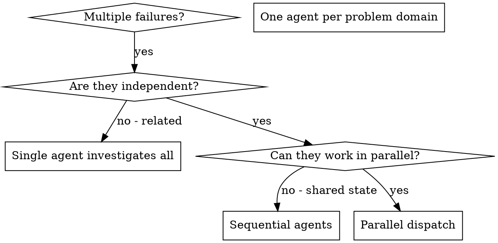

# Dispatching Parallel Agents

## Overview

When you have multiple unrelated failures (different test files, different subsystems, different bugs), investigating them sequentially wastes time. Each investigation is independent and can happen in parallel.

**Core principle:** Dispatch one agent per independent problem domain. Let them work concurrently.

## When to Use



**Use when:**
- 3+ test files failing with different root causes
- Multiple subsystems broken independently
- Each problem can be understood without context from others
- No shared state between investigations

**Don't use when:**
- Failures are related (fix one might fix others)
- Need to understand full system state
- Agents would interfere with each other

## The Pattern

### 1. Identify Independent Domains

Group failures by what's broken:
- File A tests: Tool approval flow
- File B tests: Batch completion behavior
- File C tests: Abort functionality

Each domain is independent - fixing tool approval doesn't affect abort tests.

### 2. Create Focused Agent Tasks

Each agent gets:
- **Specific scope:** One test file or subsystem
- **Clear goal:** Make these tests pass
- **Constraints:** Don't change other code
- **Expected output:** Summary of what you found and fixed

### 3. Dispatch in Parallel

```typescript
// In Claude Code / AI environment
Task("Fix agent-tool-abort.test.ts failures")
Task("Fix batch-completion-behavior.test.ts failures")
Task("Fix tool-approval-race-conditions.test.ts failures")
// All three run concurrently
```

### 4. Review and Integrate

When agents return:
- Read each summary
- Verify fixes don't conflict
- Run full test suite
- Integrate all changes

### 5. Reconcile Results

When agents return outputs that overlap (modify the same fields), use geometric conflict classification to merge intelligently.

#### 5.1 Import the Reconciliation Helper

Within hook scripts, the plugin lib directory (`plugins/onex/hooks/lib/`) is already on `sys.path`, so the import is a bare module name:

```python
from reconcile_agent_outputs import reconcile_outputs
```

If importing from tests or other code outside the plugin context, add the plugin lib to `sys.path` first (the test suite uses a `pyproject.toml`-anchored helper to locate the project root):

```python
import sys
from pathlib import Path

# Walk up to project root (directory containing pyproject.toml)
root = Path(__file__).resolve().parent
while not (root / "pyproject.toml").exists():
    root = root.parent
sys.path.insert(0, str(root / "plugins" / "onex" / "hooks" / "lib"))

from reconcile_agent_outputs import reconcile_outputs
```

#### 5.2 Gather Agent Outputs

Collect outputs from all completed agents into a dict mapping agent name to output:

```python
agent_outputs = {
    "agent-1": agent_1_result,
    "agent-2": agent_2_result,
    "agent-3": agent_3_result,
}
base_values = original_state  # state before agents ran
```

#### 5.3 Run Reconciliation

```python
result = reconcile_outputs(base_values, agent_outputs)
```

#### 5.4 Handle the Result

**If `result.requires_approval` is False**: Apply `result.merged_values` directly. Note that `merged_values` is a flat dict of dot-separated paths (e.g. `{"db.pool.max_size": 10}`). To reconstruct a nested structure, use:

```python
from reconcile_agent_outputs import unflatten_paths

nested = unflatten_paths(result.merged_values)
# {"db": {"pool": {"max_size": 10}}}
```

**If `result.requires_approval` is True**: STOP. Use `AskUserQuestion` to present each approval-required field with the competing values from each agent. Do NOT attempt to resolve these yourself.

```python
if result.requires_approval:
    # Present each conflict to the user
    for field in result.approval_fields:
        decision = result.field_decisions[field]
        # Show: field name, conflict type, each agent's value
        # Ask user to pick one
    # WAIT for approval before proceeding
```

#### 5.5 Rules

- **Never hand-merge approval-required fields.** The helper returns `chosen_value=None` for these -- there is no value to extract.
- **Always surface the exact competing values** and which agent produced them.
- **Apply only `result.merged_values`** from the helper. Do not construct merge results manually.
- **Review optional-review fields** (`result.optional_review_fields`) if time permits, but they have auto-resolved values.

#### 5.6 Reconciliation Summary

Print `result.summary` for the user. It shows counts per category and lists fields requiring action.

## Agent Prompt Structure

Good agent prompts are:
1. **Focused** - One clear problem domain
2. **Self-contained** - All context needed to understand the problem
3. **Specific about output** - What should the agent return?

```markdown
Fix the 3 failing tests in src/agents/agent-tool-abort.test.ts:

1. "should abort tool with partial output capture" - expects 'interrupted at' in message
2. "should handle mixed completed and aborted tools" - fast tool aborted instead of completed
3. "should properly track pendingToolCount" - expects 3 results but gets 0

These are timing/race condition issues. Your task:

1. Read the test file and understand what each test verifies
2. Identify root cause - timing issues or actual bugs?
3. Fix by:
   - Replacing arbitrary timeouts with event-based waiting
   - Fixing bugs in abort implementation if found
   - Adjusting test expectations if testing changed behavior

Do NOT just increase timeouts - find the real issue.

Return: Summary of what you found and what you fixed.
```

## Common Mistakes

**❌ Too broad:** "Fix all the tests" - agent gets lost
**✅ Specific:** "Fix agent-tool-abort.test.ts" - focused scope

**❌ No context:** "Fix the race condition" - agent doesn't know where
**✅ Context:** Paste the error messages and test names

**❌ No constraints:** Agent might refactor everything
**✅ Constraints:** "Do NOT change production code" or "Fix tests only"

**❌ Vague output:** "Fix it" - you don't know what changed
**✅ Specific:** "Return summary of root cause and changes"

## When NOT to Use

**Related failures:** Fixing one might fix others - investigate together first
**Need full context:** Understanding requires seeing entire system
**Exploratory debugging:** You don't know what's broken yet
**Shared state:** Agents would interfere (editing same files, using same resources)

## Real Example from Session

**Scenario:** 6 test failures across 3 files after major refactoring

**Failures:**
- agent-tool-abort.test.ts: 3 failures (timing issues)
- batch-completion-behavior.test.ts: 2 failures (tools not executing)
- tool-approval-race-conditions.test.ts: 1 failure (execution count = 0)

**Decision:** Independent domains - abort logic separate from batch completion separate from race conditions

**Dispatch:**
```
Agent 1 → Fix agent-tool-abort.test.ts
Agent 2 → Fix batch-completion-behavior.test.ts
Agent 3 → Fix tool-approval-race-conditions.test.ts
```

**Results:**
- Agent 1: Replaced timeouts with event-based waiting
- Agent 2: Fixed event structure bug (threadId in wrong place)
- Agent 3: Added wait for async tool execution to complete

**Integration:** All fixes independent, no conflicts, full suite green

**Time saved:** 3 problems solved in parallel vs sequentially

## Key Benefits

1. **Parallelization** - Multiple investigations happen simultaneously
2. **Focus** - Each agent has narrow scope, less context to track
3. **Independence** - Agents don't interfere with each other
4. **Speed** - 3 problems solved in time of 1

## Verification

After agents return:
1. **Review each summary** - Understand what changed
2. **Check for conflicts** - Did agents edit same code?
3. **Run full suite** - Verify all fixes work together
4. **Spot check** - Agents can make systematic errors

## Real-World Impact

From debugging session (2025-10-03):
- 6 failures across 3 files
- 3 agents dispatched in parallel
- All investigations completed concurrently
- All fixes integrated successfully
- Zero conflicts between agent changes
