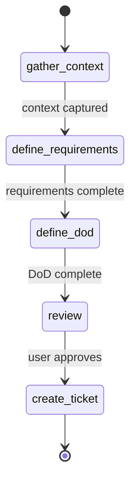

# Interactive Ticket Planning

## Overview

Guide users through structured ticket creation to produce well-formed Linear tickets with complete requirements and definition of done. This skill ensures tickets have everything needed for successful implementation.

**Announce at start:** "I'm using the plan-ticket skill to help you create a well-structured ticket."

## Quick Start

```
/plan-ticket
```

This will:
1. Start an interactive conversation to gather ticket information
2. Walk through each required section progressively
3. Validate completeness before ticket creation
4. Create the ticket in Linear with standardized format

## What This Skill Produces

A Linear ticket containing:
- **Title**: Clear, actionable ticket title
- **Description**: Context and background
- **Requirements Section**: Functional, technical, constraints, dependencies
- **Definition of Done**: Verification criteria with checkboxes
- **Contract Block**: Initialized ModelTicketContract YAML for ticket-work skill

## Interactive Flow



### Phase 1: Gather Context

Questions asked:
- What problem are you trying to solve?
- What is the expected outcome?
- Are there related tickets or prior work?

### Phase 2: Define Requirements

For each requirement type:
- **Functional**: What must the system do?
- **Technical**: Implementation constraints or approaches?
- **Constraints**: Performance, security, compatibility limits?
- **Dependencies**: External systems, other tickets, or blockers?

### Phase 3: Define Done

Establish verification criteria:
- How will we know this is complete?
- What tests should pass?
- What documentation is needed?
- Who needs to review?

### Phase 4: Review and Create

Present draft ticket for user review:
- Display formatted ticket preview
- Allow edits and refinements
- Confirm team and priority
- Create ticket via Linear MCP

## Output Format

The created ticket will have this structure:

```markdown
## Context

{background and problem statement}

## Requirements

### Functional
- {requirement 1}
- {requirement 2}

### Technical
- {technical requirement}

### Constraints
- {constraint}

### Dependencies
- {dependency}

## Definition of Done

- [ ] {verification criterion 1}
- [ ] {verification criterion 2}
- [ ] PR approved and merged
- [ ] Documentation updated

---

## Contract

```yaml
phase: intake
context: {}
questions: []
requirements: []
verification: []
gates: []
commits: []
pr_url: null
```
```

## Integration with ticket-work

Tickets created by this skill are immediately ready for the `/ticket-work` skill:

```
/plan-ticket          # Create the ticket interactively
/ticket-work OMN-XXX  # Execute the work using contract-driven flow
```

## See Also

- `/ticket-work` - Execute tickets using contract-driven phases
- Linear MCP tools (`mcp__linear-server__create_issue`)
- ModelTicketContract schema in omnibase_core
