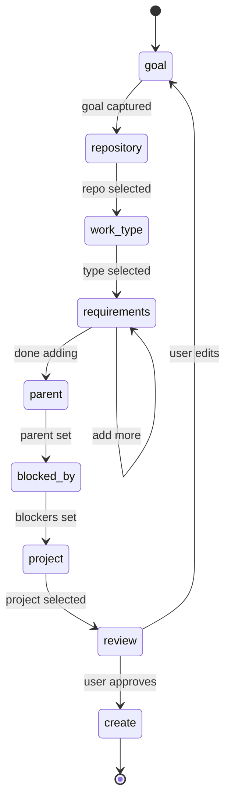

# Interactive Ticket Planning

## Overview

Guide users through structured ticket creation to produce well-formed Linear tickets with complete requirements and verification steps. This skill ensures tickets have everything needed for successful implementation.

**Announce at start:** "I'm using the plan-ticket skill to help you create a well-structured ticket."

## Quick Start

```
/plan-ticket
```

This will:
1. Start an interactive conversation to gather ticket information
2. Walk through each required section using AskUserQuestion
3. Validate completeness before ticket creation
4. Create the ticket in Linear via `/create-ticket`

## What This Skill Produces

A Linear ticket containing:
- **Title**: Derived from your stated goal
- **Repository**: Selected from OmniNode repos
- **Requirements**: Numbered list (R1, R2, R3...) with acceptance criteria
- **Verification**: Default unit test and lint checks
- **Relationships**: Optional parent and blocking ticket links

## Interactive Flow



### Step-by-Step Flow

| Step | Question | Input Type |
|------|----------|------------|
| 1. Goal | "What's the goal of this ticket?" | Free text |
| 2. Repository | "Which repository?" | Selection (7 repos + Other) |
| 3. Work Type | "What type of work?" | Selection (Feature, Bug fix, Refactor, Documentation, Infrastructure) |
| 4. Requirements | "What is requirement R{n}?" + "What are the acceptance criteria?" | Free text (iterative loop) |
| 5. Parent | "Does this have a parent ticket?" | Yes/No + ID entry |
| 6. Blocked By | "Is this blocked by other tickets?" | Yes/No + ID entry |
| 7. Project | "Which Linear project?" | Selection from recent projects |
| 8. Review | "Does this look correct?" | Yes/No with edit options |
| 9. Create | Invoke /create-ticket | Automatic |

## Output Format

The created ticket will have this structure (via `/create-ticket`):

```markdown
## Summary

{goal as description}

**Repository**: {selected_repo}
**Dependencies**: {blocked_by or "None"}

## Requirements

### R1: {statement}

**Rationale**: Required for {work_type}

**Acceptance Criteria**:
- [ ] {criterion_1}
- [ ] {criterion_2}

### R2: {statement}
...

## Verification

| ID | Title | Kind | Command | Blocking |
|----|-------|------|---------|----------|
| V1 | Unit tests pass | unit_tests | `uv run pytest tests/` | Yes |
| V2 | Lint passes | lint | `uv run ruff check .` | Yes |

## Definition of Done

- [ ] All acceptance criteria verified
- [ ] Verification commands pass
- [ ] Code reviewed and approved
- [ ] Documentation updated (if applicable)
- [ ] No regressions introduced
```

## Repository Options

- `omnibase_core` - Core runtime, models, and validation
- `omniclaude` - Claude Code plugin and hooks
- `omnibase_infra` - Infrastructure and deployment
- `omnidash` - Dashboard and monitoring UI
- `omniintelligence` - Intelligence and RAG services
- `omnimemory` - Memory and context services
- `omninode_infra` - Node infrastructure
- Other (custom entry)

## See Also

- `/create-ticket` - Low-level ticket creation (used internally)
- `/ticket-work` - Execute tickets using contract-driven phases
- Linear MCP tools (`mcp__linear-server__create_issue`)
