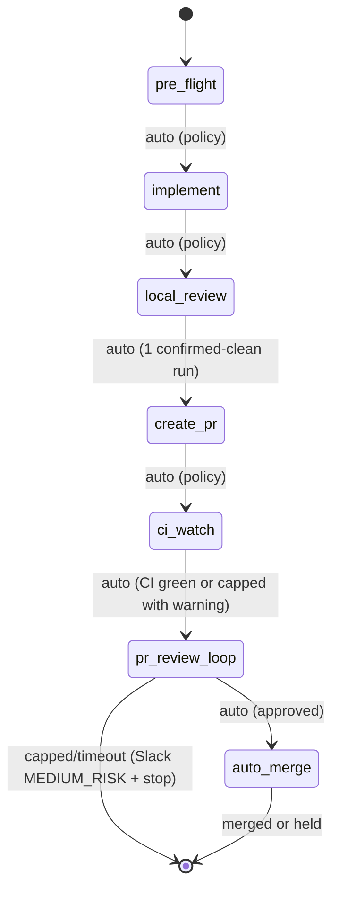

# Ticket Pipeline

## Overview

Chain existing skills into an autonomous per-ticket pipeline: pre_flight -> implement -> local_review -> create_pr -> ci_watch -> pr_review_loop -> auto_merge. Slack notifications fire at each phase transition. Policy switches (not agent judgment) control auto-advance.

**Announce at start:** "I'm using the ticket-pipeline skill to run the pipeline for {ticket_id}."

## Quick Start

```
/ticket-pipeline OMN-1234
/ticket-pipeline OMN-1234 --dry-run
/ticket-pipeline OMN-1234 --skip-to create_pr
/ticket-pipeline OMN-1234 --force-run
```

## Pipeline Flow



### Phase 0: pre_flight

- Runs pre-commit hooks + mypy on clean checkout
- Classifies pre-existing issues as AUTO-FIX or DEFER
- AUTO-FIX: <=10 files, same subsystem, low-risk → fix, commit as `chore(pre-existing):`
- DEFER: creates Linear sub-ticket, notes in PR description
- AUTO-ADVANCE to Phase 1

### Phase 1: implement

- Dispatches `ticket-work` to a polymorphic agent via `Task()` (own context window)
- Human gates still fire for questions/spec within the agent
- Cross-repo detection: invokes `decompose-epic` to create per-repo sub-tickets (MEDIUM_RISK gate, 10 min), then hands off to `epic-team` instead of hard-stopping
- Slack: `notification.blocked` when waiting for human input
- AUTO-ADVANCE to Phase 2

### Phase 2: local_review

- Dispatches `local-review` to a polymorphic agent via `Task()` (own context window)
- Autonomous: loops until clean or policy limits hit
- Requires 1 confirmed-clean run before advancing
- Stop on: 0 blocking issues (confirmed by 1 clean run), max iterations, repeat issues, new major after iteration 1
- AUTO-ADVANCE to Phase 3 (only if quality gate passed: 1 confirmed-clean run)

### Phase 3: create_pr

- Runs inline in orchestrator (lightweight git/gh operations)
- Idempotent: skips creation if PR already exists on branch
- Pre-checks: clean tree, branch tracks remote, branch name pattern, gh auth, realm/topic invariant
- Pushes branch, creates PR via `gh`, updates Linear status
- AUTO-ADVANCE to Phase 4

### Phase 4: ci_watch [NEW]

- Invokes `ci-watch` sub-skill (OMN-2523) with configured policy
- `ci-watch` polls `gh pr checks` every 5 minutes
- Auto-invokes `ci-fix-pipeline` on CI failure (respects `max_ci_fix_cycles` cap)
- Returns: `status: completed | capped | timeout | failed`
- On `completed`: AUTO-ADVANCE to Phase 5
- On `capped` or `timeout`: log warning, continue to Phase 5 with warning note
- On `failed`: Slack MEDIUM_RISK gate, stop pipeline

### Phase 5: pr_review_loop (see OMN-2528)

- Placeholder: invokes `pr-watch` sub-skill
- Returns: `status: approved | capped | timeout | failed`
- On `approved`: AUTO-ADVANCE to Phase 6
- On `capped`: Slack MEDIUM_RISK "merge blocked" + stop
- On `timeout`: Slack MEDIUM_RISK notification + stop

### Phase 6: auto_merge (see OMN-2529)

- Placeholder: invokes `auto-merge` sub-skill
- Default: HIGH_RISK Slack gate requiring explicit "merge" reply
- On `merged`: clear ticket-run ledger entry, post success to Slack
- On `held`: pipeline exits cleanly (human will reply to Slack)

## Pipeline Policy

All auto-advance behavior is governed by explicit policy switches, not agent judgment:

| Switch | Default | Description |
|--------|---------|-------------|
| `policy_version` | `"2.0"` | Version the policy for forward compatibility |
| `auto_advance` | `true` | Auto-advance between phases |
| `auto_commit` | `true` | Allow local-review to commit fixes |
| `auto_push` | `true` | Allow pushing to remote branch |
| `auto_pr_create` | `true` | Allow creating PRs |
| `max_review_iterations` | `3` | Cap review loops (local + PR) |
| `stop_on_major` | `true` | Stop if new major appears after first iteration |
| `stop_on_repeat` | `true` | Stop if same issues appear twice (fingerprint-based) |
| `stop_on_cross_repo` | `false` | Auto-split via decompose-epic instead of stopping |
| `stop_on_invariant` | `true` | Stop if realm/topic naming violation detected |
| `auto_fix_ci` | `true` | Auto-invoke ci-fix-pipeline on CI failure |
| `ci_watch_timeout_minutes` | `60` | Max minutes waiting for CI before timeout |
| `max_ci_fix_cycles` | `3` | Max ci-fix-pipeline invocations before capping |
| `cap_escalation` | `"slack_notify_and_continue"` | On ci_watch cap: notify Slack and continue to Phase 5 |

## State Management

Pipeline state is stored at `~/.claude/pipelines/{ticket_id}/state.yaml` as the primary state machine. Linear ticket gets a compact summary mirror (run_id, current phase, blocked reason, artifacts).

### Ticket-Run Ledger

Prevents duplicate pipeline runs. Stored at `~/.claude/pipelines/ledger.json`:

```json
{
  "OMN-2356": {
    "active_run_id": "run-abc123",
    "started_at": "2026-02-21T14:00:00Z",
    "log": "~/.claude/pipeline-logs/OMN-2356.log"
  }
}
```

- Entry created when pipeline starts (Phase 0)
- Entry cleared when pipeline reaches terminal state (merged, failed, capped)
- On new invocation: check ledger first; if entry exists → post "already running ({run-id})" to Slack and exit

## Dry Run Mode

`--dry-run` executes phase logic, logs all decisions, and writes state (marked `dry_run: true`), but does NOT commit, push, create PRs, or update Linear status. Slack notifications are prefixed with `[DRY RUN]`.

## Maximum Damage Assessment

If pipeline runs unattended, worst case:
- Pushes code to a feature branch (not main) -- reversible
- Creates a PR -- closeable, doesn't auto-merge without explicit "merge" reply
- Runs CI fixes (ci-fix-pipeline) -- reversible via git
- Sends Slack notifications -- ignorable
- Updates Linear status -- manually reversible

## Supporting Modules (OMN-1970)

| Module | Location | Purpose |
|--------|----------|---------|
| `pipeline_slack_notifier.py` | `plugins/onex/hooks/lib/` | Threaded Slack notifications with correlation formatting |
| `cross_repo_detector.py` | `plugins/onex/hooks/lib/` | Detect changes spanning multiple repo roots |
| `linear_contract_patcher.py` | `plugins/onex/hooks/lib/` | Safe marker-based patching of Linear descriptions |

These modules are imported by the pipeline orchestration logic in `prompt.md`.

## Dispatch Contracts (Execution-Critical)

**This section governs how you execute the pipeline. Follow it exactly.**

You are an orchestrator. You coordinate phase transitions, state persistence, and policy checks.
You do NOT implement, review, or fix code yourself. Heavy phases run in separate agents via `Task()`.

**Rule: The coordinator must NEVER call Edit(), Write(), or Bash(code-modifying commands) directly.**
If code changes are needed, dispatch a polymorphic agent. If you find yourself wanting to make an
edit, that is the signal to dispatch instead.

### Phase 0: pre_flight — runs inline (no sub-agent dispatch needed)

Pre-flight checks run inline in the orchestrator. No `Task()` dispatch. The orchestrator runs
pre-commit hooks and mypy directly, classifies issues, and auto-advances to Phase 1.

### Phase 1: implement — dispatch to polymorphic agent

```
Task(
  subagent_type="onex:polymorphic-agent",
  description="ticket-pipeline: Phase 1 implement for {ticket_id}: {title}",
  prompt="You are executing ticket-work for {ticket_id}.
    Invoke: Skill(skill=\"onex:ticket-work\", args=\"{ticket_id} --autonomous\")

    Ticket: {ticket_id} - {title}
    Description: {description}
    Branch: {branch_name}
    Repo: {repo_path}

    Execute the full ticket-work workflow (intake -> research -> questions -> spec -> implementation).
    Do NOT commit changes -- the orchestrator handles git operations.
    Report back with: files changed, tests run, any blockers encountered."
)
```

### Phase 2: local_review — dispatch to polymorphic agent

```
Task(
  subagent_type="onex:polymorphic-agent",
  description="ticket-pipeline: Phase 2 local-review for {ticket_id}",
  prompt="You are executing local-review for {ticket_id}.
    Invoke: Skill(skill=\"onex:local-review\", args=\"--max-iterations {max_review_iterations} --required-clean-runs 1\")

    Branch: {branch_name}
    Repo: {repo_path}
    Previous phase: implementation complete

    Execute the local review loop.
    Report back with:
    - Number of iterations completed
    - Blocking issues found (count and descriptions)
    - Whether review passed (0 blocking issues)"
)
```

### Phase 3: create_pr — runs inline (lightweight git/gh operations only)

No dispatch needed. The orchestrator runs `git push`, `gh pr create`, and Linear MCP calls directly.

### Phase 4: ci_watch — dispatch to polymorphic agent

```
Task(
  subagent_type="onex:polymorphic-agent",
  description="ticket-pipeline: Phase 4 ci_watch for {ticket_id} on PR #{pr_number}",
  prompt="You are executing ci-watch for {ticket_id}.
    Invoke: Skill(skill=\"onex:ci-watch\",
      args=\"--pr {pr_number} --ticket-id {ticket_id} --timeout-minutes {ci_watch_timeout_minutes} --max-fix-cycles {max_ci_fix_cycles}\")

    Read the ModelSkillResult from ~/.claude/skill-results/{context_id}/ci-watch.json
    Report back with: status (completed|capped|timeout|failed), ci_fix_cycles_used, watch_duration_minutes."
)
```

**On ci_watch result:**
- `completed`: auto-advance to Phase 5
- `capped`: log warning "CI fix cap reached — continuing to Phase 5 with degraded confidence", auto-advance to Phase 5
- `timeout`: log warning "CI watch timed out — continuing to Phase 5", auto-advance to Phase 5
- `failed`: post Slack MEDIUM_RISK gate, stop pipeline

**MEDIUM_RISK Slack gate on ci_watch failed:**
```
[MEDIUM_RISK] ticket-pipeline: CI watch failed for {ticket_id}

PR #{pr_number} CI failed and could not be fixed automatically.
Reply 'skip' to continue to PR review anyway, 'stop' to halt pipeline.
Silence (15 min) = stop.
```

### Phase 5: pr_review_loop — dispatch to polymorphic agent (see OMN-2528)

Placeholder — implemented in OMN-2528.

### Phase 6: auto_merge — dispatch to polymorphic agent (see OMN-2529)

Placeholder — implemented in OMN-2529.

---

## Detailed Orchestration

Full orchestration logic (state machine, helper functions, error handling, resume behavior)
is documented in `prompt.md`. The dispatch contracts above are sufficient to execute the pipeline.
Load `prompt.md` only if you need reference details for state schema, helper functions, or
edge case handling.

---

## See Also

- `ticket-work` skill (Phase 1)
- `local-review` skill (Phase 2)
- `ci-watch` skill (Phase 4, OMN-2523)
- `pr-watch` skill (Phase 5, OMN-2524)
- `auto-merge` skill (Phase 6, OMN-2525)
- `emit_client_wrapper` (Kafka event emission)
- `HandlerSlackWebhook` in omnibase_infra (Slack delivery infrastructure)
- OMN-2157 (Web API threading support — future dependency)
- Linear MCP tools (`mcp__linear-server__*`)
