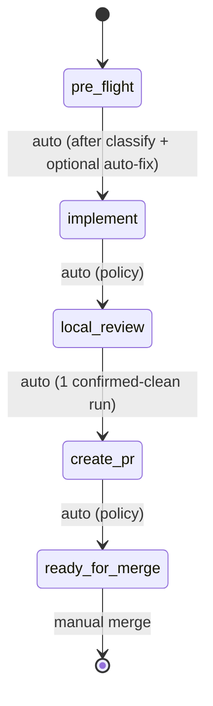

# Ticket Pipeline

## Overview

Chain existing skills into an autonomous per-ticket pipeline: pre_flight -> implement -> local_review -> create_pr -> ready_for_merge. Slack notifications fire at each phase transition. Policy switches (not agent judgment) control auto-advance.

**Announce at start:** "I'm using the ticket-pipeline skill to run the pipeline for {ticket_id}."

## Quick Start

```
/ticket-pipeline OMN-1234
/ticket-pipeline OMN-1234 --dry-run
/ticket-pipeline OMN-1234 --skip-to create_pr
/ticket-pipeline OMN-1234 --force-run
```

## Pipeline Flow



### Phase 0: pre_flight

Runs BEFORE implementation on a clean checkout to detect and classify pre-existing issues.

**Key invariant**: Phase 0 is detect-and-classify, NOT "always fix everything." Derailing ticket
implementation by fixing an unrelated subsystem is worse than deferring with a follow-up ticket.

**Procedure**:
1. Run `pre-commit run --all-files` on clean checkout
2. Run `mypy src/ --strict` (or repo-equivalent from `pyproject.toml`)
3. Classify each failure:
   - **AUTO-FIX** if ALL of these are true:
     - <= 10 files touched
     - Same subsystem as the ticket's work
     - Low-risk change (formatting, import ordering, type annotation style)
   - **DEFER** if any criterion fails (> 10 files, architectural, unrelated subsystem)
4. For AUTO-FIX: apply fixes, commit as `chore(pre-existing): fix pre-existing lint/type errors`
5. For DEFER: auto-create a Linear sub-ticket via MCP; record in PR description note section
6. Write Phase 0 result to state (`phases.pre_flight.artifacts`)
7. AUTO-ADVANCE to Phase 1 (implementation begins on now-cleaner codebase)

**Phase 0 commits are always separate from feature work.**

### Phase 1: implement

- Dispatches `ticket-work` to a polymorphic agent via `Task()` (own context window)
- Human gates still fire for questions/spec within the agent
- Cross-repo detection: blocks if changes touch multiple repo roots
- Slack: `notification.blocked` when waiting for human input
- AUTO-ADVANCE to Phase 2

### Phase 2: local_review

- Dispatches `local-review` to a polymorphic agent via `Task()` (own context window)
- Autonomous: loops until clean or policy limits hit
- Requires 1 confirmed-clean run with stable run signature before advancing
- Stop on: 0 blocking issues (confirmed by 1 clean run), max iterations, repeat issues, new major after iteration 1
- AUTO-ADVANCE to Phase 3 (only if quality gate passed: 1 confirmed-clean run)

### Phase 3: create_pr

- Runs inline in orchestrator (lightweight git/gh operations)
- Idempotent: skips creation if PR already exists on branch
- Pre-checks: clean tree, branch tracks remote, branch name pattern, gh auth, realm/topic invariant
- Pushes branch, creates PR via `gh`, updates Linear status
- AUTO-ADVANCE to Phase 4

### Phase 4: ready_for_merge

- Adds `ready-for-merge` label to Linear
- Slack notification with blocking/nit counts
- Pipeline STOPS (manual merge only)

## Pipeline Policy

All auto-advance behavior is governed by explicit policy switches, not agent judgment:

| Switch | Default | Description |
|--------|---------|-------------|
| `policy_version` | `"1.0"` | Version the policy for forward compatibility |
| `auto_advance` | `true` | Auto-advance between phases |
| `auto_commit` | `true` | Allow local-review to commit fixes |
| `auto_push` | `true` | Allow pushing to remote branch |
| `auto_pr_create` | `true` | Allow creating PRs |
| `max_review_iterations` | `7` | Cap review loops (local + PR) |
| `stop_on_major` | `true` | Stop if new major appears after first iteration |
| `stop_on_repeat` | `true` | Stop if same issues appear twice (fingerprint-based) |
| `stop_on_cross_repo` | `true` | Stop if changes touch multiple repo roots |
| `stop_on_invariant` | `true` | Stop if realm/topic naming violation detected |

## State Management

Pipeline state is stored at `~/.claude/pipelines/{ticket_id}/state.yaml` as the primary state machine. Linear ticket gets a compact summary mirror (run_id, current phase, blocked reason, artifacts).

## Dry Run Mode

`--dry-run` executes phase logic, logs all decisions, and writes state (marked `dry_run: true`), but does NOT commit, push, create PRs, or update Linear status. Slack notifications are prefixed with `[DRY RUN]`.

## Maximum Damage Assessment

If pipeline runs unattended, worst case:
- Pushes code to a feature branch (not main) -- reversible
- Creates a PR -- closeable, doesn't auto-merge
- Sends Slack notifications -- ignorable
- Updates Linear status -- manually reversible

## Supporting Modules (OMN-1970)

| Module | Location | Purpose |
|--------|----------|---------|
| `pipeline_slack_notifier.py` | `plugins/onex/hooks/lib/` | Threaded Slack notifications with correlation formatting |
| `cross_repo_detector.py` | `plugins/onex/hooks/lib/` | Detect changes spanning multiple repo roots |
| `linear_contract_patcher.py` | `plugins/onex/hooks/lib/` | Safe marker-based patching of Linear descriptions |

These modules are imported by the pipeline orchestration logic in `prompt.md`.

## Dispatch Contracts (Execution-Critical)

**This section governs how you execute the pipeline. Follow it exactly.**

You are an orchestrator. You coordinate phase transitions, state persistence, and policy checks.
You do NOT implement, review, or fix code yourself. Heavy phases run in separate agents via `Task()`.

**Rule: The coordinator must NEVER call Edit(), Write(), or Bash(code-modifying commands) directly.**
If code changes are needed, dispatch a polymorphic agent. If you find yourself wanting to make an
edit, that is the signal to dispatch instead.

### Phase 0: pre_flight — dispatch to polymorphic agent

```
Task(
  subagent_type="onex:polymorphic-agent",
  description="ticket-pipeline: Phase 0 pre-flight for {ticket_id}",
  prompt="**AGENT REQUIREMENT**: You MUST be a polymorphic-agent.

    Run Phase 0 pre-flight checks for ticket {ticket_id}.

    ## Steps

    1. Run: pre-commit run --all-files
    2. Run: mypy src/ --strict  (or detected equivalent from pyproject.toml)
    3. For each failure, classify as AUTO-FIX or DEFER:
       - AUTO-FIX: <= 10 files, same subsystem as ticket, low-risk change
       - DEFER: otherwise (auto-create Linear sub-ticket, note in PR description)
    4. Apply AUTO-FIX changes (do NOT commit — orchestrator commits separately)

    ## Output Format

    Return JSON:
    {\"auto_fixed\": [{\"file\": str, \"issue\": str}],
     \"deferred\": [{\"file\": str, \"issue\": str, \"sub_ticket\": str}],
     \"clean\": bool}

    If no pre-existing issues: {\"auto_fixed\": [], \"deferred\": [], \"clean\": true}"
)
```

After dispatch: if `auto_fixed` is non-empty, orchestrator commits:
`git add <changed_files> && git commit -m "chore(pre-existing): fix pre-existing lint/type errors"`

### Phase 1: implement — dispatch to polymorphic agent

```
Task(
  subagent_type="onex:polymorphic-agent",
  description="ticket-pipeline: Phase 1 implement for {ticket_id}: {title}",
  prompt="You are executing ticket-work for {ticket_id}.
    Invoke: Skill(skill=\"onex:ticket-work\", args=\"{ticket_id}\")

    Ticket: {ticket_id} - {title}
    Description: {description}
    Branch: {branch_name}
    Repo: {repo_path}

    Execute the full ticket-work workflow (intake -> research -> questions -> spec -> implementation).
    Do NOT commit changes -- the orchestrator handles git operations.
    Report back with: files changed, tests run, any blockers encountered."
)
```

### Phase 2: local_review — dispatch to polymorphic agent

```
Task(
  subagent_type="onex:polymorphic-agent",
  description="ticket-pipeline: Phase 2 local-review for {ticket_id}",
  prompt="You are executing local-review for {ticket_id}.
    Invoke: Skill(skill=\"onex:local-review\", args=\"--max-iterations {max_review_iterations} --required-clean-runs 1\")

    Branch: {branch_name}
    Repo: {repo_path}
    Previous phase: implementation complete

    Execute the local review loop.
    Report back with:
    - Number of iterations completed
    - Blocking issues found (count and descriptions)
    - Whether review passed (0 blocking issues)"
)
```

### Phase 3: create_pr — runs inline (lightweight git/gh operations only)

No dispatch needed. The orchestrator runs `git push`, `gh pr create`, and Linear MCP calls directly.

### Phase 4: ready_for_merge — runs inline (Linear label + Slack notification only)

No dispatch needed. The orchestrator adds labels and sends notifications directly.

---

## Detailed Orchestration

Full orchestration logic (state machine, helper functions, error handling, resume behavior)
is documented in `prompt.md`. The dispatch contracts above are sufficient to execute the pipeline.
Load `prompt.md` only if you need reference details for state schema, helper functions, or
edge case handling.

---

## See Also

- `ticket-work` skill (Phase 1)
- `local-review` skill (Phase 2)
- `emit_client_wrapper` (Kafka event emission)
- `HandlerSlackWebhook` in omnibase_infra (Slack delivery infrastructure)
- OMN-2157 (Web API threading support — future dependency)
- Linear MCP tools (`mcp__linear-server__*`)
