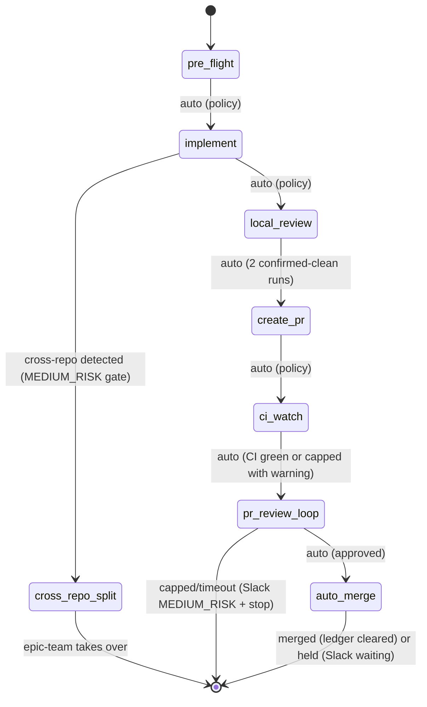

# Ticket Pipeline

## Overview

Chain existing skills into an autonomous per-ticket pipeline: pre_flight -> implement -> local_review -> create_pr -> ci_watch -> pr_review_loop -> auto_merge. Slack notifications fire at each phase transition. Policy switches (not agent judgment) control auto-advance.

**Cross-repo detection**: When implementation touches files in multiple repos, the pipeline no longer hard-stops. Instead it invokes `decompose-epic` to create per-repo sub-tickets, posts a Slack MEDIUM_RISK gate (10-min timeout), then hands off to `epic-team` for parallel execution.

**Announce at start:** "I'm using the ticket-pipeline skill to run the pipeline for {ticket_id}."

## Quick Start

```
/ticket-pipeline OMN-1234
/ticket-pipeline OMN-1234 --dry-run
/ticket-pipeline OMN-1234 --skip-to create_pr
/ticket-pipeline OMN-1234 --force-run
/ticket-pipeline OMN-1234 --auto-merge    # Skip HIGH_RISK merge gate
```

## Pipeline Flow



### Phase 0: pre_flight

- Runs pre-commit hooks + mypy on clean checkout
- Classifies pre-existing issues as AUTO-FIX or DEFER
- AUTO-FIX: <=10 files, same subsystem, low-risk → fix, commit as `chore(pre-existing):`
- DEFER: creates Linear sub-ticket, notes in PR description
- AUTO-ADVANCE to Phase 1

### Phase 1: implement

- Dispatches `ticket-work` to a polymorphic agent via `Task()` (own context window)
- Human gates still fire for questions/spec within the agent
- **Cross-repo detection** (see below): invokes `decompose-epic` and hands off to `epic-team` instead of hard-stopping
- Slack: `notification.blocked` when waiting for human input
- AUTO-ADVANCE to Phase 2 (single-repo only)

### Phase 1b: cross_repo_split (inline in orchestrator)

When cross-repo changes are detected during Phase 1:

```
ticket-pipeline OMN-XXXX
  → During Phase 1 (implement), agent detects cross-repo dependency
  [OLD] stop_on_cross_repo: true → Hard-stop: "Manual intervention required."
  [NEW] → Invoke decompose-epic to split OMN-XXXX into per-repo sub-tickets
        → Create sub-tickets in Linear (one per repo affected)
        → Post Slack MEDIUM_RISK gate (10-min timeout):
            "[MEDIUM_RISK] OMN-XXXX requires cross-repo work.
             Decomposed into N sub-tickets. Handing off to epic-team.
             Reply 'reject' within 10 min."
        → Silence (10 min): invoke epic-team with parent epic OMN-XXXX
        → epic-team assigns sub-tickets to workers in correct repos
        → ticket-pipeline exits (epic-team owns execution from here)
        → 'reject' reply: revert to hard-stop behavior, notify Slack
```

**Cross-repo detection heuristic**: Implementation touches files in repos not matching the ticket's labeled repo (from `~/.claude/epic-team/repo_manifest.yaml`).

### Phase 2: local_review

- Dispatches `local-review` to a polymorphic agent via `Task()` (own context window)
- Autonomous: loops until clean or policy limits hit
- Requires 2 consecutive confirmed-clean runs with stable run signature before advancing
- Stop on: 0 blocking issues (confirmed by 2 clean runs), max iterations, repeat issues, new major after iteration 1
- AUTO-ADVANCE to Phase 3 (only if quality gate passed: 2 confirmed-clean runs)

### Phase 3: create_pr

- Runs inline in orchestrator (lightweight git/gh operations)
- Idempotent: skips creation if PR already exists on branch
- Pre-checks: clean tree, branch tracks remote, branch name pattern, gh auth, realm/topic invariant
- Pushes branch, creates PR via `gh`, updates Linear status
- AUTO-ADVANCE to Phase 4

### Phase 4: ci_watch

- Invokes `ci-watch` sub-skill (OMN-2523) with configured policy
- `ci-watch` polls `gh pr checks` every 5 minutes
- Auto-invokes `ci-failures` skill on CI failure to diagnose and fix failing checks (respects `max_ci_fix_cycles` cap)
- Returns: `status: completed | capped | timeout | failed`
- On `completed`: AUTO-ADVANCE to Phase 5
- On `capped` or `timeout`: log warning, continue to Phase 5 with warning note
- On `failed`: Slack MEDIUM_RISK gate, stop pipeline

### Phase 5: pr_review_loop

- Invokes `pr-watch` sub-skill (OMN-2524) with configured policy
- `pr-watch` polls `gh pr reviews` every 10 minutes
- Auto-invokes `pr-review-dev` on CHANGES_REQUESTED reviews, pushes fixes, re-requests review
- Returns: `status: approved | capped | timeout | failed`
- On `approved`: AUTO-ADVANCE to Phase 6
- On `capped`: Slack MEDIUM_RISK "merge blocked" + stop pipeline
- On `timeout`: Slack MEDIUM_RISK "review timeout" + stop pipeline
- On `failed`: Slack MEDIUM_RISK gate, stop pipeline

### Phase 6: auto_merge

- Invokes `auto-merge` sub-skill (OMN-2525) with configured policy
- Default (`auto_merge: false`): HIGH_RISK Slack gate requiring explicit "merge" reply
- With `--auto-merge` flag: merges immediately without gate
- All three merge conditions must be met before proceeding:
  1. CI passing (all required checks `conclusion: success`)
  2. At least 1 approved review, no current CHANGES_REQUESTED
  3. No unresolved review comments
- Returns: `status: merged | held | failed`
- On `merged`: clear ticket-run ledger entry, post Slack "merged", update Linear to Done
- On `held`: pipeline exits cleanly; `held` is **not** a terminal state — the pipeline resumes when a human replies "merge" to the Slack HIGH_RISK gate. `merge_gate_timeout_hours` (default 48h) controls how long the gate stays open before expiring. On expiry, the ledger entry is cleared and a new pipeline run is required.
- On `failed`: post Slack MEDIUM_RISK gate, stop pipeline

## Pipeline Policy

All auto-advance behavior is governed by explicit policy switches, not agent judgment:

| Switch | Default | Description |
|--------|---------|-------------|
| `policy_version` | `"5.0"` | Version the policy for forward compatibility |
| `auto_advance` | `true` | Auto-advance between phases |
| `auto_commit` | `true` | Allow local-review to commit fixes |
| `auto_push` | `true` | Allow pushing to remote branch |
| `auto_pr_create` | `true` | Allow creating PRs |
| `max_review_iterations` | `3` | Cap review loops (local + PR) |
| `stop_on_major` | `true` | Stop if new major appears after first iteration |
| `stop_on_repeat` | `true` | Stop if same issues appear twice (fingerprint-based) |
| `stop_on_cross_repo` | `false` | Auto-split via decompose-epic instead of stopping |
| `cross_repo_gate_timeout_minutes` | `10` | Minutes to wait for Slack reply before handing off to epic-team |
| `stop_on_invariant` | `true` | Stop if realm/topic naming violation detected |
| `auto_fix_ci` | `true` | Auto-invoke ci-failures skill on CI failure |
| `ci_watch_timeout_minutes` | `60` | Max minutes waiting for CI before timeout |
| `max_ci_fix_cycles` | `3` | Max ci-failures skill invocations before capping |
| `auto_fix_pr_review` | `true` | Auto-invoke pr-review-dev on CHANGES_REQUESTED reviews |
| `auto_fix_nits` | `false` | Skip nit-level PR comments during auto-fix |
| `pr_review_timeout_hours` | `24` | Max hours waiting for PR approval before timeout |
| `max_pr_review_cycles` | `3` | Max pr-review-dev fix cycles before capping |
| `auto_merge` | `false` | Merge immediately without HIGH_RISK Slack gate |
| `slack_on_merge` | `true` | Post Slack notification on successful merge |
| `merge_gate_timeout_hours` | `48` | Hours to wait for explicit "merge" reply (HIGH_RISK held, no auto-advance) |
| `merge_strategy` | `squash` | Merge strategy: squash \| merge \| rebase |
| `delete_branch_on_merge` | `true` | Delete branch after successful merge |

## Cross-Repo Auto-Split

**Requires**: `~/.claude/epic-team/repo_manifest.yaml` (OMN-2519)

### Detection

A cross-repo change is detected when:
1. The implementation agent reports changes in directories not matching the current repo root
2. OR `cross_repo_detector.py` identifies imports/references to modules in different repos

### Split Behavior

```
Phase 1 cross-repo detected:
  1. Stop ticket-work agent (don't commit cross-repo changes)
  2. Create parent epic if OMN-XXXX is a ticket (not already an epic)
     OR use existing parent epic ID
  3. Invoke decompose-epic --parent {parent_id} --repos {detected_repos}
     → Creates per-repo sub-tickets as children
  4. Post Slack MEDIUM_RISK gate:
       "[MEDIUM_RISK] ticket-pipeline: Cross-repo work detected for {ticket_id}
        Decomposed into {N} sub-tickets for repos: {repo_list}
        Handing off to epic-team in 10 minutes.
        Reply 'reject' to revert to hard-stop behavior."
  5. On silence (10 min): invoke epic-team {parent_epic_id}
  6. On 'reject': hard-stop with error message, clear ledger
```

### decompose-epic Dispatch for Cross-Repo

> **Note**: `decompose-epic` is a planned skill (OMN-2522) not yet implemented. Until available,
> the cross-repo split step must be performed manually: create per-repo sub-tickets in Linear,
> then invoke `epic-team` with the parent epic ID. This dispatch contract documents the intended
> future interface.

```
Task(
  subagent_type="onex:polymorphic-agent",
  description="ticket-pipeline: cross-repo split for {ticket_id}",
  prompt="Cross-repo changes detected for {ticket_id}.
    Invoke: Skill(skill=\"onex:decompose-epic\",
      args=\"{parent_epic_id} --repos {comma_separated_repo_names}\")

    Read the ModelSkillResult from ~/.claude/skill-results/{context_id}/decompose-epic.json
    Report back with: created_tickets (list), repos_affected."
)
```

## State Management

Pipeline state is stored at `~/.claude/pipelines/{ticket_id}/state.yaml` as the primary state machine. Linear ticket gets a compact summary mirror (run_id, current phase, blocked reason, artifacts).

### Ticket-Run Ledger

Prevents duplicate pipeline runs. Stored at `~/.claude/pipelines/ledger.json`:

```json
{
  "OMN-2356": {
    "active_run_id": "run-abc123",
    "started_at": "2026-02-21T14:00:00Z",
    "log": "~/.claude/pipeline-logs/OMN-2356.log"
  }
}
```

- Entry **created** when pipeline starts (Phase 0)
- Entry **cleared** when pipeline reaches terminal state (merged, failed, capped, cross-repo-split)
- On new invocation: check ledger first; if entry exists → post "already running" to Slack and exit 0
- `--force-run` breaks stale lock

## Dry Run Mode

`--dry-run` executes phase logic, logs all decisions, and writes state (marked `dry_run: true`), but does NOT commit, push, create PRs, or update Linear status. Slack notifications are prefixed with `[DRY RUN]`.

## Maximum Damage Assessment

If pipeline runs unattended with `--auto-merge`, worst case:
- Pushes code to main via squash-merge — can be reverted
- Deletes feature branch — recreatable from merge commit
- Creates sub-tickets for cross-repo work — deleteable
- Hands off to epic-team for parallel execution — epic-team has its own gates
- Sends Slack notifications — ignorable

Without `--auto-merge` (default): pipeline halts at Phase 6 waiting for explicit "merge" reply.

## Supporting Modules (OMN-1970)

| Module | Location | Purpose |
|--------|----------|---------|
| `pipeline_slack_notifier.py` | `plugins/onex/hooks/lib/` | Threaded Slack notifications with correlation formatting |
| `cross_repo_detector.py` | `plugins/onex/hooks/lib/` | Detect changes spanning multiple repo roots |
| `linear_contract_patcher.py` | `plugins/onex/hooks/lib/` | Safe marker-based patching of Linear descriptions |

These modules are imported by the pipeline orchestration logic in `prompt.md`.

## Dispatch Contracts (Execution-Critical)

**This section governs how you execute the pipeline. Follow it exactly.**

You are an orchestrator. You coordinate phase transitions, state persistence, and policy checks.
You do NOT implement, review, or fix code yourself. Heavy phases run in separate agents via `Task()`.

**Rule: The coordinator must NEVER call Edit(), Write(), or Bash(code-modifying commands) directly.**
If code changes are needed, dispatch a polymorphic agent.

### Phase 0: pre_flight — runs inline (lightweight checks only)

No dispatch needed. The orchestrator runs pre-commit hooks and mypy directly, classifies issues, and auto-fixes or defers as appropriate. No Task() dispatch because pre_flight is lightweight and must complete before the first agent is spawned.

```
# Inline orchestrator actions for Phase 0:
# 1. Run: pre-commit run --all-files (capture output)
# 2. Run: mypy src/ (capture output)
# 3. Classify issues: AUTO-FIX (<=10 files, same subsystem) or DEFER (else)
# 4. AUTO-FIX: apply fixes, commit as chore(pre-existing): [OMN-XXXX]
# 5. DEFER: create Linear sub-ticket via MCP, note in PR description template
# 6. Update state.yaml: phase=implement
# AUTO-ADVANCE to Phase 1
```

### Phase 1: implement — dispatch to polymorphic agent

```
Task(
  subagent_type="onex:polymorphic-agent",
  description="ticket-pipeline: Phase 1 implement for {ticket_id}: {title}",
  prompt="You are executing ticket-work for {ticket_id}.
    Invoke: Skill(skill=\"onex:ticket-work\", args=\"{ticket_id}\")

    Ticket: {ticket_id} - {title}
    Description: {description}
    Branch: {branch_name}
    Repo: {repo_path}

    Execute the full ticket-work workflow.
    Do NOT commit changes -- the orchestrator handles git operations.
    Report back with: files changed, tests run, any blockers, cross-repo files detected."
)
```

If the agent reports cross-repo files, execute Phase 1b (cross_repo_split) inline.

### Phase 2: local_review — dispatch to polymorphic agent

```
Task(
  subagent_type="onex:polymorphic-agent",
  description="ticket-pipeline: Phase 2 local-review for {ticket_id}",
  prompt="You are executing local-review for {ticket_id}.
    Invoke: Skill(skill=\"onex:local-review\", args=\"--max-iterations {max_review_iterations} --required-clean-runs 2\")

    Branch: {branch_name}
    Repo: {repo_path}

    Execute the local review loop.
    Report back with: iterations completed, blocking issues found, whether review passed."
)
```

### Phase 3: create_pr — runs inline (lightweight git/gh operations only)

No dispatch needed. The orchestrator runs `git push`, `gh pr create`, and Linear MCP calls directly.

### Phase 4: ci_watch — dispatch to polymorphic agent

```
Task(
  subagent_type="onex:polymorphic-agent",
  description="ticket-pipeline: Phase 4 ci_watch for {ticket_id} on PR #{pr_number}",
  prompt="Invoke: Skill(skill=\"onex:ci-watch\",
    args=\"--pr {pr_number} --ticket-id {ticket_id} --timeout-minutes {ci_watch_timeout_minutes} --max-fix-cycles {max_ci_fix_cycles}\")
    Report back with: status, ci_fix_cycles_used, watch_duration_minutes."
)
```

### Phase 5: pr_review_loop — dispatch to polymorphic agent

```
Task(
  subagent_type="onex:polymorphic-agent",
  description="ticket-pipeline: Phase 5 pr_review_loop for {ticket_id} on PR #{pr_number}",
  prompt="Invoke: Skill(skill=\"onex:pr-watch\",
    args=\"--pr {pr_number} --ticket-id {ticket_id} --timeout-hours {pr_review_timeout_hours} --max-review-cycles {max_pr_review_cycles}\")
    Report back with: status, pr_review_cycles_used, watch_duration_hours."
)
```

### Phase 6: auto_merge — dispatch to polymorphic agent

`merge_gate_timeout_hours` is passed to `auto-merge` to control the HIGH_RISK Slack gate lifetime.
When `auto_merge: false`, the gate waits up to `merge_gate_timeout_hours` (default 48h) for a human
"merge" reply before expiring. On expiry, the pipeline clears the ledger and a new run is required.

```
Task(
  subagent_type="onex:polymorphic-agent",
  description="ticket-pipeline: Phase 6 auto_merge for {ticket_id} on PR #{pr_number}",
  prompt="Invoke: Skill(skill=\"onex:auto-merge\",
    args=\"--pr {pr_number} --ticket-id {ticket_id}{' --auto-merge' if auto_merge else ''} --strategy {merge_strategy} --gate-timeout-hours {merge_gate_timeout_hours}\")
    Report back with: status, merged_at, branch_deleted."
)
```

---

## Detailed Orchestration

Full orchestration logic (state machine, helper functions, error handling, resume behavior)
is documented in `prompt.md`. The dispatch contracts above are sufficient to execute the pipeline.

---

## See Also

- `ticket-work` skill (Phase 1)
- `local-review` skill (Phase 2)
- `ci-watch` skill (Phase 4, OMN-2523)
- `pr-watch` skill (Phase 5, OMN-2524)
- `auto-merge` skill (Phase 6, OMN-2525)
- `pr-review-dev` skill (PR review and fix loop, used by pr-watch in Phase 5)
- `ci-failures` skill (CI diagnosis and fix, used by ci-watch in Phase 4)
- `decompose-epic` skill (cross-repo split, OMN-2522 — planned)
- `epic-team` skill (receives handoff after cross-repo split)
- `slack-gate` skill (HIGH_RISK merge gate, OMN-2521)
- `~/.claude/epic-team/repo_manifest.yaml` (cross-repo detection, OMN-2519)
- `~/.claude/pipelines/ledger.json` (ticket-run ledger)
- Linear MCP tools (`mcp__linear-server__*`)
