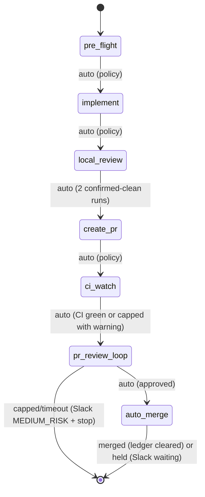

# Ticket Pipeline

## Overview

Chain existing skills into an autonomous per-ticket pipeline: pre_flight -> implement -> local_review -> create_pr -> ci_watch -> pr_review_loop -> auto_merge. Slack notifications fire at each phase transition. Policy switches (not agent judgment) control auto-advance.

**Announce at start:** "I'm using the ticket-pipeline skill to run the pipeline for {ticket_id}."

## Quick Start

```
/ticket-pipeline OMN-1234
/ticket-pipeline OMN-1234 --dry-run
/ticket-pipeline OMN-1234 --skip-to create_pr
/ticket-pipeline OMN-1234 --force-run
/ticket-pipeline OMN-1234 --auto-merge    # Skip HIGH_RISK merge gate
```

## Pipeline Flow



### Phase 0: pre_flight

- Runs pre-commit hooks + mypy on clean checkout
- Classifies pre-existing issues as AUTO-FIX or DEFER
- AUTO-FIX: <=10 files, same subsystem, low-risk → fix, commit as `chore(pre-existing):`
- DEFER: creates Linear sub-ticket, notes in PR description
- AUTO-ADVANCE to Phase 1

### Phase 1: implement

- Dispatches `ticket-work` to a polymorphic agent via `Task()` (own context window)
- Human gates still fire for questions/spec within the agent
- Cross-repo detection: invokes `decompose-epic` to create per-repo sub-tickets (MEDIUM_RISK gate, 10 min), then hands off to `epic-team` instead of hard-stopping
- Slack: `notification.blocked` when waiting for human input
- AUTO-ADVANCE to Phase 2

### Phase 2: local_review

- Dispatches `local-review` to a polymorphic agent via `Task()` (own context window)
- Autonomous: loops until clean or policy limits hit
- Requires 2 consecutive confirmed-clean runs with stable run signature before advancing
- Stop on: 0 blocking issues (confirmed by 2 clean runs), max iterations, repeat issues, new major after iteration 1
- AUTO-ADVANCE to Phase 3 (only if quality gate passed: 2 confirmed-clean runs)

### Phase 3: create_pr

- Runs inline in orchestrator (lightweight git/gh operations)
- Idempotent: skips creation if PR already exists on branch
- Pre-checks: clean tree, branch tracks remote, branch name pattern, gh auth, realm/topic invariant
- Pushes branch, creates PR via `gh`, updates Linear status
- AUTO-ADVANCE to Phase 4

### Phase 4: ci_watch

- Invokes `ci-watch` sub-skill (OMN-2523) with configured policy
- `ci-watch` polls `gh pr checks` every 5 minutes
- Auto-invokes `ci-fix-pipeline` on CI failure (respects `max_ci_fix_cycles` cap)
- Returns: `status: completed | capped | timeout | failed`
- On `completed`: AUTO-ADVANCE to Phase 5
- On `capped` or `timeout`: log warning, continue to Phase 5 with warning note
- On `failed`: Slack MEDIUM_RISK gate, stop pipeline

### Phase 5: pr_review_loop

- Invokes `pr-watch` sub-skill (OMN-2524) with configured policy
- `pr-watch` polls `gh pr reviews` every 10 minutes
- Auto-invokes `pr-review-dev` on CHANGES_REQUESTED reviews, pushes fixes, re-requests review
- Returns: `status: approved | capped | timeout | failed`
- On `approved`: AUTO-ADVANCE to Phase 6
- On `capped`: Slack MEDIUM_RISK "merge blocked" + stop pipeline
- On `timeout`: Slack MEDIUM_RISK "review timeout" + stop pipeline
- On `failed`: Slack MEDIUM_RISK gate, stop pipeline

### Phase 6: auto_merge [NEW]

- Invokes `auto-merge` sub-skill (OMN-2525) with configured policy
- Default (`auto_merge: false`): HIGH_RISK Slack gate requiring explicit "merge" reply
- With `--auto-merge` flag: merges immediately without gate
- All three merge conditions must be met before proceeding:
  1. CI passing (all required checks `conclusion: success`)
  2. At least 1 approved review, no current CHANGES_REQUESTED
  3. No unresolved review comments
- Returns: `status: merged | held | failed`
- On `merged`: clear ticket-run ledger entry, post Slack "merged", update Linear to Done
- On `held`: pipeline exits cleanly (human will reply "merge" to Slack gate when ready)
- On `failed`: post Slack MEDIUM_RISK gate, stop pipeline

## Pipeline Policy

All auto-advance behavior is governed by explicit policy switches, not agent judgment:

| Switch | Default | Description |
|--------|---------|-------------|
| `policy_version` | `"4.0"` | Version the policy for forward compatibility |
| `auto_advance` | `true` | Auto-advance between phases |
| `auto_commit` | `true` | Allow local-review to commit fixes |
| `auto_push` | `true` | Allow pushing to remote branch |
| `auto_pr_create` | `true` | Allow creating PRs |
| `max_review_iterations` | `3` | Cap review loops (local + PR) |
| `stop_on_major` | `true` | Stop if new major appears after first iteration |
| `stop_on_repeat` | `true` | Stop if same issues appear twice (fingerprint-based) |
| `stop_on_cross_repo` | `false` | Auto-split via decompose-epic instead of stopping |
| `stop_on_invariant` | `true` | Stop if realm/topic naming violation detected |
| `auto_fix_ci` | `true` | Auto-invoke ci-fix-pipeline on CI failure |
| `ci_watch_timeout_minutes` | `60` | Max minutes waiting for CI before timeout |
| `max_ci_fix_cycles` | `3` | Max ci-fix-pipeline invocations before capping |
| `auto_fix_pr_review` | `true` | Auto-invoke pr-review-dev on CHANGES_REQUESTED reviews |
| `auto_fix_nits` | `false` | Skip nit-level PR comments during auto-fix |
| `pr_review_timeout_hours` | `24` | Max hours waiting for PR approval before timeout |
| `max_pr_review_cycles` | `3` | Max pr-review-dev fix cycles before capping |
| `auto_merge` | `false` | Merge immediately without HIGH_RISK Slack gate |
| `slack_on_merge` | `true` | Post Slack notification on successful merge |
| `merge_gate_timeout_hours` | `48` | Hours to wait for explicit "merge" reply (HIGH_RISK held, no auto-advance) |
| `merge_strategy` | `squash` | Merge strategy: squash \| merge \| rebase |
| `delete_branch_on_merge` | `true` | Delete branch after successful merge |

## State Management

Pipeline state is stored at `~/.claude/pipelines/{ticket_id}/state.yaml` as the primary state machine. Linear ticket gets a compact summary mirror (run_id, current phase, blocked reason, artifacts).

### Ticket-Run Ledger

Prevents duplicate pipeline runs. Stored at `~/.claude/pipelines/ledger.json`:

```json
{
  "OMN-2356": {
    "active_run_id": "run-abc123",
    "started_at": "2026-02-21T14:00:00Z",
    "log": "~/.claude/pipeline-logs/OMN-2356.log"
  }
}
```

**Ledger lifecycle:**
- Entry **created** when pipeline starts (Phase 0), before any side effects
- Entry **cleared** when pipeline reaches terminal state:
  - `auto_merge` returns `merged` → clear entry, post "merged" to Slack
  - `auto_merge` returns `held` → keep entry (pipeline is paused, not done)
  - `auto_merge` returns `failed` → clear entry with error note
  - Pipeline stopped early (capped, timeout) → clear entry
- On new invocation: check ledger first; if entry exists → post "already running (run-id: {run_id})" to Slack and exit 0
- `--force-run` breaks stale lock: removes existing entry, starts fresh

## Dry Run Mode

`--dry-run` executes phase logic, logs all decisions, and writes state (marked `dry_run: true`), but does NOT commit, push, create PRs, or update Linear status. Slack notifications are prefixed with `[DRY RUN]`.

## Maximum Damage Assessment

If pipeline runs unattended with `--auto-merge`, worst case:
- Pushes code to main via squash-merge — can be reverted
- Deletes feature branch — recreatable from merge commit
- Runs CI fixes (ci-fix-pipeline) — committed to branch before merge
- Sends Slack notifications — ignorable
- Updates Linear status to Done — manually reversible

Without `--auto-merge` (default): pipeline halts at Phase 6 waiting for explicit "merge" reply. Maximum damage: PR created, branch pushed.

## Supporting Modules (OMN-1970)

| Module | Location | Purpose |
|--------|----------|---------|
| `pipeline_slack_notifier.py` | `plugins/onex/hooks/lib/` | Threaded Slack notifications with correlation formatting |
| `cross_repo_detector.py` | `plugins/onex/hooks/lib/` | Detect changes spanning multiple repo roots |
| `linear_contract_patcher.py` | `plugins/onex/hooks/lib/` | Safe marker-based patching of Linear descriptions |

These modules are imported by the pipeline orchestration logic in `prompt.md`.

## Dispatch Contracts (Execution-Critical)

**This section governs how you execute the pipeline. Follow it exactly.**

You are an orchestrator. You coordinate phase transitions, state persistence, and policy checks.
You do NOT implement, review, or fix code yourself. Heavy phases run in separate agents via `Task()`.

**Rule: The coordinator must NEVER call Edit(), Write(), or Bash(code-modifying commands) directly.**
If code changes are needed, dispatch a polymorphic agent. If you find yourself wanting to make an
edit, that is the signal to dispatch instead.

### Phase 1: implement — dispatch to polymorphic agent

```
Task(
  subagent_type="onex:polymorphic-agent",
  description="ticket-pipeline: Phase 1 implement for {ticket_id}: {title}",
  prompt="You are executing ticket-work for {ticket_id}.
    Invoke: Skill(skill=\"onex:ticket-work\", args=\"{ticket_id} --autonomous\")

    Ticket: {ticket_id} - {title}
    Description: {description}
    Branch: {branch_name}
    Repo: {repo_path}

    Execute the full ticket-work workflow (intake -> research -> questions -> spec -> implementation).
    Do NOT commit changes -- the orchestrator handles git operations.
    Report back with: files changed, tests run, any blockers encountered."
)
```

### Phase 2: local_review — dispatch to polymorphic agent

```
Task(
  subagent_type="onex:polymorphic-agent",
  description="ticket-pipeline: Phase 2 local-review for {ticket_id}",
  prompt="You are executing local-review for {ticket_id}.
    Invoke: Skill(skill=\"onex:local-review\", args=\"--max-iterations {max_review_iterations} --required-clean-runs 1\")

    Branch: {branch_name}
    Repo: {repo_path}
    Previous phase: implementation complete

    Execute the local review loop.
    Report back with:
    - Number of iterations completed
    - Blocking issues found (count and descriptions)
    - Whether review passed (0 blocking issues)"
)
```

### Phase 3: create_pr — runs inline (lightweight git/gh operations only)

No dispatch needed. The orchestrator runs `git push`, `gh pr create`, and Linear MCP calls directly.

### Phase 4: ci_watch — dispatch to polymorphic agent

```
Task(
  subagent_type="onex:polymorphic-agent",
  description="ticket-pipeline: Phase 4 ci_watch for {ticket_id} on PR #{pr_number}",
  prompt="You are executing ci-watch for {ticket_id}.
    Invoke: Skill(skill=\"onex:ci-watch\",
      args=\"--pr {pr_number} --ticket-id {ticket_id} --timeout-minutes {ci_watch_timeout_minutes} --max-fix-cycles {max_ci_fix_cycles}\")

    Read the ModelSkillResult from ~/.claude/skill-results/{context_id}/ci-watch.json
    Report back with: status (completed|capped|timeout|failed), ci_fix_cycles_used, watch_duration_minutes."
)
```

### Phase 5: pr_review_loop — dispatch to polymorphic agent

```
Task(
  subagent_type="onex:polymorphic-agent",
  description="ticket-pipeline: Phase 5 pr_review_loop for {ticket_id} on PR #{pr_number}",
  prompt="You are executing pr-watch for {ticket_id}.
    Invoke: Skill(skill=\"onex:pr-watch\",
      args=\"--pr {pr_number} --ticket-id {ticket_id} --timeout-hours {pr_review_timeout_hours} --max-review-cycles {max_pr_review_cycles}{' --fix-nits' if auto_fix_nits else ''}\")

    Read the ModelSkillResult from ~/.claude/skill-results/{context_id}/pr-watch.json
    Report back with: status (approved|capped|timeout|failed), pr_review_cycles_used, watch_duration_hours."
)
```

### Phase 6: auto_merge — dispatch to polymorphic agent

```
Task(
  subagent_type="onex:polymorphic-agent",
  description="ticket-pipeline: Phase 6 auto_merge for {ticket_id} on PR #{pr_number}",
  prompt="You are executing auto-merge for {ticket_id}.
    Invoke: Skill(skill=\"onex:auto-merge\",
      args=\"--pr {pr_number} --ticket-id {ticket_id}{' --auto-merge' if auto_merge else ''} --strategy {merge_strategy}{' --no-delete-branch' if not delete_branch_on_merge else ''}\")

    Read the ModelSkillResult from ~/.claude/skill-results/{context_id}/auto-merge.json
    Report back with: status (merged|held|failed), merged_at, branch_deleted."
)
```

**On auto_merge result:**
- `merged`:
  1. Clear ticket-run ledger entry (remove `{ticket_id}` key from `~/.claude/pipelines/ledger.json`)
  2. Post Slack: "Merged PR #{pr_number} for {ticket_id} — {PR URL}"
  3. Update Linear ticket status to Done
  4. Emit `status: finished, progress: 1.00` via emit_ticket_status.py
- `held`:
  - Pipeline exits cleanly. Entry remains in ledger.
  - Human will reply "merge" to the HIGH_RISK Slack gate posted by auto-merge sub-skill
- `failed`:
  - Post Slack MEDIUM_RISK gate
  - Clear ledger entry with error note
  - Stop pipeline

**MEDIUM_RISK Slack gate on auto_merge failed:**
```
[MEDIUM_RISK] ticket-pipeline: Merge failed for {ticket_id}

PR #{pr_number} could not be merged. Reason: {held_reason}
Ticket: {ticket_id}

Reply 'retry' to attempt merge again, 'stop' to halt.
Silence (15 min) = stop.
```

---

## Detailed Orchestration

Full orchestration logic (state machine, helper functions, error handling, resume behavior)
is documented in `prompt.md`. The dispatch contracts above are sufficient to execute the pipeline.
Load `prompt.md` only if you need reference details for state schema, helper functions, or
edge case handling.

---

## See Also

- `ticket-work` skill (Phase 1)
- `local-review` skill (Phase 2)
- `ci-watch` skill (Phase 4, OMN-2523)
- `pr-watch` skill (Phase 5, OMN-2524)
- `auto-merge` skill (Phase 6, OMN-2525)
- `slack-gate` skill (HIGH_RISK merge gate, OMN-2521)
- `emit_client_wrapper` (Kafka event emission)
- `HandlerSlackWebhook` in omnibase_infra (Slack delivery infrastructure)
- `~/.claude/pipelines/ledger.json` (ticket-run ledger)
- OMN-2157 (Web API threading support — future dependency)
- Linear MCP tools (`mcp__linear-server__*`)
