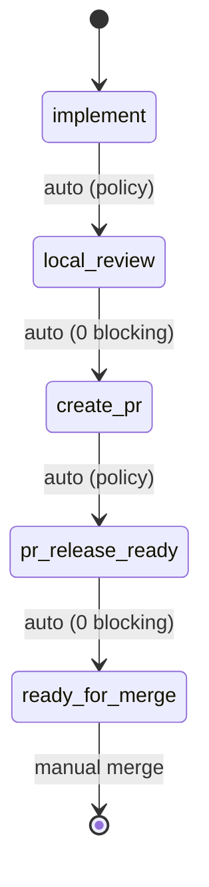

# Ticket Pipeline

## Overview

Chain existing skills into an autonomous per-ticket pipeline: implement -> local_review -> create_pr -> pr_release_ready -> ready_for_merge. Slack notifications fire at each phase transition. Policy switches (not agent judgment) control auto-advance.

**Announce at start:** "I'm using the ticket-pipeline skill to run the pipeline for {ticket_id}."

## Quick Start

```
/ticket-pipeline OMN-1234
/ticket-pipeline OMN-1234 --dry-run
/ticket-pipeline OMN-1234 --skip-to create_pr
/ticket-pipeline OMN-1234 --force-run
```

## Pipeline Flow



### Phase 1: implement

- Invokes `ticket-work` skill (human gates still fire for questions/spec)
- Cross-repo detection: blocks if changes touch multiple repo roots
- Slack: `notification.blocked` when waiting for human input
- AUTO-ADVANCE to Phase 2

### Phase 2: local_review

- Invokes `local-review` in a review iteration loop controlled by pipeline policy
- Issue fingerprinting: each iteration's findings are normalized to `{file, rule_id, severity}` tuples
- Mechanical stop conditions (policy switches, not agent judgment):
  - `max_review_iterations`: cap on total iterations
  - `stop_on_repeat`: stops if current fingerprints are a subset of any previous iteration (no progress)
  - `stop_on_major`: stops if new major/critical issues appear after iteration 1
- AUTO-ADVANCE to Phase 3 (only if 0 blocking issues)

### Phase 3: create_pr

- Idempotent: skips creation if PR already exists on branch
- Pre-checks: clean tree, branch tracks remote, branch name pattern, gh auth, realm/topic invariant
- Pushes branch, creates PR via `gh`, updates Linear status
- AUTO-ADVANCE to Phase 4

### Phase 4: pr_release_ready

- Invokes `pr-release-ready` in a review iteration loop (same as Phase 2)
- Same fingerprinting and mechanical stop conditions as Phase 2
- AUTO-ADVANCE to Phase 5 (only if 0 blocking issues)

### Phase 5: ready_for_merge

- Adds `ready-for-merge` label to Linear
- Slack notification with blocking/nit counts
- Pipeline STOPS (manual merge only)

## Pipeline Policy

All auto-advance behavior is governed by explicit policy switches, not agent judgment:

| Switch | Default | Description |
|--------|---------|-------------|
| `policy_version` | `"1.0"` | Version the policy for forward compatibility |
| `auto_advance` | `true` | Auto-advance between phases |
| `auto_commit` | `true` | Allow local-review to commit fixes |
| `auto_push` | `true` | Allow pushing to remote branch |
| `auto_pr_create` | `true` | Allow creating PRs |
| `max_review_iterations` | `3` | Cap review loops (local + PR) |
| `stop_on_major` | `true` | Stop if new major appears after first iteration |
| `stop_on_repeat` | `true` | Stop if same issues appear twice (fingerprint-based) |
| `stop_on_cross_repo` | `true` | Stop if changes touch multiple repo roots |
| `stop_on_invariant` | `true` | Stop if realm/topic naming violation detected |

## Issue Fingerprinting

Review phases (Phase 2 and 4) track issue fingerprints across iterations for mechanical repeat detection:

- Each review finding is normalized to a `{file, rule_id, severity}` tuple
- Fingerprint sets are stored per iteration in `issue_fingerprints` within phase state
- `stop_on_repeat`: compares current fingerprints against all previous iterations — if current is a subset (no progress), pipeline stops
- `stop_on_major`: if new major/critical findings appear after iteration 1, pipeline stops
- All comparisons are set-based and deterministic — no agent judgment involved

Python implementation: `src/omniclaude/lib/pipeline/` (models, fingerprint_engine, review_loop_controller)

## State Management

Pipeline state is stored at `~/.claude/pipelines/{ticket_id}/state.yaml` as the primary state machine. Linear ticket gets a compact summary mirror (run_id, current phase, blocked reason, artifacts). Review phases include `issue_fingerprints` for per-iteration fingerprint records.

## Dry Run Mode

`--dry-run` executes phase logic, logs all decisions, and writes state (marked `dry_run: true`), but does NOT commit, push, create PRs, or update Linear status. Slack notifications are prefixed with `[DRY RUN]`.

## Maximum Damage Assessment

If pipeline runs unattended, worst case:
- Pushes code to a feature branch (not main) -- reversible
- Creates a PR -- closeable, doesn't auto-merge
- Sends Slack notifications -- ignorable
- Updates Linear status -- manually reversible

## See Also

- `ticket-work` skill (Phase 1)
- `local-review` command (Phase 2)
- `pr-release-ready` command (Phase 4)
- `emit_client_wrapper` (Slack notifications)
- Linear MCP tools (`mcp__linear-server__*`)
