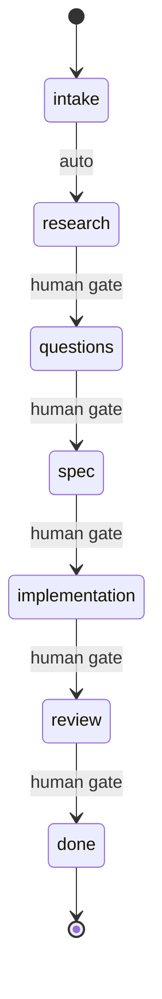

# Contract-Driven Ticket Execution

## Overview

Orchestrate ticket execution through structured phases with Linear as the single source of truth. The contract YAML block in the ticket description tracks all state.

**Critical Principle:** This skill requires explicit human confirmation for meaningful phase transitions. The intake→research transition is automatic (nothing to review), but all other transitions require human approval.

**Announce at start:** "I'm using the ticket-work skill to work on {ticket_id}."

## Quick Start

```
/ticket-work OMN-1234
```

This will:
1. Fetch the ticket from Linear
2. Parse or create the contract in the ticket description
3. Announce current phase and pending items
4. Guide you through the workflow

## Phase Flow



Each transition requires:
- Entry invariant satisfied
- Human gate (keyword + confirmation) - except intake→research which is automatic
- Exit invariant satisfied

## Contract Location

The contract is stored as a YAML block at the end of the Linear ticket description:

```markdown
---
## Contract

```yaml
phase: intake
context: {}
questions: []
requirements: []
verification: []
gates: []
commits: []
pr_url: null
```
```

The skill preserves all existing ticket description content above the contract section.

## Human Gates

| Transition | Trigger Keywords |
|------------|------------------|
| intake → research | *(auto-advance, no gate required)* |
| research → questions | "questions ready", "done researching" |
| questions → spec | "requirements clear", "proceed to spec" |
| spec → implementation | "approve spec", "build it" |
| implementation → review | "create PR", "ready for review" |
| review → done | "approve merge", "ship it" |

## Slack Notifications

When waiting for human input or completing work, send a Slack notification via the emit daemon so the user knows action is needed. This uses the event-driven architecture through the runtime.

**When to notify (blocked):**
- Entering `questions` phase with open questions
- Hitting any human gate that requires approval
- Verification failed and blocking further progress

**When to notify (completed):**
- Ticket work finished and PR merged/ready

**CLI Commands:**

```bash
# Blocked notification (via emit daemon -> runtime -> Slack)
python3 -c "
from plugins.onex.hooks.lib.emit_client_wrapper import emit_event
emit_event(
    event_type='notification.blocked',
    payload={
        'ticket_id': '{ticket_id}',
        'reason': '{reason}',
        'details': ['{detail1}', '{detail2}'],
        'repo': '{repo}',
        'session_id': '{session_id}'
    }
)
"

# Completion notification (via emit daemon -> runtime -> Slack)
python3 -c "
from plugins.onex.hooks.lib.emit_client_wrapper import emit_event
emit_event(
    event_type='notification.completed',
    payload={
        'ticket_id': '{ticket_id}',
        'summary': '{what_was_accomplished}',
        'repo': '{repo}',
        'pr_url': '{pr_url}',  # optional
        'session_id': '{session_id}'
    }
)
"
```

**Architecture:**
```
skill -> emit_event() -> emit daemon -> Kafka -> NotificationConsumer -> Slack
```

**Important:** Notifications are best-effort and non-blocking. If `SLACK_WEBHOOK_URL` is not configured on the runtime, they silently no-op. Do not let notification failures block workflow progress.

## See Also

- Linear MCP tools (`mcp__linear-server__*`)
- Related: OMN-1807 (ModelTicketContract in omnibase_core) - contract schema mirrors this model
- Related: OMN-1831 (Slack notifications) - notification implementation
