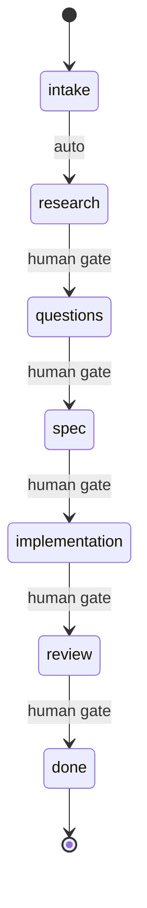

# Contract-Driven Ticket Execution

## Overview

Orchestrate ticket execution through structured phases with Linear as the single source of truth. The contract YAML block in the ticket description tracks all state.

**Critical Principle:** This skill requires explicit human confirmation for meaningful phase transitions. The intake→research transition is automatic (nothing to review), but all other transitions require human approval.

**Announce at start:** "I'm using the ticket-work skill to work on {ticket_id}."

## Quick Start

```
/ticket-work OMN-1234
```

This will:
1. Fetch the ticket from Linear
2. Parse or create the contract in the ticket description
3. Announce current phase and pending items
4. Guide you through the workflow

## Phase Flow



Each transition requires:
- Entry invariant satisfied
- Human gate (keyword + confirmation) - except intake→research which is automatic
- Exit invariant satisfied

## Contract Location

The contract is stored as a YAML block at the end of the Linear ticket description:

```markdown
---
## Contract

```yaml
phase: intake
context: {}
questions: []
requirements: []
verification: []
gates: []
commits: []
pr_url: null
```
```

The skill preserves all existing ticket description content above the contract section.

## Human Gates

| Transition | Trigger Keywords |
|------------|------------------|
| intake → research | *(auto-advance, no gate required)* |
| research → questions | "questions ready", "done researching" |
| questions → spec | "requirements clear", "proceed to spec" |
| spec → implementation | "approve spec", "build it" |
| implementation → review | "create PR", "ready for review" |
| review → done | "approve merge", "ship it" |

## Slack Notifications

When waiting for human input or completing work, send a Slack notification via the emit daemon so the user knows action is needed. This uses the event-driven architecture through the runtime.

**When to notify (blocked):**
- Entering `questions` phase with open questions
- Hitting any human gate that requires approval
- Verification failed and blocking further progress

**When to notify (completed):**
- Ticket work finished and PR merged/ready

**CLI Commands:**

```bash
# Blocked notification (via emit daemon -> runtime -> Slack)
python3 -c "
from plugins.onex.hooks.lib.emit_client_wrapper import emit_event
emit_event(
    event_type='notification.blocked',
    payload={
        'ticket_id': '{ticket_id}',
        'reason': '{reason}',
        'details': ['{detail1}', '{detail2}'],
        'repo': '{repo}',
        'session_id': '{session_id}'
    }
)
"

# Completion notification (via emit daemon -> runtime -> Slack)
python3 -c "
from plugins.onex.hooks.lib.emit_client_wrapper import emit_event
emit_event(
    event_type='notification.completed',
    payload={
        'ticket_id': '{ticket_id}',
        'summary': '{what_was_accomplished}',
        'repo': '{repo}',
        'pr_url': '{pr_url}',  # optional
        'session_id': '{session_id}'
    }
)
"
```

**Architecture:**
```
skill -> emit_event() -> emit daemon -> Kafka -> NotificationConsumer -> Slack
```

**Important:** Notifications are best-effort and non-blocking. If `SLACK_WEBHOOK_URL` is not configured on the runtime, they silently no-op. Do not let notification failures block workflow progress.

## Status Emission

Emit agent status events at key workflow points so external systems (dashboards, alerting, observability) can track ticket progress. Status emission is **non-blocking and fail-open** -- if emission fails, log a warning to stderr and continue. Never let a status emission failure block workflow progress.

**CLI invocation pattern:**

```bash
python3 "${CLAUDE_PLUGIN_ROOT}/hooks/lib/emit_ticket_status.py" \
  --state STATE --message "MESSAGE" \
  --phase PHASE --ticket-id {ticket_id} [--progress N] [--blocking-reason REASON]
```

**Note:** Always include `--progress` when transitioning phases, using the values from the table below to ensure dashboards and alerting accurately reflect workflow position.

### Phase Transition Emissions

Emit a status event when entering each phase.

**Note:** Every emission requires `--state`, `--message`, `--phase`, and `--ticket-id`. The `--message` column below shows the value to pass for each phase entry. Use the CLI invocation pattern from above.

| Phase Entry | State | Progress | Message | Extra Args |
|-------------|-------|----------|---------|------------|
| intake | working | 0.00 | `"Starting ticket intake"` | `--task "Ticket intake"` |
| research | working | 0.15 | `"Researching codebase"` | `--task "Researching codebase"` |
| questions | awaiting_input | 0.30 | `"Waiting for clarification"` | `--task "Waiting for clarification"` `--blocking-reason "Waiting for answers to clarifying questions"` |
| spec | working | 0.45 | `"Generating specification"` | `--task "Generating specification"` |
| spec gate | blocked | 0.45 | `"Awaiting spec approval"` | `--task "Awaiting spec approval"` `--blocking-reason "Awaiting spec approval"` |
| implementation | working | 0.70 | `"Implementing requirements"` | `--task "Implementing requirements"` |
| review | working | 0.90 | `"Running verification"` | `--task "Running verification"` |
| done | finished | 1.00 | `"Ticket complete"` | `--task "Ticket complete"` |

### Implementation Sub-Progress

During the implementation phase, report granular progress as requirements are completed:

```
progress = 0.70 + 0.20 * (completed_requirements / total_requirements)
```

Example: 3 of 5 requirements done yields progress = 0.82.

```bash
python3 "${CLAUDE_PLUGIN_ROOT}/hooks/lib/emit_ticket_status.py" \
  --state working --message "Implemented 3/5 requirements" \
  --phase implementation --ticket-id {ticket_id} --progress 0.82 \
  --metadata '{"requirements_completed": "3", "requirements_total": "5"}'
```

### Error Emission

When a phase encounters an error (e.g., verification failure), emit an error status:

```bash
python3 "${CLAUDE_PLUGIN_ROOT}/hooks/lib/emit_ticket_status.py" \
  --state error --message "Verification failed: tests" \
  --phase review --ticket-id {ticket_id} \
  --metadata '{"error": "pytest exit code 1"}'
```

### Important

Status emission must NEVER block workflow progress. If emission fails, log and continue. The CLI wrapper always exits 0 regardless of whether the underlying Kafka emit succeeded.

## Dispatch Contract (Execution-Critical)

**This section governs how the implementation phase executes. Follow it exactly.**

You are an orchestrator for ticket-work phases. You manage the contract, human gates, and phase
transitions. You do NOT write implementation code yourself.

**Rule: When entering the implementation phase, dispatch a polymorphic agent via Task().
Do NOT call Edit(), Write(), or implement code directly in the orchestrator context.**

### spec → implementation transition

After user approves spec ("approve spec", "build it"), execute automation steps (branch, Linear
status, contract update) then dispatch:

```
Task(
  subagent_type="polymorphic-agent",
  description="Implement {ticket_id}: {title}",
  prompt="Implement the following requirements for {ticket_id}: {title}.

    Requirements:
    {requirements_list}

    Relevant files:
    {relevant_files}

    Execute the implementation. Do NOT commit changes (the orchestrator handles git).
    Report: files changed, what was implemented, any issues encountered."
)
```

The orchestrator reads the agent's result, runs verification, and manages the commit.

### Other phases (intake, research, questions, spec, review, done)

These phases run inline in the orchestrator. They involve reading tickets, asking questions,
presenting specs, and running verification — all lightweight operations that don't need dispatch.

---

## Detailed Orchestration

Full orchestration logic (contract schema, phase handlers, persistence, error handling)
is documented in `prompt.md`. The dispatch contract above is sufficient for the implementation
phase. Load `prompt.md` only if you need reference details for contract parsing, completion
checks, or edge case handling.

---

## See Also

- Linear MCP tools (`mcp__linear-server__*`)
- Related: OMN-1807 (ModelTicketContract in omnibase_core) - contract schema mirrors this model
- Related: OMN-1831 (Slack notifications) - notification implementation
